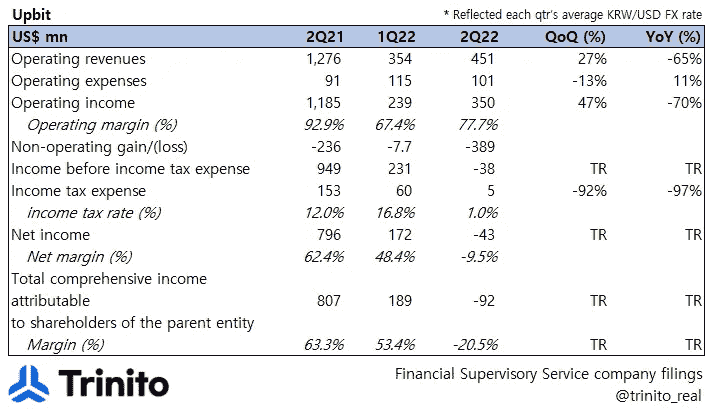

# 概览:Upbit 2Q22

> 原文：<https://medium.com/coinmonks/at-a-glance-upbit-2q22-3ef4af84c2bd?source=collection_archive---------6----------------------->

## *上比特-下比特差距扩大*

**【损益表集锦】**

韩国最大的 CEX Upbit 运营商 Dunamu 于 8 月 29 日(KST)披露了 1H 业绩。

## **1) P & L**

*   按美元计算，Upbit 的顶线同比下降 65%；经汇率调整后(由于韩元对美元贬值)，同比跌幅仍为 75%。
*   以美元计价的 OPEX 较上年同期上涨 11%，但以韩元计算，其季度环比和同比涨幅分别为-42%和-22%。
    > OPM 从去年的 92.9%下降到 77.7%。
    > >尽管利润大幅下降，但与 OPM 从去年的 87.7%下降到 48%和 39.3%下降到-129.2%的比瑟姆和比特币基地相比，Upbit 在控制费用方面似乎做得更好。
    > > >成本控制主要来自工资，同比下降 45%(拜拜奖金..)
*   尽管成本得到了很好的控制，但最终还是亏损了 4300 万美元(-9.5%的净利润率)，这主要是受数字资产估值损失(2.32 亿美元)的影响，数字资产估值同比增长 97%。

## **2) Upbit 的数字资产余额**

*   上表显示了 Upbit 在每个季度末拥有的数字资产类型。
*   与减持 BTC 股票的 Bithumb 不同，Upbit 今年上半年在 BTC 的总余额增加了 1645 英镑。
    **>** BTC 现在代表着 Upbit 拥有的 87%的数字资产。

## **3)提升客户的数字资产余额**

*   **第一次**(终于！)，Upbit 披露了代表其客户持有的数字资产类型。
*   突出的是 XRP 的巨大存在，其在 1 小时 22 分远远超过。
    > Upbit 用户在 Upbit 上存入的 XRP 比 ETH 多(金额为$ number)；这也表明(可悲的是)没有太多的选择利用 XRP，所以许多韩国零售商使用 Upbit 作为他们的 XRP 托管。
*   与 Bithumb 类似，Upbit 客户的数字资产余额(数字资产总数)与去年年底相比有所增加。

## **4)上升位< >下降位差距扩大**

*   Upbit 和 Bithumb 是韩国毫无争议的排名第一和第二的 CEXs，这是众所周知的事实。
*   然而，有趣的是，P&L 和英国统计局的关键数字之间的差距继续扩大，如下所示。

**白色单元格:Upbit = Bithumb
*橙色单元格:Upbit < Bithumb
*蓝色单元格:Upbit > Bithumb*

*   就收入而言，Upbit 现在比 Bithumb 大 4.5 倍，就运营而言，Upbit 比 Bithumb 大 7.2 倍，NAV 比后者大 3 倍。
*   至于不需要披露 1H22 结果的 Coinone 和 Korbit(不像韩国的第一名和第二名)，我们认为他们的底线很可能变红(像他们更大的同行一样)，我们不能排除 Korbit 的 OP 变红的可能性。
*   关于 Bithumb 2Q22 的成绩，请参考下面的链接
    * [一览:Bithumb 2Q22 集锦](/coinmonks/at-a-glance-bithumb-2q22-5790db8564d2)

由 Trinito 联合创始人 Eric Yoo 撰写，Trinito 合伙人 Jiyon Kim 供稿。

**免责声明**

这不是投资建议，仅供参考。您不应将任何此类信息或其他材料理解为法律、税务、投资、财务或其他建议。

# Upbit # Dunamu # Bithumb #比特币基地# CEX # ETH # BTC # XRP #加密#数字资产#估值

> 交易新手？尝试[加密交易机器人](/coinmonks/crypto-trading-bot-c2ffce8acb2a)或[复制交易](/coinmonks/top-10-crypto-copy-trading-platforms-for-beginners-d0c37c7d698c)