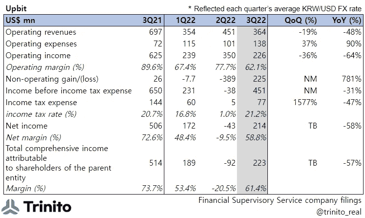
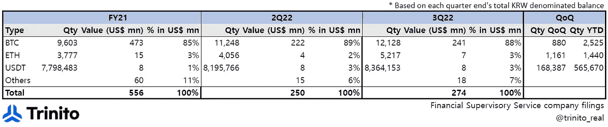
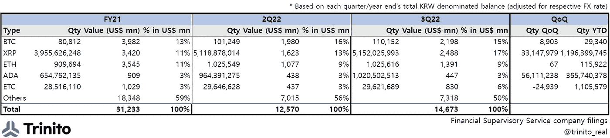
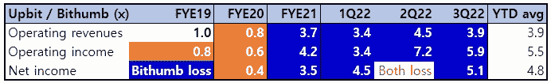
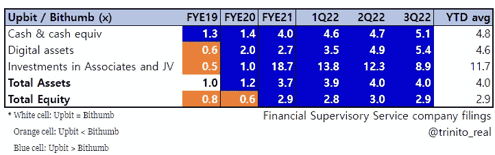

# 概览:2022 年第三季度

> 原文：<https://medium.com/coinmonks/at-a-glance-upbit-3q-2022-3e24a05825b4?source=collection_archive---------14----------------------->

领先者 Upbit 和亚军 Bithumb 之间的差距保持不变

韩国最大的 CEX Upbit 运营商 Dunamu 于 11 月 29 日(KST)披露了 [2022 年第三季度 YTD 财务](https://dart.fss.or.kr/dsaf001/main.do?rcpNo=20221129001389)。

## **1) P & L**

*   按美元计算，Upbit 的顶线同比下降 48%；经汇率调整后(由于韩元对美元同比贬值)，同比降幅更大，为 66%。
*   以美元计价的 OPEX 同比上涨 90%，环比上涨 37%。
    > OPEX 的增长主要是由工资同比增长 300%推动的，这可能是员工数量增加的结果(与大多数其他裁员的区块链公司和交易所相反)。工资占本季度 OPEX 总额的 43%。
*   营业收入同比下降 64%，环比下降 36%，营业利润率为 62.1%。
*   在记录了上一季度的亏损后，底线出现了亏损[主要受数字资产估值损失的影响(-＄2 . 32 亿)]。

## **2) Upbit 的数字资产余额**

*   上表显示了 Upbit 在每个季度末拥有的数字资产类型。
*   在过去几个季度中，Upbit 在数字资产平衡方面一直非常一致。
    1)他们不卖(如 BTC/瑞士联邦理工学院/USDT 季度和年初数量增长所示)。
    2)到目前为止，BTC 是他们最大的风险敞口(按美元计算超过 85%)。这是因为他们还经营着一个 BTC 配对市场。

## **3)提升客户的数字资产余额**

*   上表显示了代表 Upbit 客户持有的数字资产类型。
*   有趣的是，除了 ETC 之外，所有其他数字资产的客户存款都增加了 QQ 和 YTD(因此流入 Upbit)。
    > 我们一直在说，这可能是来自其他交易所、钱包的净流入的结果，和/或净增加的结果，尽管目前的信息披露水平无法证实这一点。自从 FTX 在 11 月份崩溃以来，看看上述数字到年底如何变化将会很有趣(韩国零售商会不信任 cex 还是 FTX 的崩溃会增加韩国持有者在韩国 cex 上存款的压力？)

## Upbit 和 Bithumb 之间的差距依然存在

*   本季度，Upbit 和 Bithumb 在 P&L 方面的差距略有缩小。
*   然而，在损益方面，前者现在至少是后者的 4 倍。
*   与韩国第二大交易所相比，Upbit 的总资产仍高出 4 倍，总股本高出近 3 倍。

由 Trinito 联合创始人 Eric Yoo 撰写，Jiyon Kim 供稿

# Upbit # bith umb # FTX #杜纳姆# bith umb #比特币基地# CEX # ETH # BTC # XRP #加密#数字资产#估值

**免责声明**

这不是投资建议，仅供参考。您不应将任何此类信息或其他材料理解为法律、税务、投资、财务或其他建议。

Dunamu(Upbit) 2022 年第三季度年初至今财务报告:

[https://dart.fss.or.kr/dsaf001/main.do?rcpNo=20221129001389](https://dart.fss.or.kr/dsaf001/main.do?rcpNo=20221129001389)

> 交易新手？试试[密码交易机器人](/coinmonks/crypto-trading-bot-c2ffce8acb2a)或者[复制交易](/coinmonks/top-10-crypto-copy-trading-platforms-for-beginners-d0c37c7d698c)