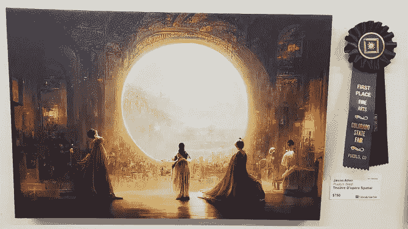
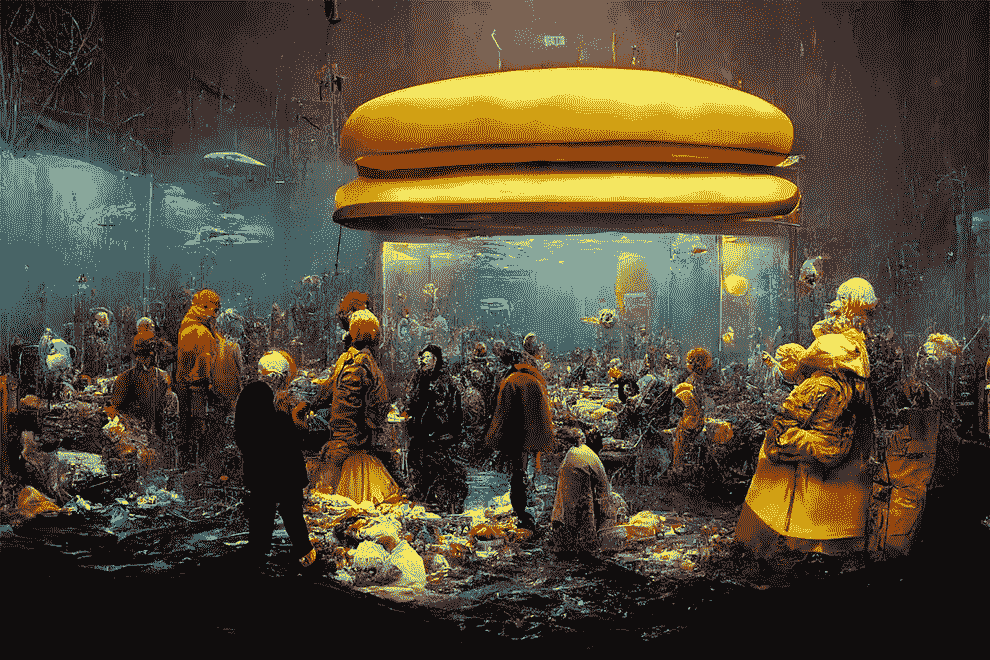
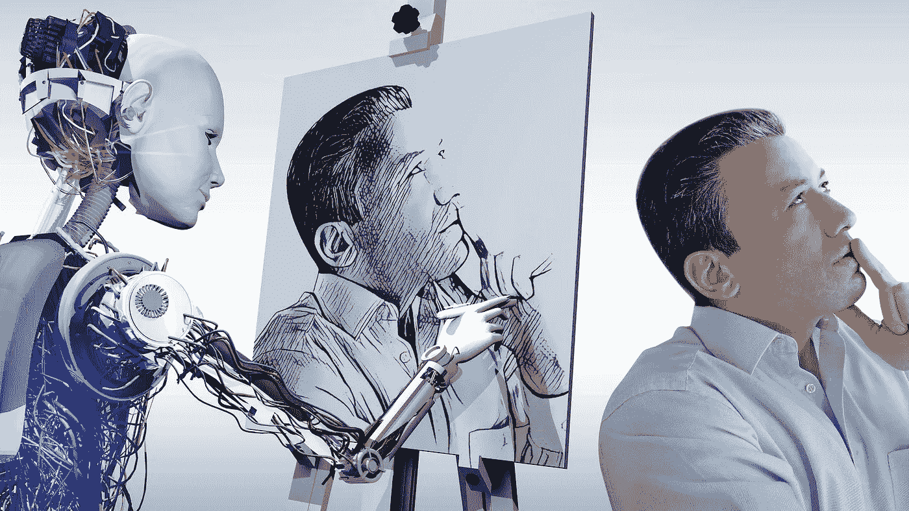
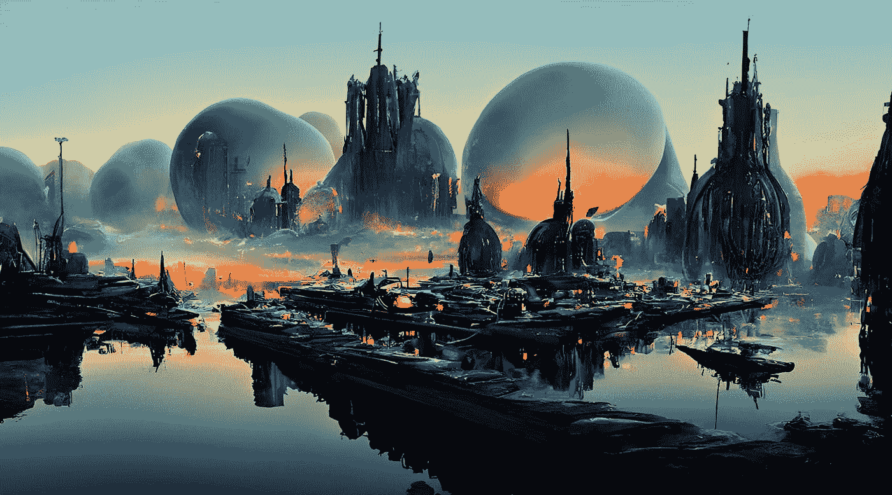

# 什么时候艺术不再算艺术？

> 原文：<https://medium.com/coinmonks/at-what-point-does-art-no-longer-counts-as-art-d12f273ab08c?source=collection_archive---------9----------------------->

This AI generated artwork won first place at a competition, and it raised so many questions and furore in the process.

有人提交了一幅人工智能生成的艺术作品，并在美术比赛中获得了一等奖，互联网火了。

一个家伙把他的艺术作品参加了科罗拉多州博览会的美术比赛。

关键是他使用人工智能来生成数字作品。

杰森·艾伦是科罗拉多州桌面游戏公司“化身游戏”的总裁。根据该州博览会的网站，他凭借一件名为“空间剧场”的作品赢得了数字艺术类奖项。"

艾伦在画布上打印出来提交的图像非常漂亮。它描绘了一个奇怪的场景，看起来像是来自太空歌剧，看起来像是一幅精湛的画作。巴洛克风格大厅中的古典人物透过圆形视窗凝视着阳光普照、光芒四射的风景。"

艺术本身真的很美，很有想象力。

你可能会问什么软件？

中途。

Some of Midjourney’s work are simply astonishing and bewildering.

这是一家相当新的初创公司，允许用户描述并提示人工智能以数字方式增强、创建和美化图形。

公平地说，结果相当令人陶醉。

如果另一个阿哈支付帐户或用户，让我知道你的想法！

有些艺术作品确实鼓舞人心，气势磅礴。

谁在乎它们是人类还是人工智能做的！

那么 Ai 生成的不是艺术吗？

好吧，考虑到比赛中的权威注意到了他对人工智能的使用并允许获胜，这应该是合法的。

随着技术的进步和人工智能的日益完善，将越来越难区分什么是人，什么不是人。

How will we be able to differentiate human vs AI art? Wait..should we?

这是一个数字艺术比赛，那么数字工具是不允许的吗？

能不能禁止 photoshop，canva 等数字艺术工具？

如果我们允许这些，那么这些与 Midjourney 和 Dall-e 等人工智能辅助工具有什么区别？

客观地说，从中途输入提示到最终状态仍然需要很大的努力。

艾伦通过在中途向人工智能图像生成器输入文本提示，创建了 900 个以“太空剧院”为主题的图像变体。然后，他在 Adobe Photoshop 中编辑他最喜欢的作品(就像在中途忘记的脑袋中编辑一样)，并在将它们打印到画布上之前，使用另一种机器学习工具提高质量。

你可以说艺术家确实投入了工作，我猜？

那么在什么时候艺术不再被认为是艺术，尤其是当涉及到技术和工具的时候。

Ai generated artwork like this city scape piece is so mesmerizing yet it makes us wonder how far can we push it?

或许到那时，人工智能辅助的数字艺术将会有一个全新的类别。

那么监管它将是一个全新的挑战。

如果一个数字作品是由人类、人工智能或两者混合编辑/创造/设计的，你怎么能肯定地说出来呢？

这也带来了许多有趣的问题和机会。

我所知道的是，这是 Midjourney 的伟大营销，我敢打赌，他们将在未来几周内看到新用户的巨大峰值！

-

你认为人工智能生成的艺术是艺术吗？

-

# startups # business # startupx # growth # success # social media # culture # entrepreneurs # eth # BTC # crypto # ai generated # midway # dalle # ai # arts intelligence # art competition # art # first place

> 交易新手？试试[加密交易机器人](/coinmonks/crypto-trading-bot-c2ffce8acb2a)或者[复制交易](/coinmonks/top-10-crypto-copy-trading-platforms-for-beginners-d0c37c7d698c)