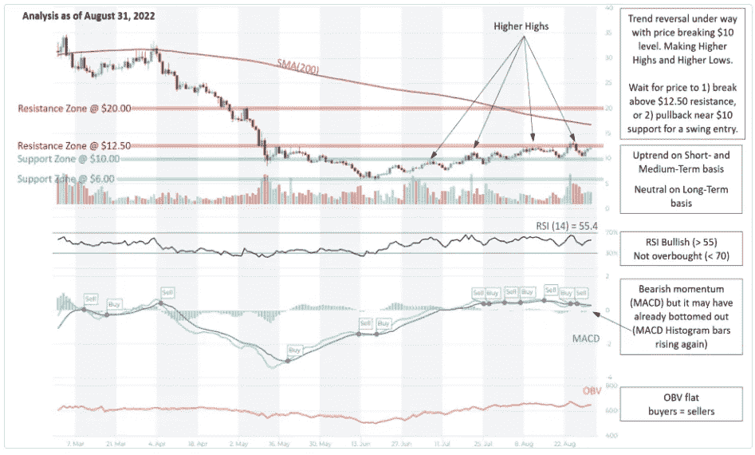
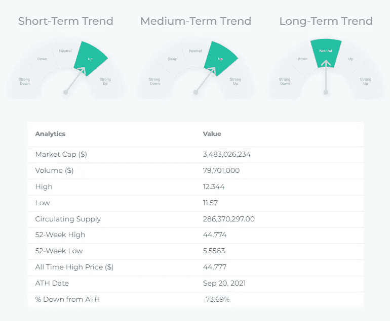
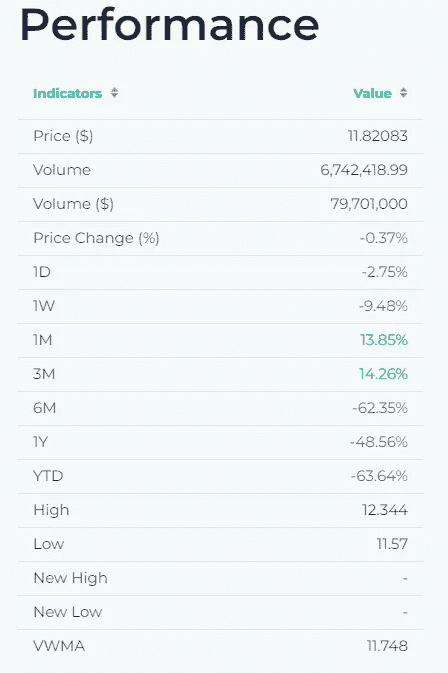
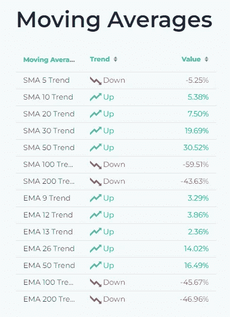

# ATOM (Comos)-价格分析、描述、技术指标

> 原文：<https://medium.com/coinmonks/atom-comos-price-analysis-description-technical-indicators-5075de335f42?source=collection_archive---------38----------------------->

ATOM 价格分析:

Source: altFINS.com

交易设置:趋势反转正在进行，价格突破 10 美元水平。制造更高的高点和更高的低点。等待价格 1)突破 12.50 美元阻力以恢复上升趋势，并有上升潜力至 30 美元，或 2)回调至 10 美元附近的支撑，以进行摆动进场。(设置价格[提醒](https://altfins.com/knowledge-base/create-alert-for-cryptocurrencies/))。

趋势:短期和中期趋势向上，长期趋势中性。

势头喜忧参半，因为 [MACD](https://altfins.com/knowledge-base/macd-line-and-macd-signal-line/) 线低于 MACD 信号线(看跌)，但 RSI > 55(看涨)。 [MACD 柱状图](https://altfins.com/knowledge-base/macd-line-and-macd-signal-line/)柱在上涨，这表明势头可能接近另一次上涨。

OBV(平衡成交量):持平，表示上涨日的成交量等于下跌日的成交量。因此，买方的需求和卖方的供应处于平衡状态

支撑和阻力:最近的支撑区域是 10.00 美元(之前的阻力)，然后是 6.00 美元。最近的阻力区是 12.50 美元，然后是 20.00 美元。

Source: altFINS.com

Source: altFINS.com

Source: altFINS.com

**什么是宇宙？**

Cosmos 是一个独立的区块链网络，它使用 IBC(一种基于 TCP/IP 的互操作性协议)安全地传输价值和数据。Cosmos Hub，通常被称为“Gaia”，是一个利益相关链，它使用本地硬币原子作为 Cosmos 网络中区块链之间 IBC 数据包路由的枢纽。拜占庭容错(BFT)利害关系证明共识机制 Tendermint 保护宇宙中心以及宇宙网络中的大部分区块链。

**近期新闻:**

[**卡达诺在 Vasil 升级前发布代达罗斯新测试版本**](https://u.today/cardano-releases-new-test-versions-of-daedalus-ahead-of-vasil-upgrade) **。在** [**altFINS 上查找更多新闻。**](https://platform.altfins.com/news)

> 交易新手？试试[加密交易机器人](/coinmonks/crypto-trading-bot-c2ffce8acb2a)或者[复制交易](/coinmonks/top-10-crypto-copy-trading-platforms-for-beginners-d0c37c7d698c)