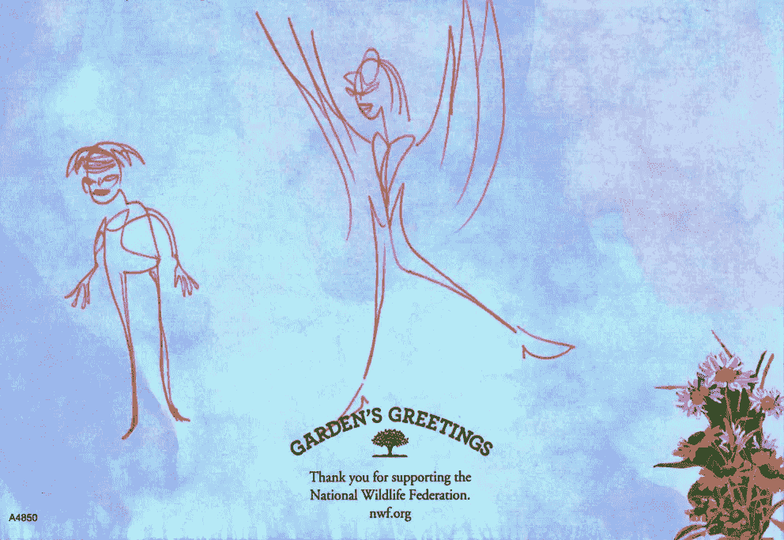

# 分叉克隆人的进攻！

> 原文：<https://medium.com/coinmonks/attack-of-the-forking-clones-302b5718d0f5?source=collection_archive---------6----------------------->

DeFi 协议的神奇崛起与预期衰落

All forked-up…DinoBUSD created a unique Dashboard Investment Portal design. The next generation of pocket-change crypto miners is being born from this original…

我喜欢迪诺布斯。这是我今年最有成效的被动收入零花钱加密投资。它有一个智能仪表板，按时返还了我的投资回报率，并继续每周支付给我超过这个数字的报酬。在目睹了令人发指的拉地毯事件之后，迪诺布斯的成功帮助我恢复了对这些项目的信心。然而…

> 也就是说，我不再投资于该协议。我鼓励阅读这篇文章的人也这样做。

不过不要担心&不要惊慌——时间还很充裕。迪诺布斯不是拉地毯的。我的预期是，在大约这个时间(8 月中下旬)之前投资的任何人不仅可能收回全部投资回报，而且可能履行合同期限，获得写入本协议的全部 5 倍投资回报。它甚至可能还会运行相当长的一段时间——下面将详细介绍……

## 发生什么事了？

市场力量可能是残酷的，尤其是在加密领域——不仅仅是硬币的每日涨跌价格，而是极端竞争的市场力量。

在他们能与你竞争之前，你需要变得成功…

> 人们喜欢成功。有没有去过艺术展开幕式&看到墙上几件展品旁边有一个红点？红点表示这件作品已经售出。观察人们做什么:他们进入画廊，倾向于被已经售出的带有红点的艺术品吸引，只是为了看看其他人喜欢到足以购买的东西。这叫做**验证口味** &它让人们迅速知道别人在想什么。

迪诺布斯成功了。如上所述，对于迄今为止已经投资的人来说，这是一笔非常好的投资。Dino 在开始时受到了很多媒体的关注——很酷的 Dashboard 投资门户可能是原因所在——人们自然而然地被这个项目所吸引。我看到锁定的总价值在 6 周内从大约 79，000 美元增加到将近 800，000 美元。这是一个非常惊人的场景...

## 极限竞争…

> 然而，成功也有模仿者。在 DinoBUSD 的成功亮相派对的 6 周内，一个新的竞争对手出现了:fork——原版的克隆，做了一些调整——被称为 SoccerBUSD。
> 
> 参见足球的[深潜](/@jebalucas/play-ball-new-16-daily-roi-pocket-change-staking-protocol-6d4c2d5e518d)。

Dino(仍然)提供高达 8%的日投资回报率，这个新的竞争对手将这一数字翻了一番，达到惊人的 16%的日回报率。新叉子是激烈的竞争。它的 TVL 开始猛增，就像几周前迪诺一样。

与此同时，迪诺布斯的 TVL 继续上升，仍然轻快地[以令人难以置信的速度跑上那座山](/coinmonks/running-up-that-hill-with-no-problems-f268d879a206)。我继续投资，总是每天从其他小矿工身上刮钱。

## 认知失调:

我对任何 16%的日投资回报率持怀疑态度。句号。他们不可能以这样的速度持续下去——简单的象征性投资似乎证明了这一点:我目睹了数十个日回报率极高的 defi 口袋里的零钱投资项目迅速崩溃。

然而，**验证口味**告诉我，人们对足球美元感到非常兴奋，其快速增加的 TVL &一些其他保护长寿的功能，如更高的出境税。

SoccerBUSD took the original smart contract design & doubled the interest, doubling the expectation.

> 我探索和剖析新的口袋变化加密赌注协议。我要么把它们拆开，要么决定投资这个项目，鼓励它们的可持续性和持久性。这些矿工中很少有人会升到最高层；那些是我正在寻找的。

我对 SoccerBUSD 进行了测试，并尽我所能进行了研究。到第三个岔口左右，项目似乎逐字逐句地复制彼此的白皮书，因此阅读克隆文档可能是浪费时间的一个教训。不过，随着其他一切检查完毕，是时候为好友账户做[了。](/coinmonks/i-usually-play-by-the-rules-however-fdaf77d191b2)

## 我们为什么在这里？

自然，投资者会努力争取 16%的更高回报率，而不是曾经令人瞩目的 8%。我做到了。

这就是为什么我们都在这个秘密世界的角落里:做一些额外的零钱。如果我欣赏并信任这个平台，那么继续投资 8%的项目就没有经济意义，因为我可以在隔壁的同一个项目中获得双倍的回报。

SpaceBUSD is the 3rd clone from the highly successful DinoBUSD. Watch this space…

## 致命一击

然后有四个…最近又有两个强硬的竞争对手进入了市场&显然，DinoBUSD 现在没有机会了。

类似于足球——下一个新事物——space busd 提供 16%的日投资回报率，税收结构与足球略有不同。

BNBTheLostWorld is the 2nd clone pocket-change miner to hit the market in less than 2 months. If you like this one, there’s more on the way.

## 供给与需求

为什么我喜欢的矿工注定要失败？因为加密市场的这个角落里只有这么多投资者。我看过 TVL，他们都在几周内暴涨了几十万美元——这很好，因为希望更多的人发现这些零花钱投资项目。

然而，DinoBUSD 以前神话般的 8%回报率现在已经过时了。是时候继续前进了…

> 现在**有大量**这些仪表板投资门户设计的矿工协议。由于他们的成功，我预计几周内会有更多的人上网。这是一件可怕的事情…
> 
> 需求就这么多——显然不足以支撑所有这些口袋里装着零钱的矿工。

以前，袖珍密码协议的预期寿命大约是 3 个月(BNBMiner 例外)。你最好早点进去，否则你会错过，因为当 TVL 开始变平或下降时，乘坐速度也在减慢，很快就该下车了。

然而，时代在变。基于仪表板投资门户设计的 Dino/football/Lost/Space Miner 协议等现代矿工协议是为长期发展而创建的。

DinoBUSD 快 3 个月了。然而看看下面的图表。它没有崩溃也没有不稳定。它正在做它现在应该做的事情——舒服地爬上那座小山。然而，我正在看 BscScan 的分析选项卡下的每日交易电子表格，我感觉协议变慢了；此刻，我看到了写作。

Blockchain Foot-Traffic information for DinoBUSD is found at BscScan. This project is still going, perhaps less strong. I was fortunate to come across & invest into the protocol early on, June 24th. Three very recent clones of the above project offer that opportunity & have come online over the past week…

因此，DinoBUSD(可能)开始放松下来，这并不是一件悲伤的事情，也不是一件坏事。它开创了新一代的密码挖掘者，我很乐意投资其中。这是我期待的未来…

DinoBUSD 的步行交通图将会是一个自然而美丽的展开图，最初看起来像是在一个舒适悠闲的小山上快步行走；接下来的几个月，随着合约的轻松展开，将会是一个漫长而缓慢的下降过程。如果你读过早期的信件，你就会知道我喜欢图表。下面是一个模型图，我预计 DinoBUSD 的寿命是多少。实际结果可能有所不同…

Foot-traffic graph for pocket-change miner DinoBUSD. The graph up to the “You are here…” section is accurate. Beyond that, I am speculating in the graph that the protocol will slowly retire itself, over the span of probably 3 or 4 more months — plenty of time to get your ROI back, plus more.

## 为什么需要这么长时间才能放松下来？

这是一个很好，但有点悲哀的问题。你在读这个，所以你知道这个矿工可能的命运。

> 然而，有闲钱的不知情的投资者会偶然发现这个网站，看到这个很酷的仪表盘，然后决定投资。
> 
> 他们不会读过这本书；他们不会做必要的研究；他们会失去他们的钱。

与此同时，他们这种愚蠢的“先跳起来，希望落地，以后再站起来”的投资方式将在未来几个月支撑合约，让除他们之外的所有人都有时间获得投资回报。

## 好消息

> 与每日回报率波动的加密矿工不同，迪诺和她目前的三个堂兄弟——足球、太空和 BNBTheLostWorld——有固定的回报。因此，当合约 TVL 最终开始下降时，回报保持不变，直到合约中的资金用完。

这就是为什么它很重要:

我有几个收益递减的矿工投资，我的收益已经降到了不到一美元——庄稼矿工、烘豆和阿米巴只是几个例子。我把这些死胡同混合了大概一周，产生了大概一美元。我用这些矿工来支付天然气费用，所以我从来没有考虑过这些费用，因为它们被仍然稍微有生产力的矿工淘汰了。

> 迪诺和她的姐妹克隆协议的固定回报率消除了回报率下降的负担。我希望收到每周提供给我的完整的每日回报，直到不再有回报。

DinoSoccerLostSpace. Above is an amalgam of the utilitarian dashboard showing the 4 competing crypto pocket-change miners. The orange section is DinoBUSD’s dashboard, of course; blue is the SpaceBUSD protocol; the green section is the SoccerBUSD project; finally, the dark chart on the left is from my new favorite, BNBTheLostWorld…

# 现在怎么办？多样化…

从迪诺布斯(微笑)身边走开后，接下来呢？

再说一次，16%的日投资回报率仍然让人觉得风险很大。然而，以我从恐龙身上赚的钱，我愿意冒更大的风险。这只是我…

> 这就是为什么我总是鼓励朋友们只玩他们不需要的东西。

为了分散我的意外之财，我投资了所有三个恐龙克隆体。我将继续记录我的被动收入 defi 零钱矿工冒险。

咻…真多。谢谢你走到这一步。

我希望你能在这篇关于我们生活的疯狂的密码世界的观点文章中找到一些有价值的东西。总是很高兴有你跟着我…

# 不要脸塞:

我最近的一些投资如下…

## 迪诺布思

我很高兴我投资了 DinoBUSD &将继续利用这个平台，直到自然结束，享受沿途的回报。

我总共向迪诺的三个账户投资了 1360 美元。乘以 5 倍&我的预期是，我将享受 6800 美元的全额奖励。到目前为止，我已经收回了 2000 多美元。合同可能正在放缓，但仍有很长的路要走。我很高兴能在那里呆到最后，或者当我达到我投资回报的 5 倍时，无论哪个先来。

> 注意:当我成功地从一个协议中赚到钱时——不一定是我的全部投资回报，只是现在——我会写下我的经历。如果你喜欢这个协议&决定投资它，那是我的目标&我很激动。使用我的文章中的推荐链接会给我提供一点补偿&是让我知道这些对话是有益的一种极好的方式。如果你使用我的推荐链接，谢谢！

**注意，这里没有 DinoBUSD 的链接。*当我不再觉得这是一项可靠的投资时，所有帖子的链接都会被删除。***

我哥们什么都画！我称之为他的账本系列。我喜欢下面的场景…

NWF

> 交易新手？尝试[加密交易机器人](/coinmonks/crypto-trading-bot-c2ffce8acb2a)或[复制交易](/coinmonks/top-10-crypto-copy-trading-platforms-for-beginners-d0c37c7d698c)