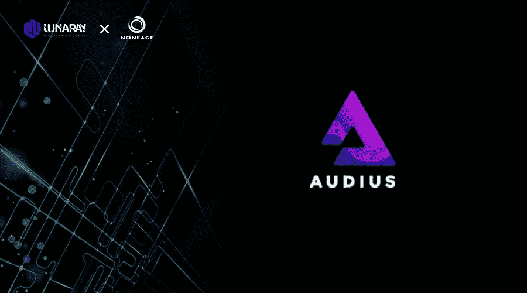
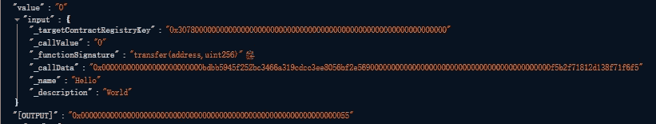
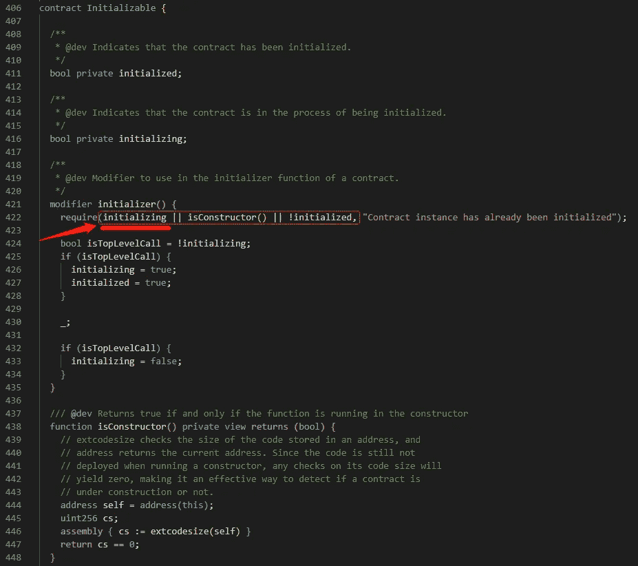
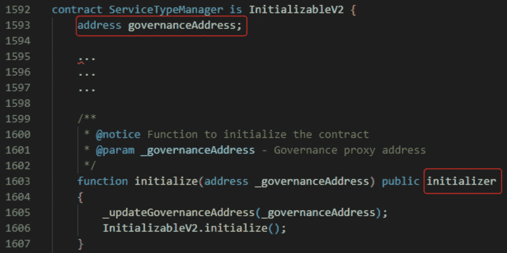
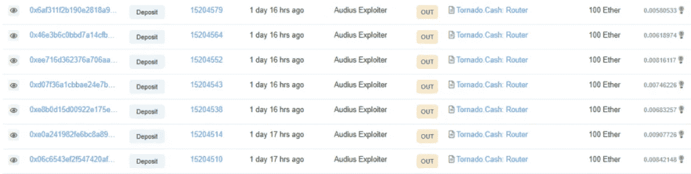

# 音频协议黑客分析

> 原文：<https://medium.com/coinmonks/audios-protocol-hack-analysis-c4d7b96756da?source=collection_archive---------10----------------------->

**0x01 预览**

Audius 是一个完全去中心化的音乐平台。拥有主人和平台。奥迪斯周六被黑客攻击，损失了价值约 600 万美元的以太坊音频令牌。这 1860 万个音频令牌以 705 ETH(110 万美元)的价格转售，并通过交易混合服务进行交易。

**0x02 攻击信息**

攻击者的地址

0xa 0 c 7 BD 318d 69424603 CBF 91 e 9969870 f 21 b 8 ab 4c

攻击交易

0 xfefd 829 e 246002 a8fd 061 eed 7501 bccb 6 e 244 a9 AAC ea 0 ebceaecef 5d 877 a984

0x3c 09 c 6306 b 67737227 EDC 24 c 663462d 870 e 7c 2 BF 39 e 9 ab 66877 a 980 c 900 D5 d 5

0x 4227 BCA 8 ed 4b 8915 c 7 EEC 0 e 14 ad 3748 a 88 c 4371d 4176 e 716 e 8007249 b 9980 DC 9

攻击合同

0 xa 62 C3 ced 6906 b 188 a4 d3a 3c 981 b 79 F2 aabp 2107 f

0x bdbb 5945 f 252 BC 3466 a 319 CDCC 3 ee 8056 bf2e 569

被攻击的合同**治理**

0x 35 DD 16 DFA 4 ea 1522 c 29 DDD 087 E8 f 076 CAD 0 AE 5 e 8

**0x03 攻击步骤**

1.  攻击者部署攻击合同
2.  攻击者通过 **evaluateProposalOutcome** 方法评估当前 84 提案是否通过(84 提案由攻击者发起，但缺乏提案通过的条件)
3.  通过转账方式向 0x bdbb 5945 f 252 BC 3466 a 319 CDCC 3 ee 8056 BF 2e 569 发起大额资金转账新提案 85。

4.调用 **Staking.initialize** 初始化方法，将攻击者契约地址设置为管理员地址(**注**:为什么攻击者可以调用初始化方法)

5.调用**delegate manager v2 . initialize**初始化方法更新管理员地址

6.调用**delegate manager . setserviceproviderfactoryaddress**更新**serviceProviderFactoryAddress**

7.调用 **delegateStake** 方法将大量选票委托给攻击者的契约地址

8.攻击者调用 **submitVote** 方法进行投票

9.攻击者调用**evaluateProposalOutcome**方法评估 85 提议通过，成功完成转移。

**0x04 攻击的核心**

**可初始化合同**

**初始值设定项()**修饰符判断中的三个条件。

初始化:最初为假，当方法完成时也为假。

**isConstructor()** :最初部署契约时，代码在构造函数运行时仍未部署，对其代码大小的任何检查都将产生零。

**初始化:**初始化为 true 满足条件，方法执行结束时修改为 false，不能进行二次调用。
正常调用初始化契约，被初始化器修改的方法只能调用一次，这里攻击者在多个契约中进行了调用，为什么会这样？

Audius 平台上存在代理契约，治理契约由代理契约调用，初始化契约中的修饰符在部署时由治理契约调用。

初始化导致存在于第一个卡槽中的 governanceAddress 地址的确定，以及该初始化的修饰符条件，其中变量的布尔值也存储在第一个卡槽中，导致存储冲突，之后初始化变量保持为真。可以多次调用 initializer()修饰符。

**0x05 资金来源和流向**

袭击者被龙卷风带走。币安链上的现金平台

**资金流向**

攻击者现在已经把他们的利润转移到了**龙卷风上。现金**平台。

**0x06 摘要**

虽然在官方的 openzeppelin 代理模型中声明了多个存储冲突，但是当多个逻辑组合在一起时，可能会发生意外的存储冲突。Audius 现已正式在初始化修改器中添加了一个判断条件，以防止二次开发，并在初始化契约中添加了存储参数。

> 交易新手？尝试[加密交易机器人](/coinmonks/crypto-trading-bot-c2ffce8acb2a)或[复制交易](/coinmonks/top-10-crypto-copy-trading-platforms-for-beginners-d0c37c7d698c)