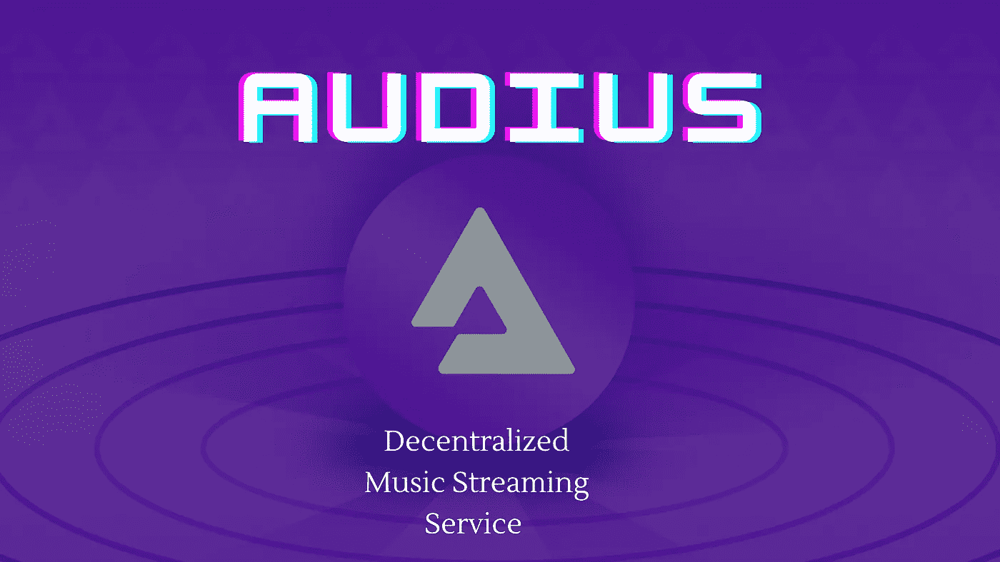

# AUDIUS——分散式音乐流媒体服务

> 原文：<https://medium.com/coinmonks/audius-a-decentralized-music-streaming-service-10cbfb2c3f7f?source=collection_archive---------18----------------------->

Audius

**简介**

随着区块链技术的应用不断扩展；在微观和宏观层面，人们只能预测区块链还能做多少。

对于一个价值 260 亿美元的音乐产业来说，期待区块链进入这个产业是很自然的。

区块链在音乐产业中的角色可以采取不同的形式，在音乐领域充分利用这项技术的方式是保持好奇和不断探索。

一个目前拥抱区块链技术全部频谱的音乐平台是[Audius](https://audius.org/)；一个分散的音乐流媒体服务。

**什么是奥迪斯？**

Audius 类似于传统的流媒体服务，只是这次它建立在区块链之上，支持去中心化；消除所有形式的集中/控制。该平台不仅旨在将艺人和粉丝直接联系起来，还探索了非传统艺术的可能性以及艺人和粉丝如何从中受益。

Audius 最初建立在支持互操作性的第 2 层 POA 网络上，后来将其内容管理系统转移到索拉纳区块链。

分散的音乐流媒体平台由分散的节点保护，允许 it 用户/验证者标记 Audius 平台的本机令牌 Audius。

在平台上存放音乐的 Audius 用户可以从他们上传的音乐中获得高达 90%的收入，而剩下的 10%则支付给平台的其他用户。这是对传统流媒体服务的一个改进，传统流媒体服务不会将流媒体总收入的很大一部分支付给创作者。通过去中心化，Audius 对于艺人跟踪他们的音乐记录也更加透明。

**音频令牌是做什么用的？**

[AUDIO](https://coinmarketcap.com/currencies/poa/) 是便于 Audius 上批量交易的原生令牌。尽管平台现在转移到了 Solana 网络，音频令牌仍然作为 ERC-20 令牌存在。奥迪斯目前的总供应量上限为 10 亿辆，最高供应量不详。

那些拥有音频令牌的用户通常可以访问平台上的专有服务。这是为了鼓励那些希望使用平台购买和持有令牌的人访问这些独家服务。

音频令牌也是用于运行 Audius DAO 的治理令牌。有了这个令牌，用户可以投票决定他们希望在平台上开展的活动。这将该平台放在一个社区运行的环境中。然后，社区因其在平台的分散治理中做出的贡献而获得奖励。

音频令牌有助于维护平台的安全性。类似于[利益证明](https://www.investopedia.com/terms/p/proof-stake-pos.asp#:~:text=our%20editorial%20policies-,What%20Is%20Proof%2Dof%2DStake%20(PoS)%3F,and%20keeping%20the%20database%20secure.)共识机制，那些有更高利益的人可能会让他们的节点验证平台上的交易。将他们的令牌放入保护平台的用户被音频令牌激励。

**期待什么**

随着区块链的采用进展，预计将出现更加分散的流媒体服务趋势。然而，区块链技术的应用不限于流服务。

在未来，我们可以看到区块链曾经编写智能合同，将音乐标签和艺人以及其他应用程序绑定在一起，从而改善不断增长的行业。

> 交易新手？试试[密码交易机器人](/coinmonks/crypto-trading-bot-c2ffce8acb2a)或[复制交易](/coinmonks/top-10-crypto-copy-trading-platforms-for-beginners-d0c37c7d698c)