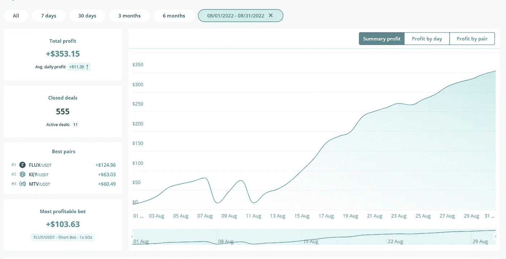
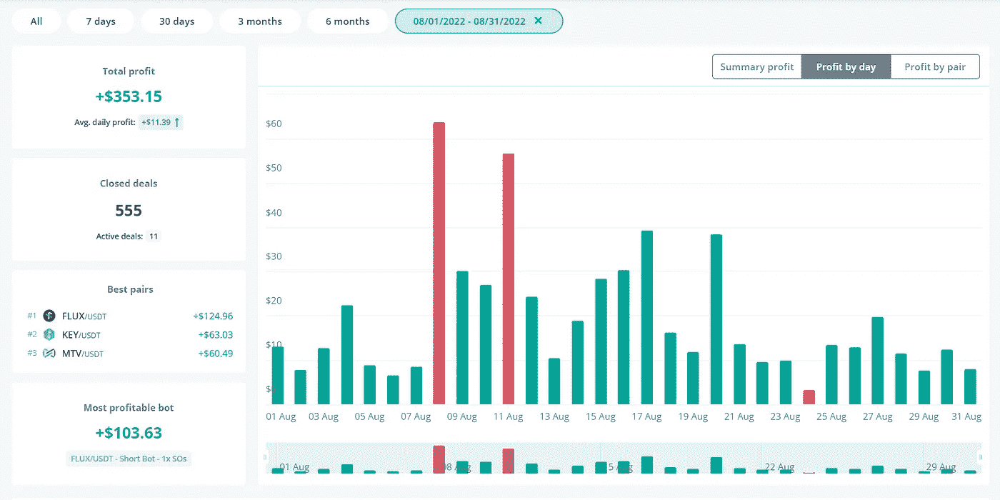
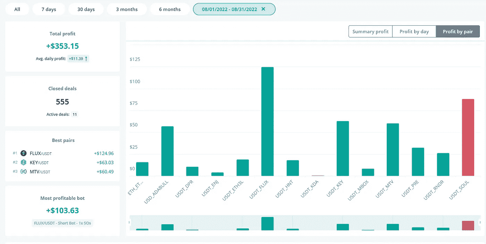

# 8 月:来自机器人、矿工和 Stepn 的 1078 美元被动收入！

> 原文：<https://medium.com/coinmonks/august-1-078-in-passive-income-from-bots-miners-stepn-2ab5779f8ea0?source=collection_archive---------4----------------------->

从我开始这个中型博客到现在已经 6 个月了。在此期间，该博客的浏览量超过 18，000 次，关注者超过 300 人，并且逐月快速增长。

我们这个月还取得了另一项成就，我们开设了 RealisticCrypto YouTube 频道，自从我发布第一个视频以来，我们已经看到了超过 1000 次观看和 25 个订户！如果你还没有检查出来，我会张贴一些定期 DCA 被动收入的更新，以及其他有关战略，机器人配置，矿工评论等内容！你可以在这里找到频道[。](https://bit.ly/3wFgowa)

那么，让我们进入被动收入更新。和往常一样，我会在下面留下前几个月的链接。

[4 月](/coinmonks/how-much-passive-income-have-i-made-with-my-crypto-miners-dca-bots-in-the-last-30-days-bcfb4c46a25a)——被动收入 705 美元

[5 月](/coinmonks/may-1-400-in-passive-income-from-bots-miners-a-couple-of-new-projects-3c824d798f7b)——1400 美元的被动收入

[6 月](/coinmonks/june-1-099-in-passive-income-from-bots-miners-stepn-feaa4cf9a276)——被动收入 1099 美元

[7 月](https://realisticcrypto.medium.com/july-417-in-passive-income-from-bots-miners-stepn-cb16e5e785df)——417 美元的被动收入

1.  **M2 职业矿工**

我有两个这样的矿工。这些矿工每人给我赚了 4，586 MXC，按目前的价格计算，总共相当于 664.60 美元。如果我把这些放在 ATH，这个月就会涨到 1224 美元！

自从我在 2 月底和 5 月初购买了这些矿工，我已经开采了 6000 美元投资中的 3100 美元，并支付了大约 6 美元的电费！

如果我等待 MXC 到达之前的 ATH 时卖出，我已经积累了 5681 美元，超过 90%的投资回报率。

完整评论&优惠 50 美元[此处](https://realisticcrypto.medium.com/my-highest-paying-2-electric-per-month-plug-play-crypto-miner-makes-me-around-12-per-day-per-375ccc604988)

**2。氦矿工**

这个月又是令人失望的一个月但是被动收益还是被动收益！

我有 2 个 Sensecap M1 氦矿工设置了 5.8dbi 无线天线。我有 1 个山猫 300 矿工，我已经在 8 月份设置，另一个山猫 300，我正在为一个新家工作-希望我们可以增加 HNT 的收入，一旦所有 4 个在线。

第一个赢得了 4.46 HNT，第二个赢得了 2.15 HNT，第三个赢得了 1.90 新台币，总计约 40.40 美元。

如果我等待 HNT 到达之前的 ATH 时卖出，这个月的总额将是 467 美元。

在投资方面，我在 miners & antennas 上花了大约 1700 美元，到目前为止，我总共赚了 31.15 HNT——今天的价格是 147.96 美元，或者以前的 ATH 是 1709.51 美元。

**3。Stepn**

在这方面没什么可更新的。我这个月只出去了 3 次，用一个 26 级的普通慢跑者产生了 116GST。按目前的价格，每月 4 美元。我当然会在九月份努力提高活动水平。

**4。DCA 机器人**

这个月我总共从 3 个普通机器人那里赚了 353.15 美元。上个月令人失望地亏损了 190 美元，因为我清算了我唯一的杠杆资产，这是 Bybit 上的一个 ETH bot。

我在这个月重新创建了所有的机器人，自从完成这项活动以来，已经有了一些坚实的进步。

我仅用于机器人的账户总价值为 5218 美元，因此这个月的利润约为 6.76%。

我写了一篇关于一些 ADABULL 设置的文章，这些设置每天净收益约为 1%(这里是)。这仍在 FTX 账户中运行，但经过 50 天的运行，我们确实有 200 美元的未实现损失。这项交易仍然开放，但这一损失将反映在九月更新。

我还为嘉手纳添加了一个新的机器人。在对一些设置进行回溯测试后，结果似乎相当不错，因此希望这将提高未来的利润数字。我额外投资了 575 美元来运营这个机器人。

我最近上传了一个视频到 YouTube，其中包括我的方法和技术，关于如何回测和查找 DCA 机器人的设置。它还包括免费使用所有工具的方法。视频可以在[这里](https://bit.ly/3czwJM8)找到。

我还计划在 YouTube 上报道更多关于我为什么选择做空策略的细节，以及这在下一轮牛市中意味着什么。

我的策略继续是积累和复合加密！

**5。SCPrime**

这是一个我非常看好的长期项目。一篇深入的文章可以在[这里](https://realisticcrypto.medium.com/scprime-long-term-investment-providing-your-own-storage-c2ab374c754a)找到。除了我赚了 23.6 SCP，没有更多的要说。按目前的价格是 5 美元，是上个月的两倍多。

**6。Hyfix.ai/Geodnet**

我们有一个新人！几周前我收到了这个矿工，但只是在周末才设法安装好。我现在正在做一些拆箱和设置视频，但我会在 YouTube 频道上报道更多关于这个矿工的内容。它已经上线 5 天了，已经赚了 225 GEOD，也就是 11.10 美元。

我支付了大约 500 美元的设备+运费+税，所以我们将在未来的更新和 YouTube 频道上继续关注这一点。

**总计**

M2 专业版——664.60 美元

氦气——40.40 美元

stepn——4 美元

DCA 机器人——353.15 美元

SCPrime——5 美元

hy fix/geod net——11.10 美元

**总计:1078.25 美元**

**总结**

比上个月好。在重新配置了所有的机器人后，我们看到了性能的提高。我们应该看到这种情况持续到整个九月，但我们可能会看到一些重大损失的阿达布尔机器人。

**附属链接**

更多优惠还可以在这里找到:【https://linktr.ee/RealisticCrypto】T4

还有，如果你想请我喝杯咖啡或者啤酒:) :

BTC—BC 1 qaxaq 2 q 9 js 89 gyzhr 0202 sxt 6 hgchprqjga 5 px

基于 ETH、BNB、AVAX、SOL 和 FTM 的令牌—0 x3b 7b 843d 8125 Fe 7 EBA 541 e 1d 751 a4 a 73 f 0 cfad 4c

**免责声明**

这不是财务建议，我不是财务顾问或会计或税务专家。这是我对帮助过我的软件工具的体验，以及我使用它们的经历。

我在本指南中使用了推荐链接。使用这些工具有助于以后的文章，所以如果你觉得这篇文章有用，并且想看看我提到的工具，请使用它们。我还会叫出你在哪里打折——双赢对吧？

> 交易新手？尝试[加密交易机器人](/coinmonks/crypto-trading-bot-c2ffce8acb2a)或[复制交易](/coinmonks/top-10-crypto-copy-trading-platforms-for-beginners-d0c37c7d698c)