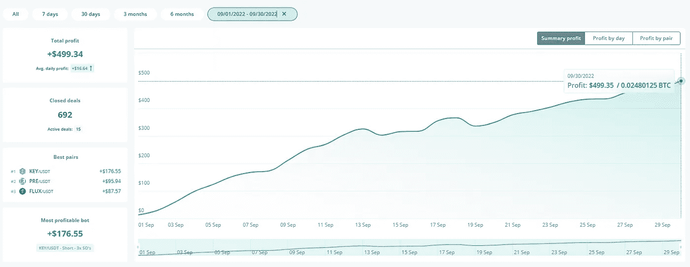
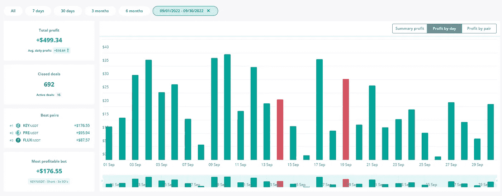
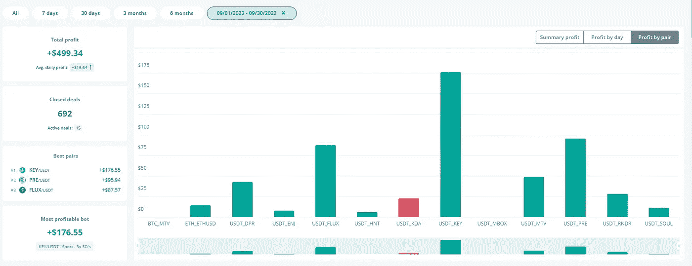
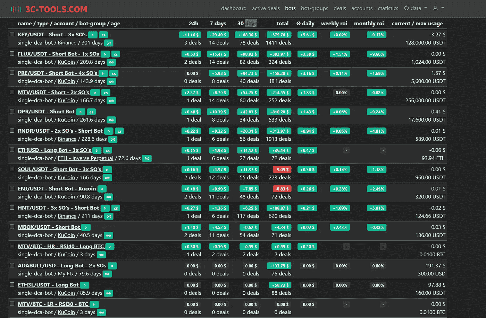
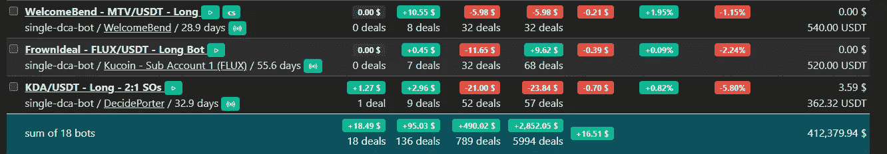

# 9 月:来自机器人、矿工和其他项目的 1130 美元被动收入！

> 原文：<https://medium.com/coinmonks/august-1-130-in-passive-income-from-bots-miners-other-projects-6a2826fd53bc?source=collection_archive---------0----------------------->

又一个月过去了。我们离圣诞节和 2022 年年底只有不到 3 个月了！我们已经在 YouTube 上呆了整整一个月了(尽管我需要更加稳定地发布内容！).你可以在这里找到频道[。](https://bit.ly/3wFgowa)

那么，让我们进入被动收入更新。和往常一样，我会在下面留下前几个月的链接。

[4 月](/coinmonks/how-much-passive-income-have-i-made-with-my-crypto-miners-dca-bots-in-the-last-30-days-bcfb4c46a25a)——被动收入 705 美元

[5 月](/coinmonks/may-1-400-in-passive-income-from-bots-miners-a-couple-of-new-projects-3c824d798f7b)——1400 美元的被动收入

[6 月](/coinmonks/june-1-099-in-passive-income-from-bots-miners-stepn-feaa4cf9a276)——被动收入 1099 美元

[7 月](https://realisticcrypto.medium.com/july-417-in-passive-income-from-bots-miners-stepn-cb16e5e785df)——417 美元的被动收入

[8 月](https://realisticcrypto.medium.com/august-1-078-in-passive-income-from-bots-miners-stepn-2ab5779f8ea0)——被动收入 1078 美元

首先要注意的是，上个月的停电和网络中断降低了所有矿商的盈利能力。氦气矿工受到的打击最大，因为自从互联网中断以来，矿工已经有几周没有在线了。今天是时候解决这个问题了！

1.  **M2 职业矿工**

我有两个这样的矿工。这些矿工每人给我赚了 3894 MXC，按目前的价格计算，总共相当于 539.57 美元。如果我把这些放在 ATH，这个月就会涨到 1040.11 美元！

自从我在 2 月底和 5 月初购买了这些矿工，我已经开采了 6000 美元投资中的 3529 美元，并支付了大约 7 美元的电费！

如果我等待并在 MXC 到达之前的 ATH 时卖出，我将总共积累 6，804 美元，这将在大约 6 个月内收回初始投资并为我带来超过 10%的利润。

完整评论&优惠 50 美元[此处](https://realisticcrypto.medium.com/my-highest-paying-2-electric-per-month-plug-play-crypto-miner-makes-me-around-12-per-day-per-375ccc604988)

**2。氦矿工**

又一个令人失望的月份但是被动收入还是被动收入！

我有 2 个 Sensecap M1 氦矿工设置了 5.8dbi 无线天线。我有 1 个山猫 300 矿工，我已经在 8 月份设置，另一个山猫 300，我正在为一个新家工作-希望我们可以增加 HNT 的收入，一旦所有 4 个在线。

第一个赢得了 3.60 HNT，第二个赢得了 0.6 HNT，第三个赢得了 1.49 HNT，总计约 30 美元。

如果我等待 HNT 到达之前的 ATH 时卖出，这个月的总额将是 317.79 美元。

在投资方面，我在 miners & antennas 上花了大约 1700 美元，到目前为止，我总共赚了 36.84 HNT——今天的价格是 189 美元，以前的 ATH 是 2021 美元。

**3。Stepn**

在这方面没什么可更新的。我把球鞋从 26 级升级到了 27 级。我九月份只出去过 4 次，产生了 123GST。按目前的价格，这个月是 3.20 美元。

**4。DCA 机器人**

这个月我总共从 3 个普通机器人那里赚了 499.34 美元。

这相当于每天大约 16.64 美元。

我仅用于机器人的账户的总价值是 6385 美元，因此这个月大约有 7.81%的利润。

这个月，我还会在下面附上显示每个机器人利润明细的截图。

请注意，上面截图中当前/最大使用量一栏中的金额并不准确，因为这些金额并不是所有情况下的 USDT 金额。

此外，数字也有变化，因为这反映了过去 30 天的情况，我在 10 月 1 日写这篇更新。

总的来说，这是相对稳定的一个月。我仍然有一些对 ADABULL & ETH3L 的大的未实现损失，我还没有关闭，所以这些将在即将到来的更新中反映出来。

总的来说，longs 机器人有点令人失望，我需要在整个月做一些调整和调整，但我认为这将运行得相对较好。

自从八月更新以来，我已经添加了一个新的机器人，这是一个 MTV 长机器人。这使用 USDT 积累更多的 MTV，然后我将复合到短机器人。我拨了 638 美元给机器人。

我将在未来几天制作一个 YouTube 视频，介绍我的理论以及为什么我同时运行长短机器人，所以如果你有兴趣详细了解这一点，一周后再来这里查看，或者在这里订阅 YouTube 频道。

十月份还有一个新的机器人是为 MTV/BTC 制作的，我会在下一次更新中详细介绍。

更多关于我对 DCA 机器人进行回溯测试和查找设置的方法和技术的信息可以在[这里](https://bit.ly/3czwJM8)找到。

我的策略继续是积累和复合加密！

**5。SCPrime**

这是一个我非常看好的长期项目。一篇深入的文章可以在这里找到虽然，这有点过时了——我将在未来几周内对其进行更新。

这个月我赚了 41.8 便士，约合 8.61 美元。这比上个月有了显著的增长。

在投资成本方面，我建立了自己的存储提供商，花费了我 1，000 美元(16TB)+450 美元的许可成本，因此我以大约 1，450 美元的价格购买了 SCPrime，回报为 140.21SCP，按今天的价格计算为 29 美元，按历史最高价格计算为 486.52 美元。

**6。Hyfix.ai/Geodnet**

这将是第一个完整的月份。我在八月底建立了这个矿工。我上个月承诺了一些拆箱和设置视频，我现在还在制作中，所以请继续关注。它已经上线一个月了，已经赚了 1130 GEOD，也就是 44 美元。

上个月，它在 5 天内制造了 225 个 GEOD，因此奖励大幅下降。这是因为他们增加了一种机制，以确保矿工向网络提供高质量的数据。这意味着该设备必须放置在室外，具有 360 度的天空视野。我的目前被阻挡了 180 度，我计划在我订购的 WeatherXM 设备到达后解决这个问题，因为它们将被安装在一起。

**7。庞氏节点**

前几个月我没有写过这些，因为这些风险极高，我不希望人们陷入其中的不可持续性。就第一个而言，他们将很快将所有“节点”转换为可交易并获得奖励的 NFT，第二个是众所周知的，我觉得大多数人都已经知道或参与其中。无论哪种方式，他们确实提供了一些被动收入，所以我会考虑把这些包括进来。如果你不太了解这些 ponzinomic 项目，那么请在参与之前做自己的研究。

第一个是 Avalanche chain 上的[VaporNodes](https://bit.ly/3Qok7VD)——今年年初，我最初向 vapor nodes 投资了大约 700 美元。我获得了大约 150 美元的利润，剩下大约 550 美元来收回我的投资。我目前每天的收入约为 1600 越南盾，按目前的价格计算，相当于每天 2.41 美元。

第二个是 BNB 连锁店的[Drip](https://bit.ly/3wYd67a)——几个月前我最初投资了 120 美元。我不时地(不是每天)复利。我目前每天挣大约 0.1 滴水，根据目前的价格，大约是 0.64 美元。

就这两个项目而言，我没有要求任何每日回报，我只是继续复合。

**8。预研节点奖励**

这是我在之前的更新中没有包括的另一个项目。关于这个项目的更多信息可以在这里找到。早在 6 月份，我就使用 2，000 PRE 设置了一个节点(这可以回收，它不像其他 DRIP/STRONG 类型的节点那样会浪费初始投资)。自从 6 月底设立这个项目以来，我已经在大约 3 个月的时间里赚了 230 英镑，按今天的价格计算是 14 美元。

就初始投资而言，我以每台 0.1 美元的价格购买了 2，000 台 PRE，因此总投资为 200 美元，外加 22 美元来托管一整年的节点。

**总计**

M2 专业版——539.57 美元

氦气——30 美元

stepn——3.20 美元

DCA 机器人——499.34 美元

黄金——8.61 美元

hy fix/geod net——44 美元

庞氏节点——0 美元(全部复利)

预搜索节点奖励——4.70 美元

**总计:1129.42 美元**

**总结**

比上个月好。在重新配置了所有的机器人后，我们看到了性能的提高。我们应该看到这种情况持续到整个九月，但我们可能会看到一些重大损失的阿达布尔机器人。

**附属链接**

更多优惠还可以在这里找到:[https://linktr.ee/RealisticCrypto](https://linktr.ee/RealisticCrypto)

还有，如果你想请我喝杯咖啡或者啤酒:) :

BTC—BC 1 qaxaq 2 q 9 js 89 gyzhr 0202 sxt 6 hgchprqjga 5 px

基于 ETH、BNB、AVAX、SOL 和 FTM 的令牌—0 x3b 7b 843d 8125 Fe 7 EBA 541 e 1d 751 a4 a 73 f 0 cfad 4c

**免责声明**

这不是财务建议，我不是财务顾问或会计或税务专家。这是我对帮助过我的软件工具的体验，以及我使用它们的经历。

我在本指南中使用了推荐链接。使用这些工具有助于以后的文章，所以如果你觉得这篇文章有用，并且想看看我提到的工具，请使用它们。我还会叫出你在哪里打折——双赢对吧？

> 交易新手？尝试[加密交易机器人](/coinmonks/crypto-trading-bot-c2ffce8acb2a)或[复制交易](/coinmonks/top-10-crypto-copy-trading-platforms-for-beginners-d0c37c7d698c)