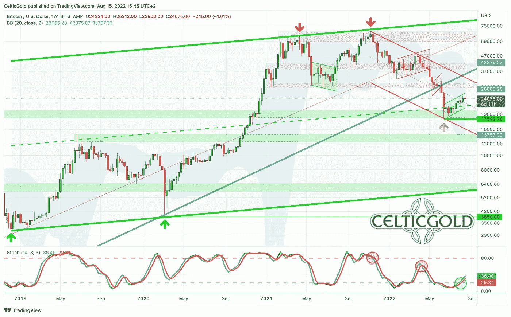
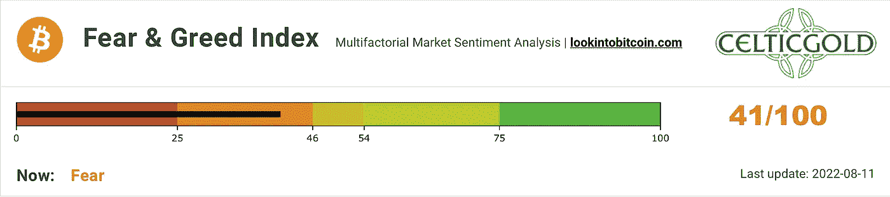
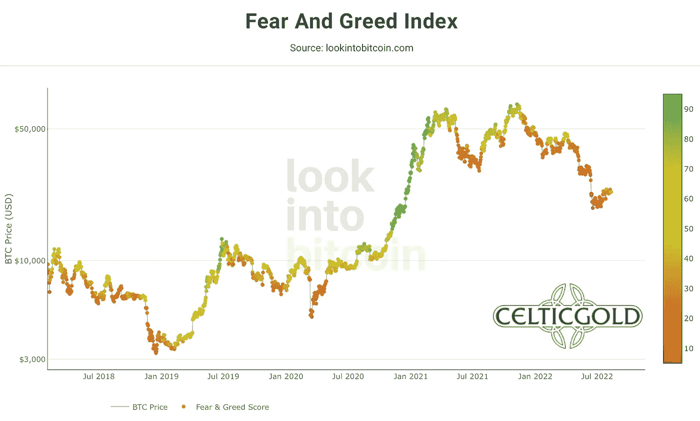
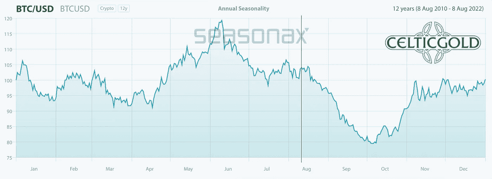
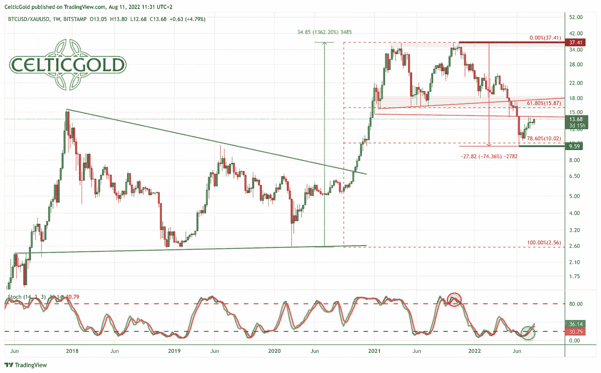
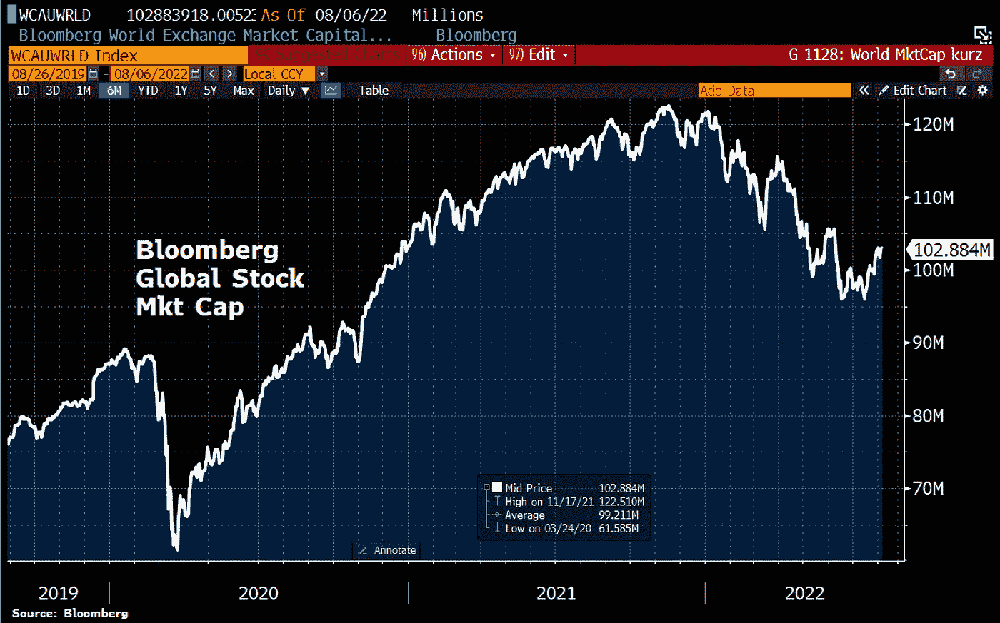
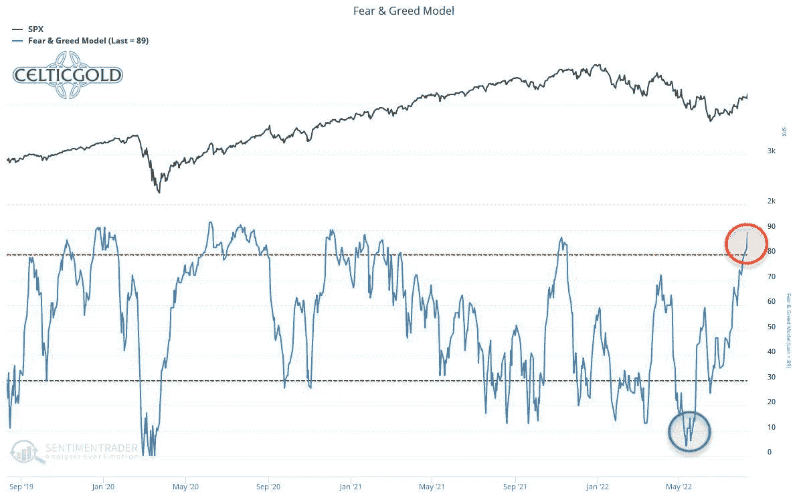
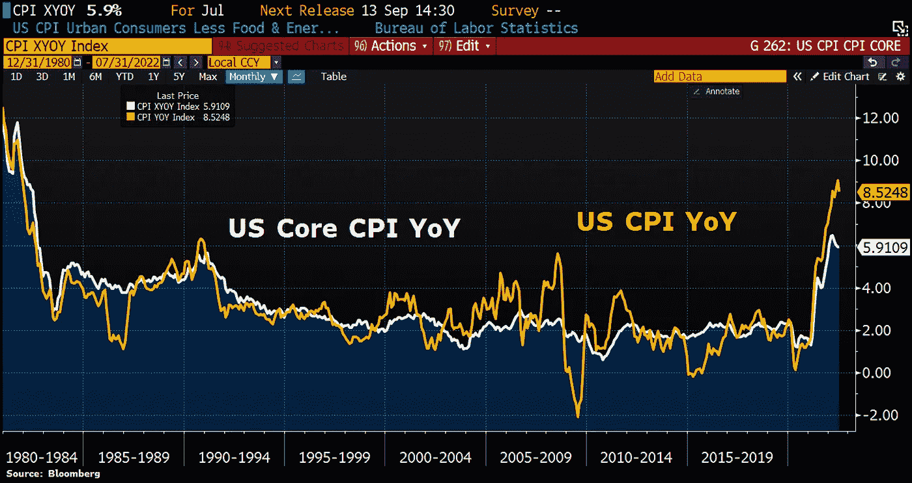

# 2022 年 8 月 15 日，比特币——复苏达到首个价格目标

> 原文：<https://medium.com/coinmonks/august-15th-2022-bitcoin-recovery-reaches-first-price-target-d6bc6eb6610f?source=collection_archive---------30----------------------->

过去几周，比特币开始复苏。就在两天前，比特币价格自 6 月 13 日以来首次收复 25000 美元水平。**比特币——复苏达到首个价格目标。**

## 回顾

自从我们分析 7 月 13 日([夏季救济集会？](https://www.midastouch-consulting.com/14072022-bitcoin-relief-rally-in-the-summer))，比特币明显复苏，在意料之中。在高峰时期，比特币价格在过去四周内上涨了近 33%，达到了自 6 月中旬崩盘以来的最高水平，价格约为 25212 美元。以太坊的表现甚至更强，同期上涨了近 102%。

然而，在过去的两周内，比特币一直在 22，500 美元至 24，500 美元之间平静地横向运行。与此同时，股票市场以及大多数商品价格在最近几周也有所回升。因此，金融市场总体上正在经历预期的夏季反弹。

由于金融市场长达一个月的严重调整，市场情绪在 6 月中旬达到了极端恐慌的程度，因此在最近的复苏过程中，参与者的看法现在有了显著改善。就其本身而言，这是既定熊市中的经典模式。然而，熊市是否以及如何回归，可能要到 9 月中旬才会明朗。

## 美元比特币的技术分析

**比特币周线图——带有买入信号的随机振荡器。**

*Bitcoin in USD, weekly chart as of August 15th, 2022\. Source:* [*Tradingview*](https://www.tradingview.com/?aff_id=1321)

在既定的下降通道内，自 2021 年 11 月达到 69，000 美元的历史高点以来，比特币最近能够恢复良好。从 17，600 美元左右的低点开始，比特币目前的交易价格上涨了近 37%。这种恢复导致了周线随机指标的买入信号。此外，在下降通道中，复苏浪潮也穿过了中期趋势线。因此，继续回升至 29，000 美元至 30，000 美元的机会相当大。

总的来说，周线图提供了第一个看涨信号。现在谈论可持续的趋势逆转和秘密冬天的结束还为时过早。然而，在任何情况下，经济复苏的持续似乎都是很有可能的，这也是人们更愿意看到的情景。

## 比特币日线图——200 日均线仍是复苏目标

*Bitcoin in USD, daily chart as of August 15th, 2022\. Source:* [*Tradingview*](https://www.tradingview.com/?aff_id=1321)

在日线图上，比特币价格已经达到我们的第一个价格目标，约为 25，000 美元。目前，比特币的交易价格略低于其布林带上轨(24，622 美元)。虽然这一阻力在最近几周受到了不同程度的攻击，但它并没有在每日的基础上释放出更多的上涨空间。虽然随机振荡器试图隐藏其积极的买入信号，但距离下跌的 200 日线(32，855 美元)的距离仍然很大。因此，在接下来的几周或几个月里，与这条均线的再次会合肯定会成功。

尽管如此，与五月初类似，平缓的上升趋势仍然可以被证明是一个熊市旗的形成。但即便如此，至少在短期内，更大的可能性还是指向上行。因此，25，000 美元以上的持续上涨可能会迫使做空，并导致 29，000 至 30，000 美元的快速上涨。

**综上，日图看涨。复苏仍有上升空间。下一个恢复目标是 30，000 美元关口和快速下跌的 200 天移动平均线。只有低于 22，000 美元，图片将大幅下降。**

## 情绪比特币——复苏达到首个价格目标

*Crypto Fear & Greed Index, as of August 11th, 2022\. Source:* [*Lookintobitcoin*](https://www.lookintobitcoin.com/charts/bitcoin-fear-and-greed-index/)

过去四周，隐秘的恐惧和贪婪指数显著回升。然而，它仍然衡量了一种相当可怕的情绪。在历时 7 个多月的残酷抛售之后，恐惧继续在加密领域蔓延。

*Crypto Fear & Greed Index long term, as of August 11th, 2022\. Source:* [*Lookintobitcoin*](https://www.lookintobitcoin.com/charts/bitcoin-fear-and-greed-index/)

从更大的角度来看，被打压的情绪也依然存在。这种格局蕴含着一些非常好的反向投资机会。

**总体而言，恐惧情绪继续提供反向买入信号。**

## 季节性比特币——复苏达到首个价格目标

*Seasonality for bitcoin, as of August 11th, 2022\. Source:* [*Seasonax*](https://app.seasonax.com/assets/btc-usd-cc?h=eJyrVkpUsjI2MtBRKipWslIyMjA0NDAxMlMC8lPBfCMjKL9SySo6VkcpV8nKUEcpBUwmlylZGdQCAP58Dzw%3D)

直到 9 月底或 10 月初，季节性因素仍然相当不利。特别是，9 月份传统上是股市疲软的月份。由于比特币和股市几个月来一直密切相关，因此疲软的季节性趋势可能会在 9 月份得到加强。然而，根据季节性模式，10 月份可能会看到加密行业新一轮上升趋势的开始。

鉴于 11 月 8 日美国将举行“中期选举”，金融市场的急剧下跌将对现任政府的留任产生非常不利的影响。因此，更有可能的是，9 月份金融市场只会出现温和回调。在美国大选之前，市场可能会从这些低点进一步复苏。

**总体而言，季节性因素仍需要耐心。从统计数字来看，情况要到 10 月中旬才会明显好转。然而，在短期内，夏季反弹仍有可能继续。**

## 健全的货币:比特币与黄金

*Bitcoin/Gold-Ratio as of August 15th, 2022.Source:* [*Tradingview*](https://www.tradingview.com/u/CelticGold/)

比特币/黄金比率从 9.59 的低点回升至目前的 13.5。目前，一个比特币的价格约为 24，000 美元，一金衡盎司的黄金约为 1，775 美元，你必须为一个比特币支付 13.5 盎司的黄金。换句话说，一金衡盎司黄金目前的价格约为 0.074 比特币。

总体而言，过去四周，比特币相对于黄金出现了反弹。上述大约 15 至 16 的恢复目标尚未达到，但现在已经在望。由于上涨，周线图上的随机指标激活了新的买入信号。如果该比值能够突破 14 左右的当前阻力，那么继续回升至 16.50 至 17.50 左右将是可以想象的。在这个区域，这个比率再次遇到强大的阻力。

## 合理货币的分配

一般来说，只有在平衡这两种资产类别的配置时，买卖比特币和黄金才有意义！一个人总资产的至少 10%到最多 25%应该投资于贵金属实物，而加密货币，尤其是比特币，应该至少持有 1%，但最多不超过 25%。5%.如果你对加密货币和比特币非常熟悉，你当然可以在个人基础上为比特币分配高得多的百分比。对于主要投资于股票和房地产的普通投资者来说，在仍然具有高度投机性和高度波动性的比特币中最多投资 5%是一个很好的指导方针！

> **“总的来说，你想拥有黄金和比特币，因为对立面是互补的。在我们阴阳、身与心、上与下、暖与冷的二元世界里，我们被必然的对立吸引所束缚。在这个意义上，你可以把黄金和比特币视为这样一对力量。由于黄金的实物稀缺性和比特币的数字稀缺性，你有了一个互补的硬资产单位，它将在 21 世纪成为真正的避风港。你想两者都拥有！”——**[**弗洛里安**](https://www.midastouch-consulting.com/about)

**总之，未来几周，比特币/黄金比率仍有很大机会继续回升，有利于比特币在大约 16.50 至 17.50 的方向上运行。**

## 宏观更新——夏季复苏不仅仅是熊市反弹？

*Global stock-market capitalization, as of August 6th, 2022\. ©*[*Holger Zschaepitz*](https://twitter.com/Schuldensuehner/status/1556272912260386816)

自 2021 年 11 月以来，股票和密码市场经历了几个月的巨大压力，现在已经开始了为期四周多的大范围复苏。在这个过程中，全球股票市场的市值增加了 4200 多亿美元，以科技股为主的纳斯达克综合指数从 6 月 16 日的低点上涨了 20%以上。根据定义，这将意味着熊市已经结束！

*Fear and Greed model, as of August 10th, 2022\. Source: Sentimentrader*

然而，最近的复苏带来了情绪的转变，大多数市场参与者现在对未来再次更加乐观。因此，恐惧&贪婪模型很快就从极度恐惧转变为极度贪婪，而“傻钱”也敢于再次进入市场。这是熊市反弹通常的转折点！

然而，鉴于目前的复苏势头，在 9 月份之前，市场长达一个月的下跌是否只是调整性的，或者市场是否真的处于一个主要的周期性熊市，可能都不会明朗。

无论如何，美联储资产负债表的大幅缩减只是在 9 月份才开始形成势头。从目前每月大约 100 亿到 300 亿美元的水平来看，每月将近 5000 亿美元将会消失。另一方面，11 月 8 日的中期选举可能会在各个方面提供大量财政刺激，以防止共和党取得压倒性胜利。

*ECB balance sheet, as of August 5th, 2022\. ©*[*Holger Zschaepitz*](https://twitter.com/Schuldensuehner/status/1557048761205022722)

欧元区央行的资产负债表也在收缩。上上周，欧洲央行宣布了六周内的第五次降息。总体而言，总资产进一步减少了 185 亿欧元，至 87，460 亿欧元，现在比历史最高水平低了近 900 亿欧元。

*U.S. inflation, as of August 10th, 2022\. ©*[*Holger Zschaepitz*](https://twitter.com/Schuldensuehner/status/1557349593683197959)

与此同时，越来越多的迹象表明，通胀可能已经见顶。例如，7 月份美国整体消费者价格同比上涨 8.5%，但环比持平。当然，这些都是修饰过的篮子，高位企稳主要是因为油价走弱。然而，股票市场对这些数据反应乐观。

总的来说，我们必须暂时继续假设当前的复苏仅仅是熊市反弹。尽管如此，美国的财政刺激措施至少可以在未来三个月部分稳定市场。但仍没有理由再次大幅增加对市场的敞口。

## 结论:比特币——复苏达到首个价格目标

我们假设一个“[夏季救济集会？](https://www.midastouch-consulting.com/14072022-bitcoin-relief-rally-in-the-summer)“四周前来得正是时候，因为比特币从那时起就能够上演一场重大的反弹。当时在 18，900 美元左右交易，而在 24，000 美元左右持有代表 27%的收益。同样，我们的第一个价格目标 25，000 美元已经达到。

虽然乐观情绪现在已经回到了股票市场，但在加密领域，恐惧和怀疑情绪仍然很高。因此，最痛苦的道路将继续在加密领域向上延伸。我们对比特币的下一个价格目标是 29，725 美元附近的 23.6%回撤。在 30，000 美元的心理价位，我们也预计在某个时候会与下跌的 200 天移动平均线重聚。然而，还不能宣布“隐秘的冬天”已经结束。

*分析主办，2022 年 8 月 11 日初版，作者*[*www . Celtic gold . eu*](https://celticgold.de/blog/gold-und-bitcoin-analysen-von-florian-grummes-32/bitcoin-erholung-erreicht-erstes-kursziel-186)*。翻译成英文，2022 年 8 月 15 日部分更新。*

*随时加入我们的* [*我们的免费电报频道*](https://www.midastouch-consulting.com/services/newsletter-telegram) *获取每日实时数据和一个伟大的社区。如果您喜欢定期了解我们的黄金模型、贵金属、商品和加密货币，您还可以订阅我们的* [*免费简讯*](http://bit.ly/1EUdt2K) *。*

*声明:本文及其内容仅供参考，不包含投资建议或推荐。每一次投资和交易都有风险，读者在做决定时应该进行自己的研究。此处表达的观点、想法、看法，均为作者个人观点。它们不一定反映或代表 Midas Touch Consulting 的观点和意见。*

> 交易新手？尝试[加密交易机器人](/coinmonks/crypto-trading-bot-c2ffce8acb2a)或[复制交易](/coinmonks/top-10-crypto-copy-trading-platforms-for-beginners-d0c37c7d698c)