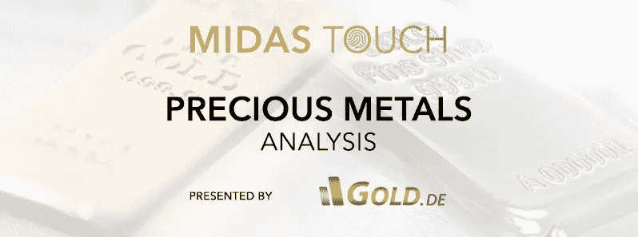
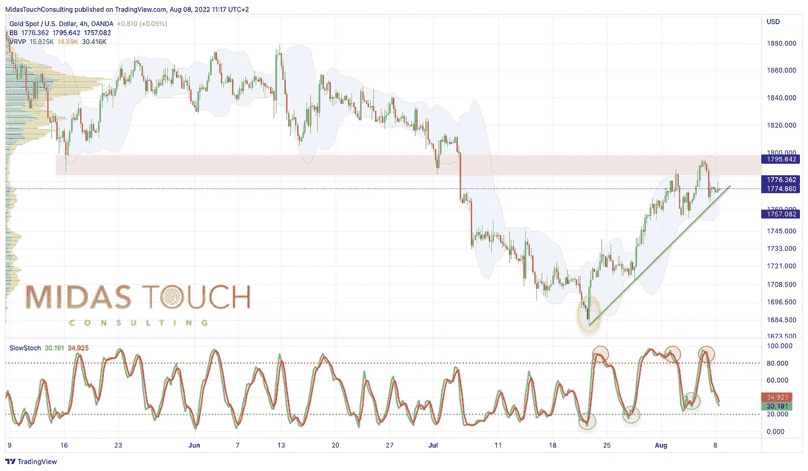
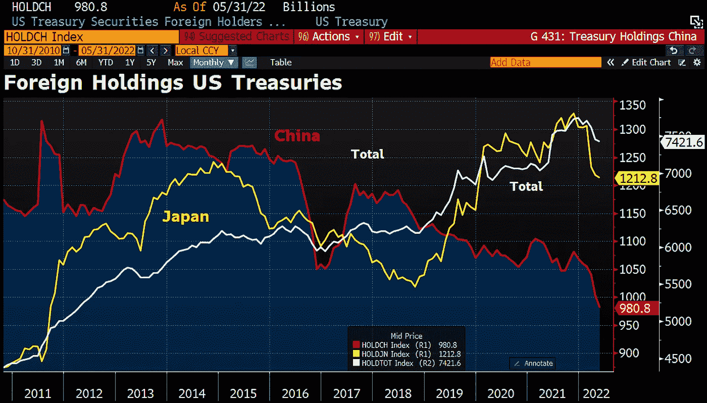
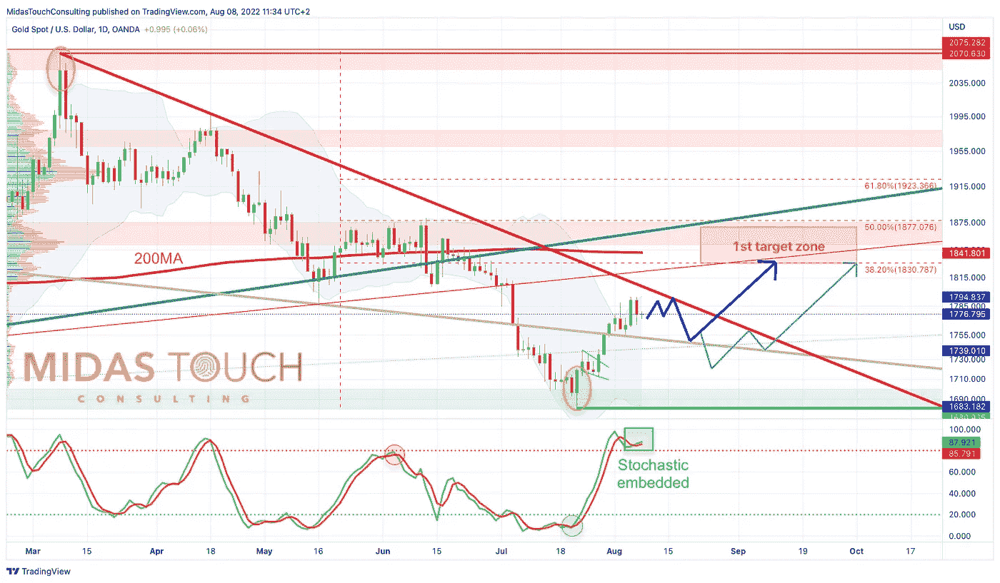

# 2022 年 8 月 8 日，黄金-夏季反弹以充满希望的势头开始

> 原文：<https://medium.com/coinmonks/august-8th-2022-gold-summer-rally-starts-with-promising-momentum-5177064f5507?source=collection_archive---------42----------------------->

在过去的四周里，从 7 月 8 日(T1 日)开始，金价基本上保持了我们的预期。最初，价格回落到 1，681 美元，但自 7 月 21 日以来，价格迅速而冲动地回升到 1，794 美元。**黄金——夏季反弹以充满希望的势头开始。**

*Gold in US-Dollar, 4-hour chart as of August 8th, 2022\. ©*[*Midas Touch Consulting*](https://www.tradingview.com/?aff_id=1321)

现在，黄金交易价格在 1775 美元左右，没有迹象表明复苏已经结束。相反，季节性窗口非常有希望，美中之间任何进一步的地缘政治紧张局势都可能在未来几周迅速加剧夏季反弹。总的来说，随着正在进行的仲夏复苏势头继续，金融市场也可能变得更倾向于风险，这也应该有助于金价。然而，在熊市反弹的背景下，股市的空气也会变得越来越稀薄。谨慎和高流动性头寸仍是当前的主流。

*Foreign holdings of U.S. Treasury securities as of August 2, 2022\. ©* [*Holger Zschäpitz*](https://twitter.com/Schuldensuehner/status/1554481106216517632)

从更大的角度来看，人们不得不承认黄金在这种艰难环境下的相对强势。鉴于美元的强势，金价可能会大幅回调。虽然美元是唯一大幅上涨的货币，类似于 2008 年的金融危机，但美元的强势同时也在侵蚀美元的储备地位。

虽然美国越来越多地使用美元作为政治武器来对付印度等“反叛”的新兴市场国家(印度正在用卢比和卢布购买俄罗斯的石油)，但中国近年来一直在减持美国债券。总而言之，世界上越来越多的国家希望尽快摆脱美元的束缚。然而，一种被所有人接受的替代储备货币(还)不存在。因此，黄金迟早会成为国际货币体系重新调整过程中最重要的锚。

## 紧缩政策体制没有改变

与此同时，市场正试图猜测美联储和其他主要央行何时将被迫放弃他们的紧缩政策。除非出现问题，无论是通胀还是金融体系的关键部分，否则央行政策的重大变化目前是不可预见的。

## 以美元计算的黄金价格日线图——至少朝着 200 天移动平均线恢复

*Gold in US-Dollar, daily chart as of August 8th, 2022\. ©*[*Midas Touch Consulting*](https://www.tradingview.com/?aff_id=1321)

在经历了四个半月的下滑后，黄金价格跌至 1，681 美元的低点，这与去年的三重底部(1，678 美元)相吻合。从那时起，价格开始冲动地回升，并在 11 个交易日内迅速上涨 113 美元或 6.7%。在 1，785 和 1，795 美元之间，黄金多头遇到了阻力区。

幸运的是，随机振荡指标已经转变为日线图上的超级看涨“嵌入状态”。因此，新的上升趋势被锁定，夏季反弹可能直接获得进一步的动力。尽管有短期盘整，但未来几周现实的最低目标是 200 天移动平均线(1，841 美元)。

或者，黄金价格可能首先需要喘口气，以便为持续的复苏获得力量。要么价格将在 1，790 美元至 1，750 美元之间横盘整理，要么价格将进一步回调至 1，720 美元至 1，705 美元。然而，这种深度回调的可能性相当低。

## 结论:黄金-夏季反弹以充满希望的势头开始

总之，黄金市场的价格走势是有希望的。血腥阶段以 1681 美元的最终低点结束，黄金开始进入今年最好的两个月。直到 9 月底甚至 10 月中旬，季节性对贵金属非常有利。结合周线图上新的买入信号，上升趋势应该大约。接下来两个月跑步。第一个价格目标是 1830 美元至 1855 美元之间的 200 天移动平均线。

## 下一次购买机会仅低于 1，700 欧元

根据我们四周前提到的 1，675 欧元的购买限额，我们可以在 7 月 19 日至 7 月 21 日之间以最低价格添加黄金。目前，黄金交易价格约为 1，740 欧元，没有理由追逐当前价格。下一个合理的买入机会只有在金价低于 1700 欧元时才会再次出现。

*分析最初发表于 2022 年 8 月 5 日，作者*[*www . gold . de*](https://www.gold.de/artikel/gold-sommerrally-startet-mit-vielversprechendem-momentum/)*。翻译成英文，2022 年 8 月 8 日部分更新。*

*随时加入我们的* [*我们的免费电报频道*](https://t.me/MidasTouchConsulting) *获取每日实时数据和一个伟大的社区。如果您喜欢获得我们的黄金模型、贵金属和加密货币的定期更新，您还可以订阅我们的* [*免费简讯*](http://bit.ly/1EUdt2K) *。*

*声明:本文及其内容仅供参考，不包含投资建议或推荐。每一次投资和交易都有风险，读者在做决定时应该进行自己的研究。此处表达的观点、想法和意见仅属于作者个人。它们不一定反映或代表 Midas Touch Consulting 的观点和意见。*

> 加入 Coinmonks [电报频道](https://t.me/coincodecap)和 [Youtube 频道](https://www.youtube.com/c/coinmonks/videos)了解加密交易和投资

# 另外，阅读

*   [瓦济里克斯 NFT 评论](https://coincodecap.com/wazirx-nft-review)|[Bitsgap vs Pionex](https://coincodecap.com/bitsgap-vs-pionex)|[Tangem 评论](https://coincodecap.com/tangem-wallet-review)
*   [如何使用 Solidity 在以太坊上创建 DApp？](https://coincodecap.com/create-a-dapp-on-ethereum-using-solidity)
*   [加密交易机器人](/coinmonks/crypto-trading-bot-c2ffce8acb2a) | [OKEx vs 币安](https://coincodecap.com/okex-vs-binance)
*   [币安 vs FTX](https://coincodecap.com/binance-vs-ftx) | [最佳(SOL)索拉纳钱包](https://coincodecap.com/solana-wallets)
*   如何在 Uniswap 上交换加密？ | [A-Ads 评论](https://coincodecap.com/a-ads-review)