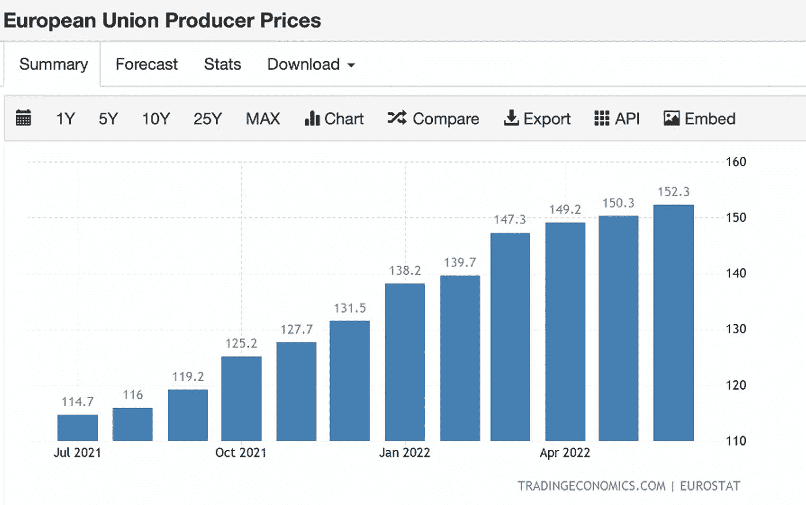
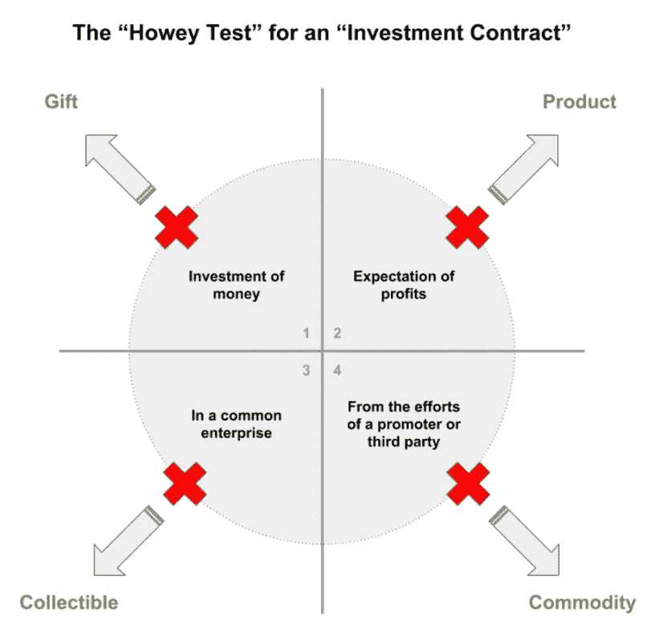

# 八月概览

> 原文：<https://medium.com/coinmonks/august-overview-15ca769798af?source=collection_archive---------7----------------------->

## *数字资产世界每月简报*

> 文章作者 [Sixte CP](https://www.linkedin.com/in/sixte-c-a72b47173/) 和 [Lesia M](https://twitter.com/LesiaMrch)

*   **宏观环境** - *美联储&衰退
    -欧洲*
*   **监管者**
    *——美国财政部禁止龙卷风现金
    ——AVAX 诽谤，SEC 对非战俘区块链的反感以及合并*
*   **加密顶尖高手** *——合并交易*
*   **JKL 矿业**
*   **金融机构**
*   **公司**

# **宏观环境**

## **美联储&衰退**

每个人最关心的是美联储的紧缩政策是否会导致长期衰退。

从技术上看，GDP(第二季度年化下降 0.6%)显示美国经济连续两个季度负增长。相反，美国其他关键增长指标暗示了健康的经济环境(第二季度 GDI 增长 1.4%；工资增长虽然在放缓，但仍然是正数；个人消费继续扩大)。

这件事的最终决定权属于美国国家经济研究局(NBER)的商业周期测定委员会，该委员会计算季度 GDP 和 GNI 的平均值，以表明经济衰退。鉴于这两项指标的平均值今年仍为正值，到目前为止，衰退预测已被正式拒绝。

维基百科对衰退的定义是:

*在美国，美国国家经济研究局(NBER)将衰退定义为“整个市场经济活动的显著下降，持续数月以上，通常可见于实际国内生产总值、实际收入、就业、工业生产和批发零售”。*

## **欧洲**

欧盟的 PPI 和 CPI 数据今年持续增长，超出预期，引发了人们对全球通胀的担忧。

8 月 19 日，德国生产者价格指数在市场上引发了灾难，尤其严重地打击了风险资产。BTC 在一天内大幅下跌超过 10%;ETH 下跌 12.9%；8 月 19 日，标准普尔 500 指数下跌 1.29%。

在美国消费者价格指数 7 月份放缓后，受抑制的通胀开始得到消化。然而，最新的德国印刷显示救济为时过早。德国 PPI 公告表明两件事:(1)美国美联储将联邦基金利率上调 75 个基点的可能性增加(2)风险资产进一步逆风。

# **监管机构**

## **AVAX 诽谤，SEC 对非战俘区块链的反感以及合并**

在 8 月 26 日至 29 日期间，AVAX 损失了 30%的价值，而比特币价格仅下跌了 8.5%。雪崩背后的团队艾娃实验室被指控在一系列匿名自称的告密者的泄露中有不道德的竞争行为。根据他们的调查，艾娃实验室正在雇用罗氏弗里德曼律师事务所，起诉像索拉纳这样的竞争对手，目的是将他们置于美国证券交易委员会的审查之下，并让监管机构的眼睛远离雪崩。

虽然这种阴谋论应该谨慎对待，但有一点是肯定的:SEC 正在积极尝试监管加密货币生态系统。它的主要重点是识别加密货币，这些货币应该作为证券而不是公用令牌进行监管。为了做到这一点，美国证券交易委员会使用了下面描述的豪威测试:

前 3 个标准几乎适用于所有加密货币。然而，豪威测试的第四项评估——由第三方产生的投资回报——并不一定适用于所有加密货币。如果加密货币足够分散，它就不应该受到 SEC 的审查。SEC 从未明确确定去中心化的程度足以忽略加密货币的安全性。

美国证券交易委员会(SEC)和加密货币在安全分类问题上发生冲突的最显著例子是正在进行的 Ripple 审判。2020 年 12 月，美国证券交易委员会起诉 Ripple 创始人克里斯·拉森和布拉德·加林豪斯非法出售 XRP 代币。根据美国证券交易委员会的规定，XRP 代币是一种需要授权才能向公众发行的证券。一方面，证交会声称，拉森和加林豪斯将 XRP 代币作为一种证券进行营销，使他们成为承诺预期利润的可识别方。另一方面，Ripple founders 的案例表明，XRP 足够分散，可以被归类为一种商品或货币。被证交会起诉不是一个积极的前景。当美国证交会对 Ripple 创始人提起诉讼时，XRP 普莱斯受到了明显压制，一个月内市值蒸发了近 70%。XRP 的例子并不是唯一的一个，许多其他加密货币都在 SEC 的监控之下。

上月底，美国证交会对一名比特币基地员工提起诉讼，指控其在 25 日即将上市的加密货币上进行内幕交易。在这份文件中，SEC 官员将 25 种加密货币中的 9 种归类为证券:AMP，RLY，DDX，XYO，RGT，LCX，POWR，DFX 和 KROM。他们都有什么共同点？它们都受到非战俘共识机制的保护。

2018 年，在金融科技周会议上，美国证券交易委员会(SEC)前企业财务总监比尔·希曼(Bill Hinman)发表了一段著名的言论，称以太坊不能被视为一种证券，因为它具有高度的去中心化。要实现这一说法，交易员应该考虑合并对 ETH 去中心化的影响，以分析这种轻率行为在多大程度上是可以想象的。

随着以太坊逐渐远离 PoW，任何超过 32 ETH 的人都会成为网络的验证者。正如 Mining Disrupt 会议小组经常重复的那样，能源消耗是去中心化的方式，而不是结果。以太坊的新共识机制将通过促进网络接管来推动集中化。

积累股权比扩大开采能力要简单得多。例如，2017 年，包括主要交易所在内的 58 家主要参与者希望通过增加块大小来提高比特币在链上的可扩展性。这项名为纽约协议的倡议没有推进，因为大多数比特币节点拒绝了这项提议。根据可伸缩性三元悖论，增加每秒事务会影响安全性和去中心化。如果比特币是一个 PoS 区块链，这 58 家机构就会购买必要的 BTC 股份来推进他们的提议。以太坊在 9 月份向 PoS 的过渡是对去中心化的危险押注，可能会吸引监管者的目光。当批判性地分析广泛覆盖的“翻转”趋势时，应考虑潜在监管审查的负面价格影响。

## **美国财政部禁止龙卷风现金**

今年 3 月，与 Axie Infinity 相关的区块链 Ronin 被黑客攻击了 6.25 亿美元。这是密码史上最大的黑客攻击。据美国财政部称，朝鲜官方黑客组织 Lazarus Group 对此次攻击负责。黑客入侵后，被盗资金被存入龙卷风现金，以消除所有痕迹。根据 Nansen 的说法，在 Ronin hack 之后，ETH 在 Tornado 的存款几乎翻了一番。平台上所有 ETH 的 18%是浪人黑客存入的。

Tornado Cash 打破了交易双方之间的链上联系，使资金所有者匿名。为了限制加密攻击和促进资金回收，外国资产控制办公室(OFAC)将 Tornado Cash 添加到黑名单中。所有美国个人现在被禁止与龙卷风现金智能合同互动，否则可能面临刑事指控。美国监管机构对加密混合服务的打击始于 5 月。美国财政部禁止了 Blender.io，据推测朝鲜黑客在 Ronin 攻击中也使用了它。从技术上讲，龙卷风现金仍然可用。因为服务是分散的，所以不能关闭。尽管如此，美国的制裁在一个存款下降近 80%的鬼城变成了龙卷风现金。该平台的 Git 中心和网站已被关闭，其不和谐的内容已被删除。

## **进一步阅读**

> 阿联酋打击地下房地产洗钱([阅读更多](https://www.coindesk.com/policy/2022/08/08/uae-to-clamp-down-on-crypto-real-estate-money-laundering/))
> 
> 荷兰逮捕涉嫌龙卷风现金开发商([阅读更多](https://www.coindesk.com/policy/2022/08/12/netherlands-arrests-suspected-tornado-cash-developer/))
> 
> 南韩国税务当局称加密空投要缴纳赠与税([阅读更多](https://forkast.news/headlines/s-korea-crypto-airdrops-subject-gift-tax/)

# **加密项目**

## **合并交易**

合并迫在眉睫，是每个人的头等大事。关于进度需要了解的几件事:

-在采矿社区中有一个硬分叉主要以太坊链的运动，保持现有的 PoW 共识机制活着。著名矿工钱德勒·郭正在领导这一进程。合并后，ETH 2.0 令牌以及 ETHW (PoW)都将可用。许多交易所已经自愿为 hard fork 支持者提供一个互换版本。然而，市场参与者在很大程度上对 hard fork 的长期成功持怀疑态度，并警告 ETH 持有者在过渡期要小心骗局。

-市场目前暗示 ETH PoW 的定价约为 30 美元，约为 ETH 市值的 1.5%。

-市场参与者仅在持有现货 ETH 的情况下获得 ETH 权力，而在持有 ETH 期货的情况下则什么也得不到。典型的交易是买入现货，卖出期货。由于合并日期的不确定性，ETH 持有人一直在出售 9 月和 12 月的期货合约。

-分叉还造成了 DeFi borrow 市场的扭曲，市场参与者借入 ETH 以获得 ETH PoW。只要支付的借款利率低于获得的 ETH PoW 的价值，借入更多资金就有利可图，从而进一步推高借款利率。

## **进一步阅读**

> 元宇宙房地产泡沫破裂？由于兴趣减弱，虚拟土地价格暴跌 85%
> 
> 维塔利科·布特林说，脸书的元宇宙将会“失败”

# **JKL 矿业**

在上个月的 Mining Disrupt 大会上，JKL Mining 宣布在美国德克萨斯州启动该集团的首个采矿设施。我们的数据中心目前的电力容量为 35MW，可容纳 10，000 多名矿工。

JKL 集团已经成为一家机构数字资产管理公司。其金融部门——JKL Capital——在多个业务领域广泛多元化:场外交易、资产管理、贷款和风险投资。

***那么集团新的矿业业务如何补充已有的财务运作，反之亦然？***

“JKL Capital 和 JKL Mining 之间有明显的协同效应。JKL Capital 的客户包括加密矿工、投资者、贷款人和借款人。有了 JKL 矿业公司，我们的直接客户是我们接待的矿工，他们可能需要融资或管理他们的资产。另一方面，我们有一个对比特币挖矿感兴趣的机构投资者网络”，JKL 集团挖矿主管杨晓西评论道。

目前，JKL Mining 仅作为托管提供商运营，向比特币矿工和垂直整合的矿业公司提供数据中心设施。然而，我们 2022 年的扩张计划包括再建 4 座总发电能力为 82MW 的采矿设施，分为托管和自采两部分。

# **金融机构**

> 加密贷款机构 Hodlnaut 以市场条件为由冻结提款
> 
> 在印度公司创始人表示 WazirX 链外转账重新开始几小时后，币安表示将取消这些交易
> 
> 由于市场低迷，银河数码在 Q2 的净亏损增加了两倍多，达到 5.547 亿美元
> 
> MakerDAO 向 Huntingdon Valley Bank 提供 1 亿美元的 DAI 贷款，首次将 btw defi 协议与传统银行相结合([阅读更多信息](https://blockworks.co/makerdao-opens-100m-dai-loan-to-huntingdon-valley-bank/?utm_source=Sailthru&utm_medium=email&utm_campaign=Daily%20NL%20Tuesday%208.23.22&utm_term=Daily%20Newsletter))
> 
> NFT 本岛银行出现挤兑，试图避免另一场流动性危机
> 
> 银河数码、BitGo 因 12 亿美元的加密交易破裂而争吵
> 
> 贝莱德凭借比特币私人信托进军加密市场([阅读更多](https://www.ft.com/content/0948f1a9-ad0b-4126-9ae8-5ce4e212c07e)
> 
> 巴西支付应用 PicPay 与 Paxos ( [阅读更多](https://cointelegraph.com/news/brazilian-payment-app-picpay-launches-crypto-exchange-with-paxos))推出加密交换

# **公司**

> 包括耐克、古驰在内的标志性品牌从 NFT 销售额中获利 2 . 6 亿美元
> 
> 比特币大牛迈克尔·塞勒辞去微软首席执行官( [阅读更多](https://www.fool.com/the-ascent/cryptocurrency/articles/bitcoin-bull-michael-saylor-resigns-as-microstrategy-ceo/))

## **免责声明**

*本材料严格保密，仅供专业投资者(根据开曼群岛金融管理局不时的定义)使用。未经 JKL Digital Capital Limited(“JKL”)的书面同意，不得出于任何目的复制、重新分发、传递给任何其他人或出版全部或部分内容。虽然本材料中包含的信息是从据信可靠的来源汇编的，但 JKL 不代表或保证本材料中包含的信息的准确性、完整性或可靠性。*

本材料的内容尚未经过任何监管机构的审核。建议您对本材料的内容保持谨慎。如果您对本材料的任何内容有任何疑问，您应该获得独立的专业意见。JKL 或其任何关联公司，或其任何或其各自的董事、高级职员、员工和代表都不会对因使用或依赖本材料中包含的任何信息而导致的任何直接、间接或后果性损失承担任何责任或义务。本材料不构成认购或购买任何金融产品的要约或邀请。其目的不是提供任何信贷或其他评估的基础，也不应被视为购买任何金融产品的建议。

­

## 联系我们

电子邮箱:ir@jkl.group
网站: [www.jkl.group](http://www.jkl.group)

> 交易新手？试试[密码交易机器人](/coinmonks/crypto-trading-bot-c2ffce8acb2a)或者[拷贝交易](/coinmonks/top-10-crypto-copy-trading-platforms-for-beginners-d0c37c7d698c)