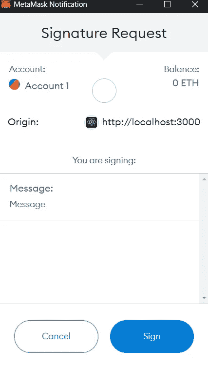
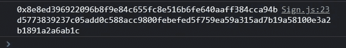

# 使用 ethers.js 验证用户

> 原文：<https://medium.com/coinmonks/authenticating-users-with-ethers-js-4395506dcf3c?source=collection_archive---------2----------------------->


Photo by [Markus Spiske](https://unsplash.com/@markusspiske?utm_source=unsplash&utm_medium=referral&utm_content=creditCopyText) on [Unsplash](https://unsplash.com/s/photos/authentication?utm_source=unsplash&utm_medium=referral&utm_content=creditCopyText)

使用 ethers.js 和 MetaMask 之类的钱包来验证用户是很简单的。这个想法是创建一个消息来标识想要认证用户的应用程序，并发送这个消息由钱包签名，钱包保存它的私钥。

> 交易新手？试试[加密交易机器人](/coinmonks/crypto-trading-bot-c2ffce8acb2a)或者[复制交易](/coinmonks/top-10-crypto-copy-trading-platforms-for-beginners-d0c37c7d698c)

签名必须发送到后端，后端有消息的副本。它将检索签署消息的地址，从而识别用户。

让我们在代码中看到这一点。以下 3 行代码应该足以生成消息签名:

```
const provider = new ethers.providers.Web3Provider(window.ethereum)     const signer = provider.getSigner()     
const signedMessage = await signer.signMessage("Message")
```

消息“message”必须替换为包含应用程序名称的字符串，最好还包含当前日期。这是为了防止签名被重复使用。

上面的代码将调用 wallet，如下图所示:



签名后，可以使用*console . log(signed message)*查看签名，如下图所示:



这是必须发送到后端的签名，在后端，可以使用另一个 ether.js 方法轻松检索签署消息的地址:

```
const signerAddr = await ethers.utils.verifyMessage("Message", signedMessage)
```

通过这种确认，可以为已经通过身份验证的用户创建一个临时会话。

**感谢阅读！**