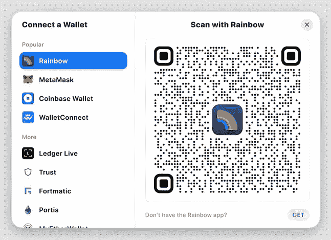
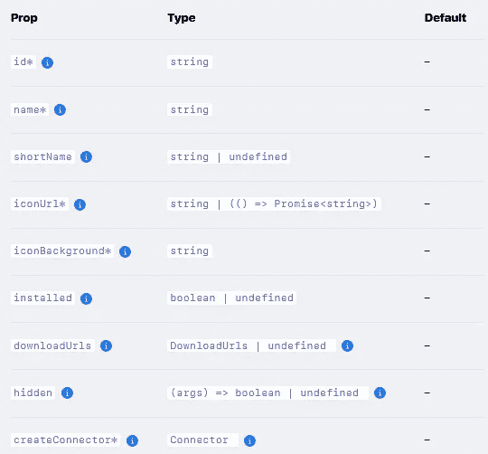
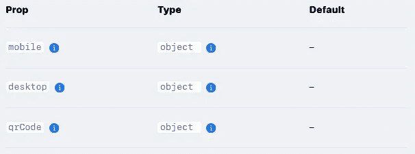
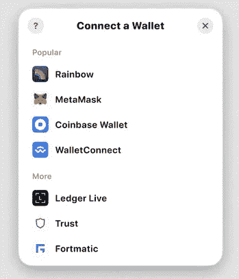

# 在 CSC Dapp 上使用 RainbowKit 进行身份验证-第 2 部分

> 原文：<https://medium.com/coinmonks/authentication-using-rainbowkit-on-csc-dapp-part2-e171a4a2c127?source=collection_archive---------14----------------------->

身份验证是 dapp 开发中最重要的部分之一，RainbowKit 是将钱包连接到 dapp 的最佳方式之一！

在本教程中，我们想介绍 RainbowKit，并打算在我们的 Dapp 中实现 RainbowKit。



## 定制链

您可以使用`Chain`类型来帮助您创建自定义链。然后，将其传递给`[configureChains](https://wagmi.sh/docs/providers/configuring-chains)` [函数](https://wagmi.sh/docs/providers/configuring-chains)。

例如，下面是我们要添加的 coinex 智能链网络:

```
import { Chain, getDefaultWallets } from '@rainbow-me/rainbowkit';import {
  chain,
  configureChains,
  createClient,
  WagmiConfig,
} from 'wagmi';import { jsonRpcProvider } from 'wagmi/providers/jsonRpc';const CSC: Chain = {id: 52,name:'**Coinex Smart Chain**',network: '**CSC**',iconUrl: 'https://example.com/CSC.svg',iconBackground: '#fff',nativeCurrency: {decimals: 18,name: 'CET',symbol: 'CET',},rpcUrls: {default: '**https://rpc.coinex.net'**,},blockExplorers: {default: { name: 'SnowTrace', url: 'https://coinex.net' }},testnet: false,};const { provider, chains } = configureChains([CSC],[jsonRpcProvider({ rpc: chain => ({ http: chain.rpcUrls.default }) })]);const { connectors } = getDefaultWallets({appName: 'My CSC RainbowKit App',chains,});const wagmiClient = createClient({autoConnect: true,connectors,provider,});const App = () => {return (<WagmiConfig client={wagmiClient}><RainbowKitProvider chains={chains}><YourApp /></RainbowKitProvider></WagmiConfig>);};
```

## 自定义钱包和钱包列表

提供了`Wallet`函数类型来帮助您定义自己的自定义钱包。可以在`Wallet`函数的返回值上配置以下属性:



[https://www.rainbowkit.com/docs/custom-wallets](https://www.rainbowkit.com/docs/custom-wallets)

注意:这个 API 是不稳定的，可能会在不久的将来改变。随着时间的推移，我们将增加更多内置钱包。

以下属性是在`createConnector`函数的返回值上定义的。



[https://www.rainbowkit.com/docs/custom-wallets](https://www.rainbowkit.com/docs/custom-wallets)

例如，要使用 WalletConnect 创建自定义钱包:

```
import {
  Chain,
  Wallet,
  getWalletConnectConnector,
} from '@rainbow-me/rainbowkit';export interface MyWalletOptions {chains: Chain[];}export const rainbow = ({ chains }: MyWalletOptions): Wallet => ({id: '**ViaWallet**',name: '**ViaWallet**',iconUrl: '**https://viawallet.com**',iconBackground: '#0c2f78',downloadUrls: {android: '[https://download.viabtc.net/viawallet_3.2.3.apk](https://download.viabtc.net/viawallet_3.2.3.apk)',ios: '[https://itunes.apple.com/us/app/viawallet/id1462031389](https://itunes.apple.com/us/app/viawallet/id1462031389)',qrCode: '[https://viawallet.com/](https://viawallet.com/)',},createConnector: () => {const connector = getWalletConnectConnector({ chains });return {connector,mobile: {getUri: async () => {const { uri } = (await connector.getProvider()).connector;return uri;},},qrCode: {getUri: async () =>(await connector.getProvider()).connector.uri,instructions: {learnMoreUrl: '[https://viawallet.com/](https://viawallet.com/)',steps: [{description:'We recommend putting My Wallet on your home screen for faster access to your wallet.',step: 'install',title: 'Open the My Wallet app',},{description:'After you scan, a connection prompt will appear for you to connect your wallet.',step: 'scan',title: 'Tap the scan button',},],},},};},});
```

我们还可以添加其他流行的钱包:

## 普通钱包

以下钱包适用于一般连接方法，而非特定应用。因此，建议总是包括这些钱包。

## WalletConnect

这是一个后备钱包选项，专为列表中其他钱包未提供的基于钱包连接的钱包而设计。

建议您始终将此钱包包括在列表中，以确保支持所有基于 WalletConnect 的钱包。

```
import { wallet } from '@rainbow-me/rainbowkit';wallet.walletConnect(options: {chains: Chain[];});
```

## 注入钱包

这是一个后备钱包选项，专为列表中的另一个钱包没有提供`window.ethereum`的情况而设计。当不需要回退或没有注入的钱包可用时，该钱包将自动从列表中隐藏自己。

**建议您始终将此钱包包括在列表中，以确保支持所有注入的钱包。**

```
import { wallet } from '@rainbow-me/rainbowkit';wallet.injected(options: {chains: Chain[];shimDisconnect?: boolean;});
```

# 特定钱包

下面的钱包是通过`wallet`对象提供的(按字母顺序)。

## 勇敢的钱包

```
import { wallet } from '@rainbow-me/rainbowkit';wallet.brave(options: {chains: Chain[];shimDisconnect?: boolean;});
```

## 比特币基地钱包

```
import { wallet } from '@rainbow-me/rainbowkit';wallet.coinbase(options: {appName: string;chains: Chain[];});
```

## 实时分类帐

```
import { wallet } from '@rainbow-me/rainbowkit';wallet.ledger(options: {chains: Chain[];infuraId?: string;});
```

## 元掩码

```
import { wallet } from '@rainbow-me/rainbowkit';wallet.metaMask(options: {chains: Chain[];shimDisconnect?: boolean;});
```

## 彩虹

```
import { wallet } from '@rainbow-me/rainbowkit';wallet.rainbow(options: {chains: Chain[];});
```

## 信任钱包

```
import { wallet } from '@rainbow-me/rainbowkit';wallet.trust(options: {chains: Chain[];shimDisconnect?: boolean;});
```

## imToken

```
import { wallet } from '@rainbow-me/rainbowkit';wallet.imToken(options: {chains: Chain[];});
```

## 自定义应用程序信息

您可以在`RainbowKitProvider`的`appInfo`道具中传递您的应用信息。您可以修改的属性是您的应用程序名称(`appName`)和连接模式中“了解更多”按钮重定向到(`learnMoreUrl`)的链接:

```
import { RainbowKitProvider } from '@rainbow-me/rainbowkit';const App = () => {return (<RainbowKitProvider
      appInfo={{
        appName: 'My CSC Dapp',
        learnMoreUrl: 'https://coinex.org',
      }}
      {...etc}
    >{/* ... */}</RainbowKitProvider>);};
```

是时候设置模态大小了！

## 模态尺寸


Wide Modal Size

默认情况下，RainbowKit 的`modalSize`设置为`wide`(看起来如上)。

我们还提供了一个`compact`模态尺寸，看起来是这样的:



Compact Modal Size

要将你的模态大小设置为`compact`，只需在你的`RainbowKitProvider`中添加`modalSize="compact"`作为道具:

```
import { RainbowKitProvider } from '@rainbow-me/rainbowkit';export const App = () => (<RainbowKitProvider modalSize="compact" {...etc}>{/* Your App */}</RainbowKitProvider>);
```

> 交易新手？尝试[加密交易机器人](/coinmonks/crypto-trading-bot-c2ffce8acb2a)或[复制交易](/coinmonks/top-10-crypto-copy-trading-platforms-for-beginners-d0c37c7d698c)