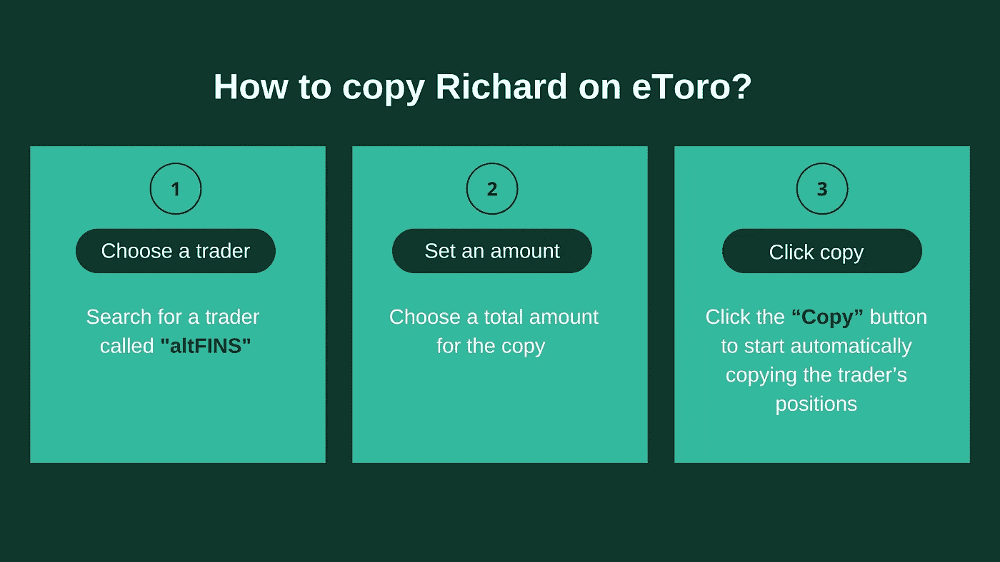
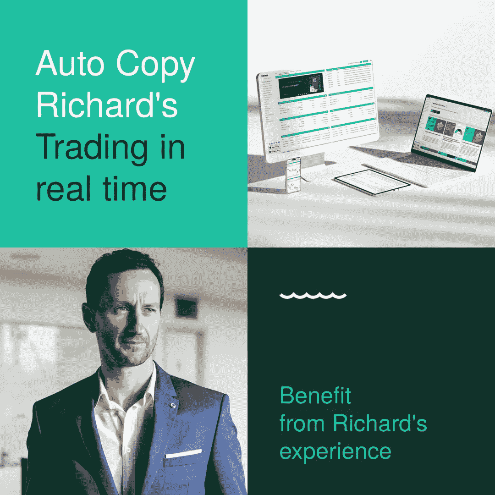
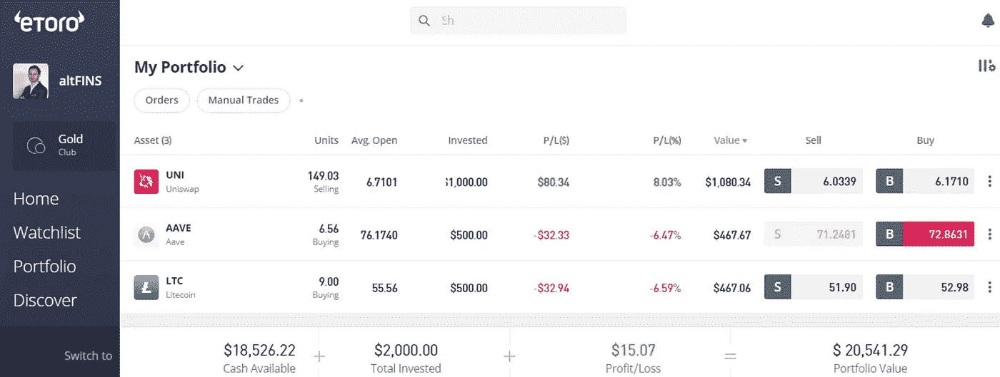

# 自动复制理查德在 eToro 上的交易

> 原文：<https://medium.com/coinmonks/auto-copy-richards-trading-on-etoro-cb582956b0c3?source=collection_archive---------50----------------------->

# 理查德交易时你也交易！

# 复制交易适合你吗？

你是那种认为如果你有更多的时间观察市场，你可以做得更好的交易者吗？你厌倦了手工复制理查德的每一笔交易吗？如果是这样，那么我们有好消息给你！**自动复制 Richard 在 eToro 上的交易**可以帮你自动复制他的所有交易。

你再也不用担心错过一个成功的交易，或者被不断变化的密码市场淹没。自动复制交易是一个很好的方法来改善你的交易结果，同时释放你的时间去做其他事情。请继续阅读，了解更多关于它的工作原理，以及为什么它可能适合你。

从理查德的经历中获益真的很简单。你可能从理查德·费泰科的 [**加密交易视频**](https://altfins.com/education) 中知道他。理查德在华尔街做了 15 年的机构基金经理顾问。

[**今天就加入**](https://med.etoro.com/B20085_A116306_TClick_Saltfins1.aspx) eToro，开始复制理查德的交易，无需额外费用。

# eToro 是什么？

如果你是加密货币交易员，你可能听说过 eToro。但是 eToro 是什么，为什么要使用它？ **eToro 是一个社交交易和投资平台**。eToro 为交易员和投资者提供了超过 2，000 种不同金融资产的访问权限，包括股票、加密货币、ETF、指数、货币和商品。这些资产可以在有或没有杠杆的情况下进行投资。

eToro 是社交副本交易的绝佳场所。eToro 平台即使对新用户来说也易于使用，并提供多种加密货币用于零佣金交易。它允许用户观察其他用户的交易活动，复制他们的交易，并从他们的经验中学习。你需要做的就是找到一个名叫“alt fins”的交易者 Richard Fetyko，然后点击“复制”按钮。就这么简单！

观看下面的[视频](https://youtu.be/MET_eMshHS4)，快速学习如何在 eToro 上复制 altFINS。

记住，当你使用复制交易时，你仍然可以完全控制如何管理你的投资组合。你可以选择一个交易者进行复制，或者一次复制 100 个。副本可以**暂停，停止**，也可以**随时更改金额。**

**点击** [**此处**](https://med.etoro.com/B20085_A116306_TClick_Saltfins1.aspx) **了解更多关于复制交易的信息。**

# 请记住以下几点:

*   一个交易者必须有 200 美元的最低投资。
*   你一次最多可以复制 100 个交易者。
*   重复交易的价值必须至少为 1 美元。

**欲了解更多信息，请访问** [**eToro**](https://med.etoro.com/B20085_A116306_TClick_Saltfins1.aspx) 。

# 理查德的作品集

理查德的投资组合在最近的动荡中依然坚挺。他在 Uniswap (UNI)的空头头寸带来的利润远远抵消了他在 AAVE 和 LTC 的损失。

> 交易新手？尝试[加密交易机器人](/coinmonks/crypto-trading-bot-c2ffce8acb2a)或[复制交易](/coinmonks/top-10-crypto-copy-trading-platforms-for-beginners-d0c37c7d698c)