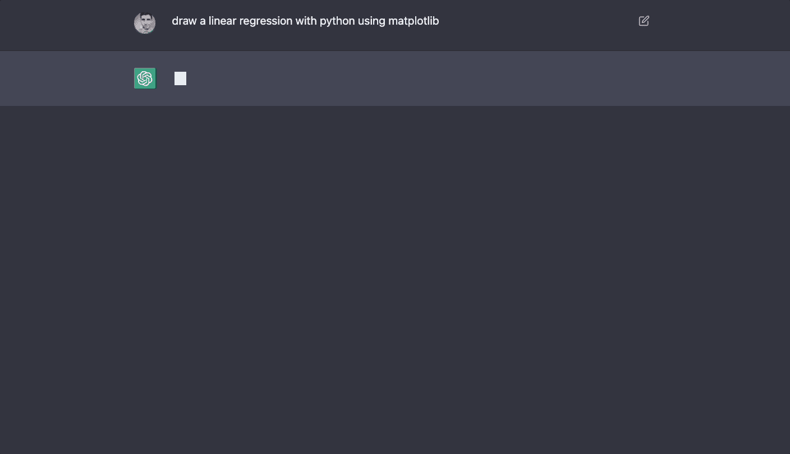
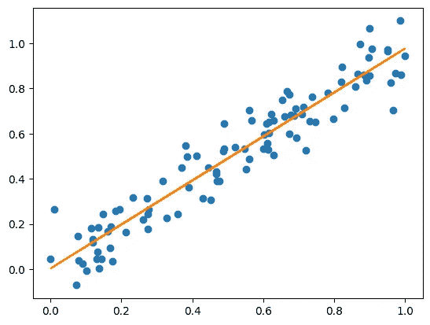
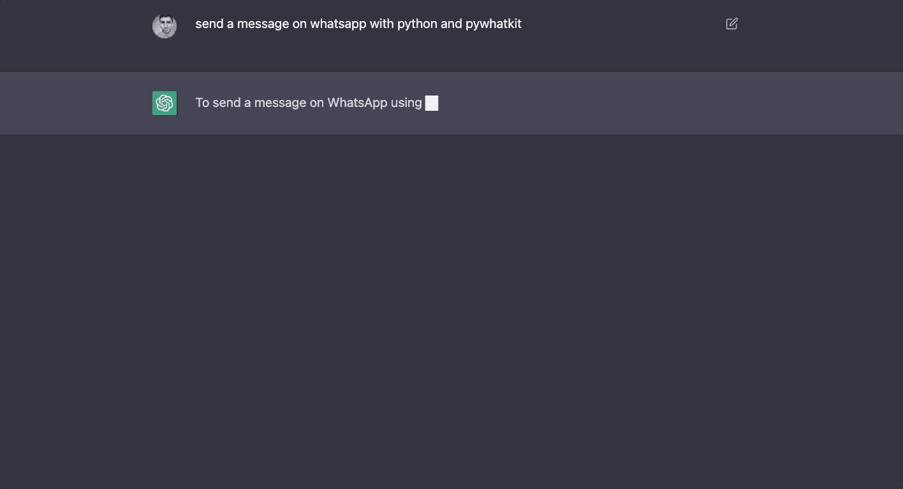
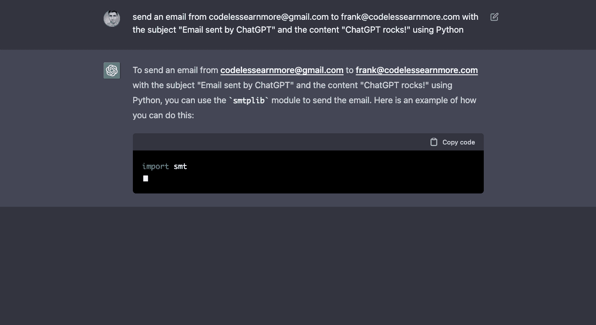
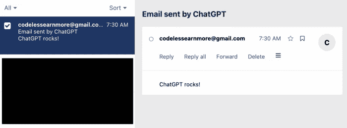
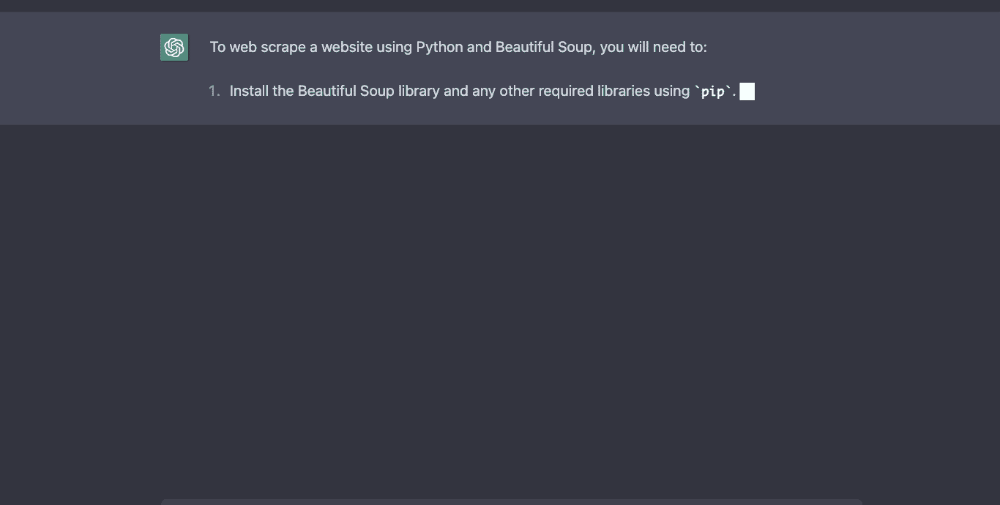
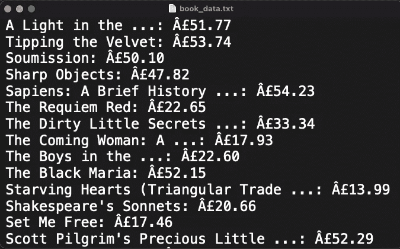
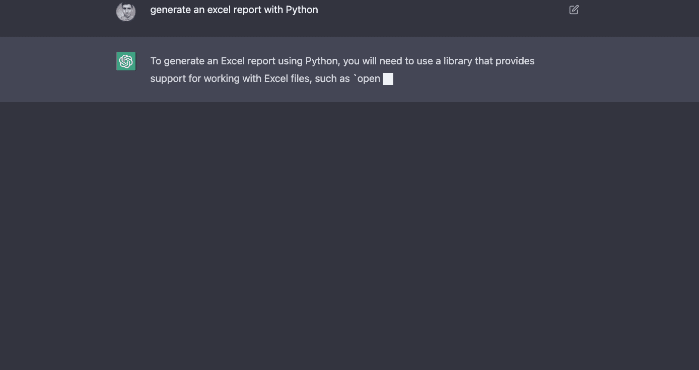
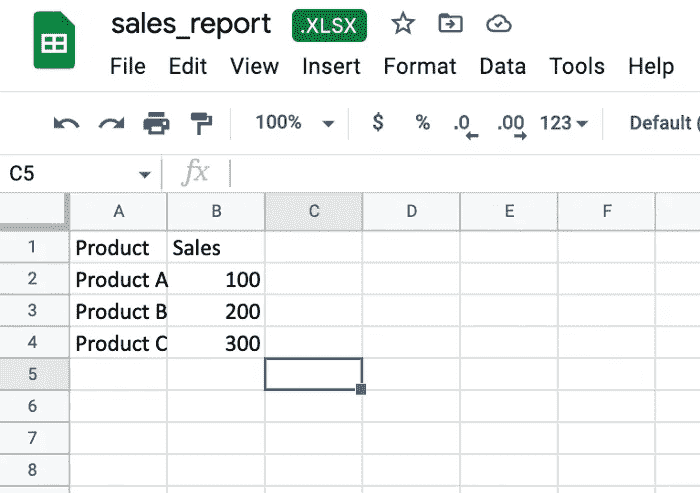

# 使用 ChatGPT 自动化 Python

> 原文：<https://medium.com/coinmonks/automate-python-using-chatgpt-9963e20c8cdd?source=collection_archive---------2----------------------->

## 使用人工智能绘制图表，发送电子邮件/信息，并在几秒钟内完成网页抓取。


Image via Shutterstock under license to Frank Andrade

最近 ChatGPT 发布了。这是 OpenAI 开发的一个专门进行对话的 AI 聊天机器人。它的目标是让人工智能系统更自然地交互，但它也可以在编写代码时帮助你。

你可以让 ChatGPT 成为你的编码助手，甚至超越它！

> 从顶级交易者那里复制交易机器人。免费试用。

在过去的几天里，我一直在玩 ChatGPT。以下是我给 ChatGPT 的一些按难度排序的任务(剧透提醒:我对结果感到惊讶)

# 任务#1:绘制线性回归图

如果您想绘制一个线性回归，您可以简单地告诉 ChatGPT:

> *使用 matplotlib 用 Python 绘制线性回归*



我们可以非常具体地告诉 ChatGPT 它应该使用的库，否则，它会自己选择。

下面是 ChatGPT 创建的 Python 代码(含注释！)

```
import matplotlib.pyplot as plt
import numpy as np
```

```
# Generate some random data
x = np.random.rand(100)
y = x + np.random.normal(0, 0.1, size=100)# Fit a linear regression to the data
m, b = np.polyfit(x, y, 1)# Plot the data and the fitted line
plt.plot(x, y, 'o')
plt.plot(x, m*x + b, '-')
plt.show()
```

这是输出。



这是一个简单的问题，所以让我们尝试一些更难的问题。

# 任务 2:用 pywhatkit 在 WhatsApp 上发送消息

我很好奇 ChatGPT 是否能帮助我们使用第三方库，比如 pywhatkit。这个库允许我们使用 Whatsapp 发送消息。

> *使用 Python 和 pywhatkit 在 Whatsapp 上发送消息*



出于本文的考虑，我没有进一步告诉 ChatGPT 我的电话号码或我想要发送的消息(虽然我在任务#3 中做了类似的事情)。

下面是 ChatGPT 创建的 Python 代码。

```
import pywhatkit
```

```
# Set the time in 24-hour format (HH:MM:SS) when you want the message to be sent
time = "HH:MM:SS"
# Set the phone number that you want to send the message to
phone_number = "1234567890"
# Set the message that you want to send
message = "Your message goes here"
# Use the sendwhatmsg method to send the message at the specified time
pywhatkit.sendwhatmsg(time, phone_number, message)
```

除了 ChatGPT 生成的代码，你还必须在浏览器中打开一个 WhatsApp 会话，并安装 pywhatkit(更多信息[请点击](https://towardsdatascience.com/automate-whatsapp-messages-with-python-in-3-steps-d64cf0de4539))

# 任务#3:用 Python 发送电子邮件

互联网上有数百个代码片段向您展示如何使用 Python 发送电子邮件。您可以使用 ChatGPT 更进一步:

> *从“email_1”向“email_2”发送邮件，主题为“ChatGPT 发送的邮件”，内容为“ChatGPT rocks！”使用 Python*



代码如下:

```
import smtplib
```

```
# create an SMTP object
smtp_obj = smtplib.SMTP('smtp.gmail.com', 587)# start TLS encryption
smtp_obj.starttls()# login to the email account
smtp_obj.login('codelessearnmore@gmail.com', 'YOUR_PASSWORD')# construct the email message
message = "Subject: Email sent by ChatGPT\n\nChatGPT rocks!"# send the email
smtp_obj.sendmail('codelessearnmore@gmail.com', 'sajawal@codelessearnmore.com', message)# close the SMTP connection
smtp_obj.quit()
```

键入代码后，ChatGPT 告诉我们应该在`“YOUR_PASSWORD”`占位符中引入我们的密码。

这次 ChatGPT 没有告诉我们的是，如果我们使用 Gmail，我们必须打开两步验证来获得 16 个字符的密码。

不管怎么说，ChatGPT 做得非常出色。输入我的密码后，我收到了邮件:



# 任务#4:从“要抓取的书籍”中抓取数据

大概我给 ChatGPT 最有挑战性的任务就是刮一个网站。你可能知道，网站有不同的 HTML，所以抓取网站的步骤因网站而异。

ChatGPT 在搜集一个名为 books.toscrape.com 的网站的书籍名称和价格方面做得很好

> *网刮*[](https://books.toscrape.com/)**利用 Python 和美汤**

**

*这是代码。*

```
*import requests
from bs4 import BeautifulSoup*
```

```
*# Make a GET request to the website
response = requests.get("https://books.toscrape.com/")# Parse the HTML content of the website
soup = BeautifulSoup(response.text, "html.parser")# Extract the data you want using Beautiful Soup's various methods and attributes
titles = soup.find_all("h3")
prices = soup.find_all(class_="price_color")# Save the extracted data to a file or database, or use it for some other purpose
with open("book_data.txt", "w") as file:
    for title, price in zip(titles, prices):
        file.write(f"{title.text}: {price.text}\n")*
```

*这是提取的数据。*

**

*自己不写代码提取数据…厉害！*

# *额外收获:用 Python 生成 Excel 报表*

*对于那些喜欢 excel 自动化的人，我还让 ChatGPT 生成了一个 Excel 报告。*

*我想不出一个好主意让 ChatGPT 帮我自动化 Excel 报表，所以我只尝试了这个。*

> **用 Python 生成 Excel 报表**

**

*下面是生成的代码。*

```
*# Import the `openpyxl` library
import openpyxl
# Create a new Excel workbook
workbook = openpyxl.Workbook()
# Get the active sheet in the workbook (which will be the only sheet at this point)
sheet = workbook.active
# Add some data to the sheet
sheet["A1"] = "Product"
sheet["B1"] = "Sales"
# Add some more data to the sheet
products = ["Product A", "Product B", "Product C"]
sales = [100, 200, 300]
for i in range(len(products)):
    sheet.cell(row=i+2, column=1).value = products[i]
    sheet.cell(row=i+2, column=2).value = sales[i]
# Save the workbook to a file
workbook.save("sales_report.xlsx")*
```

*这是输出结果:*

**

*正如您所看到的，我只得到一个简单的模板，但是我相信您只需要给 ChatGPT 正确的命令就可以得到令人印象深刻的结果。*

*现在是你玩 ChatGPT 的时候了！*

> *加入 Coinmonks [电报频道](https://t.me/coincodecap)和 [Youtube 频道](https://www.youtube.com/c/coinmonks/videos)了解加密交易和投资*

# *另外，阅读*

*   *[如何匿名购买比特币](https://coincodecap.com/buy-bitcoin-anonymously) | [比特币现金钱包](https://coincodecap.com/bitcoin-cash-wallets)*
*   *[瓦济里克斯 NFT 评论](https://coincodecap.com/wazirx-nft-review) | [比茨盖普 vs 皮奥克斯](https://coincodecap.com/bitsgap-vs-pionex) | [坦吉姆评论](https://coincodecap.com/tangem-wallet-review)*
*   *[如何使用 Solidity 在以太坊上创建 DApp？](https://coincodecap.com/create-a-dapp-on-ethereum-using-solidity)*
*   *[加密交易机器人](/coinmonks/crypto-trading-bot-c2ffce8acb2a) | [OKEx vs 币安](https://coincodecap.com/okex-vs-binance)*