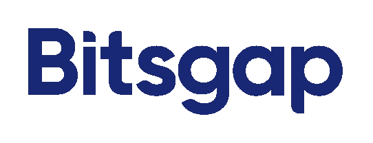
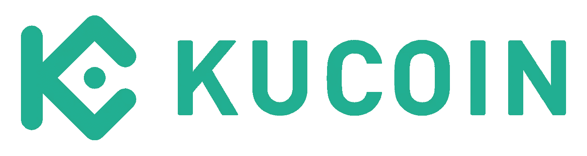

# 免费自动交易

> 原文：<https://medium.com/coinmonks/automated-trading-for-free-72a375685f1a?source=collection_archive---------26----------------------->

在我之前的文章中，我告诉你如何使用来自 T2 Bitsgap 的机器人。但是你知道你可以不用订阅就可以使用这个机器人吗？

怎么会？

有了来自 [Bitsgap](https://bitsgap.com/?ref=70116acf-bot) 的“黄牛机器人”，你可以免费交易 [Kucoin](https://www.kucoin.com/ucenter/signup?rcode=r3FVU52) 。你所需要的只是一个拥有 [Bitsgap](https://bitsgap.com/?ref=70116acf-bot) 和 [Kucoin](https://www.kucoin.com/ucenter/signup?rcode=r3FVU52) 的账户。两者都可以免费创建并保持免费。为了让机器人进行交易，你必须在 [Kucoin](https://www.kucoin.com/ucenter/signup?rcode=r3FVU52) 钱包中有比特币或其他类似的硬币(符合逻辑，对吗？).

什么是“黄牛机器人”？

黄牛机器人是一种所谓的 HFT 机器人(高频交易)。它以最小的价格波动获得稳定快速的利润。利润并没有达到数千，但通过贸易的多样性，很多聚集在一起。

例如:LUNC/USDT

该机器人在购买或销售的地方创建 135 个订单。订单到订单(或进价到售价)的距离为 0.1%。每笔交易你赚 0.1%的利润。用 500 美元，你的利润大约是每笔交易 0.0037 美元。我知道你在想什么…不多。但是机器人交易量很大。你见过比特币有多波动吗？
例如，如果机器人做了 25，000 笔交易(是的，它可以),那就是 92.50 美元。这比把钱放在钱包里要好。

试试吧！

—-->[Bitsgap.com](https://bitsgap.com/?ref=70116acf-bot)

—-->[Kucoin.com](https://www.kucoin.com/ucenter/signup?rcode=r3FVU52)

> 加入 Coinmonks [电报频道](https://t.me/coincodecap)和 [Youtube 频道](https://www.youtube.com/c/coinmonks/videos)了解加密交易和投资

# 另外，阅读

*   [AscendEx 保证金交易](https://coincodecap.com/ascendex-margin-trading) | [Bitfinex 赌注](https://coincodecap.com/bitfinex-staking) | [bitFlyer 点评](https://coincodecap.com/bitflyer-review)
*   [麻雀交换评论](https://coincodecap.com/sparrow-exchange-review) | [纳什交换评论](https://coincodecap.com/nash-exchange-review)
*   [支持卡审核](https://coincodecap.com/uphold-card-review) | [信任钱包 vs 元掩码](https://coincodecap.com/trust-wallet-vs-metamask)
*   [TraderWagon 回顾](https://coincodecap.com/traderwagon-review) | [北海巨妖 vs 双子 vs 比特亚德](https://coincodecap.com/kraken-vs-gemini-vs-bityard)
*   [Exness 点评](https://coincodecap.com/exness-review)|[moon xbt Vs bit get Vs Bingbon](https://coincodecap.com/bingbon-vs-bitget-vs-moonxbt)