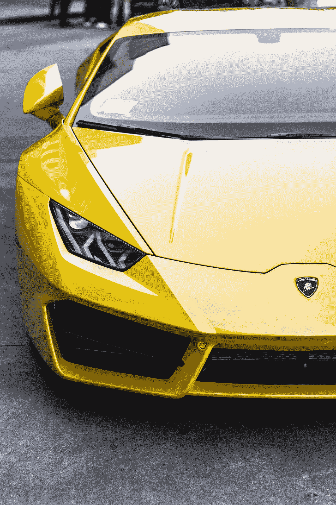

# 兰博基尼汽车公司放弃其限量版“世界巡回赛”NFTs

> 原文：<https://medium.com/coinmonks/automobili-lamborghini-drops-its-limited-edition-world-tour-nfts-65ff5fe1362e?source=collection_archive---------35----------------------->

# 滴剂(每次仅适用于 24 小时)

*本月是该活动的第三个月，10 月份的终极数字收藏品将于 2022 年 10 月 24 日* ***欧洲中部时间下午 4 点/美国东部时间上午 10 点 EST 时间上午 12 点发布。***

Photo by [Dhiva Krishna](https://unsplash.com/@dhivakrishna?utm_source=medium&utm_medium=referral) on [Unsplash](https://unsplash.com?utm_source=medium&utm_medium=referral)

只有那些在掉落 3 期间购买三(3)个基本可收集 NFT 系列的人将拥有进入掉落 3 稀有 NFT 的白名单。每一部 NFT 动画都配有 30 秒的定制音频。1963 年标志着对兰博基尼汽车公司创立的认可。

以世界巡回赛为主题的 NFT 是为了庆祝兰博基尼汽车公司自 1963 年成立以来的辉煌历程而创立的。根据这一计划，它将为用户提供一次穿越纽约市、日本、迪拜及其标志性的意大利总部的独特旅程。游览安排在以下日期:

1.  10 月 24 日星期一，纽约时代广场之旅。
2.  日本樱花梦——10 月 25 日，星期二
3.  阿联酋《阿联酋快报》——10 月 26 日，星期三
4.  首页(圣阿加塔博洛尼亚，兰博基尼汽车公司总部——10 月 27 日

这些 NFT 极其有限。每个月，四个 NFT 将连续发布四天。该系列包括三个基本的 NFT 和一个罕见的每个下降。

那些只收集基本组的人将获得一张 NFT 代币，可以发行最终限量版银拼图 NFT 的一片。此外，那些收集完整的一套(包括罕见的)将获得一个独特的 NFT 令牌，揭示了最终有限的黄金拼图 NFT。

> 交易新手？尝试[加密交易机器人](/coinmonks/crypto-trading-bot-c2ffce8acb2a)或[复制交易](/coinmonks/top-10-crypto-copy-trading-platforms-for-beginners-d0c37c7d698c)