# Avalanche —最新更新

> 原文：<https://medium.com/coinmonks/avalanche-latest-updates-4b565b11ddda?source=collection_archive---------36----------------------->

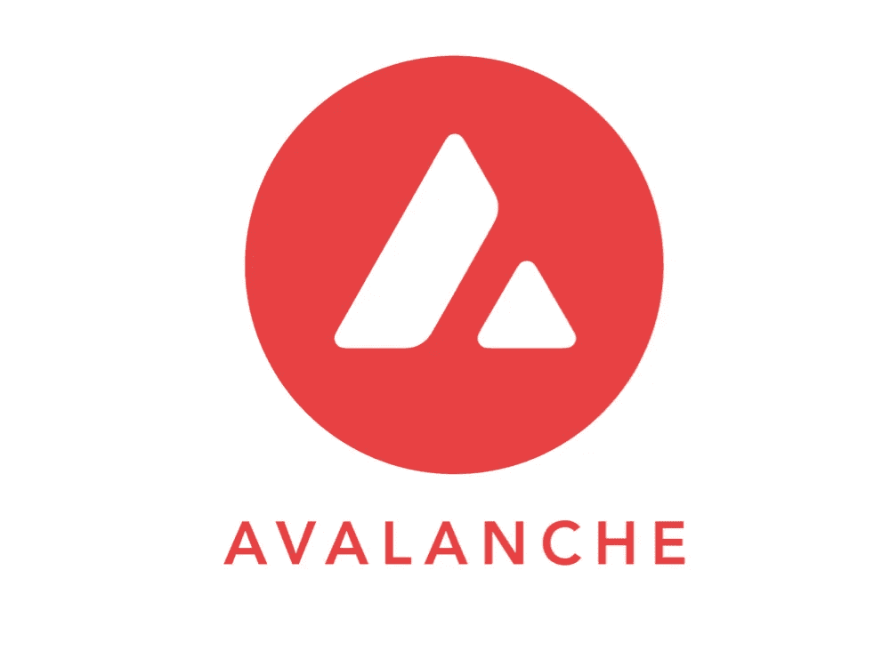

avax.network

# 介绍

Avalanche 是一款适用于分散式应用和定制互联区块链网络(子网)的利益相关证明(PoS)智能合同区块链，它通过引入一个名为“Avalanche consensus”的新共识家族而脱颖而出雪崩区块链于 2020 年 9 月由康乃尔大学教授 Emin Gün Sirer 创建的艾娃实验室推出，具有采用三条链的多链结构:P 链、X 链和 C 链。虽然提供与单个网络相同的功能，但每个链都在雪崩生态系统中发挥着重要而独特的作用。

本文将概述 Avalanche 生态系统和网络性能分析的最新主要进展。

# 网络概述

链上数据将通过分析定量参数(如每日活跃用户、交易和网络收入)来帮助我们评估网络性能。这将包括 C 链和子网。

# 每日活跃用户

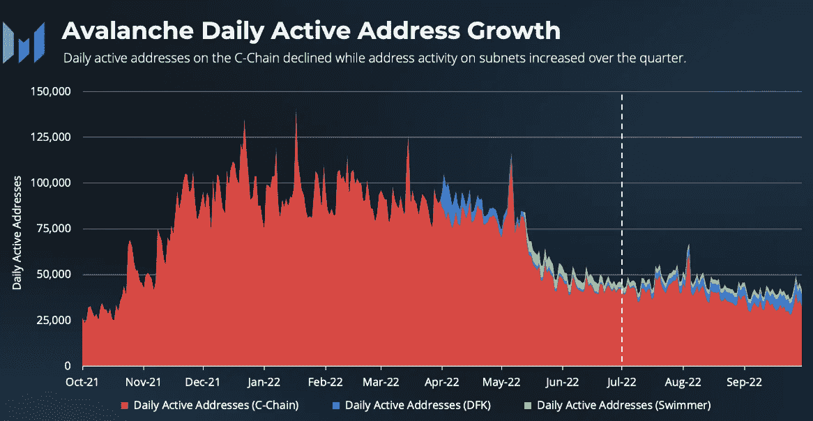

*snowtrace, avax explorer — messari.io*

我们可以在主 C 链上观察到每日活跃用户，该链用于智能合约和分散式应用程序，目前是 AVAX 的主要价值驱动因素，以及 Avalanche 的两个子网 DFK 和游泳者网络。

随着用户活动从 C 链转移到子网，C 链的日均活跃地址已从 Q2 的 6.3 万个下降到平均 3.8 万个，与之前一样，DFK 和游泳者子网是 C 链的主要用户、交易和收入驱动因素。

即便如此，C 链上的地址活动仍是一年前的四倍。

# 日常交易

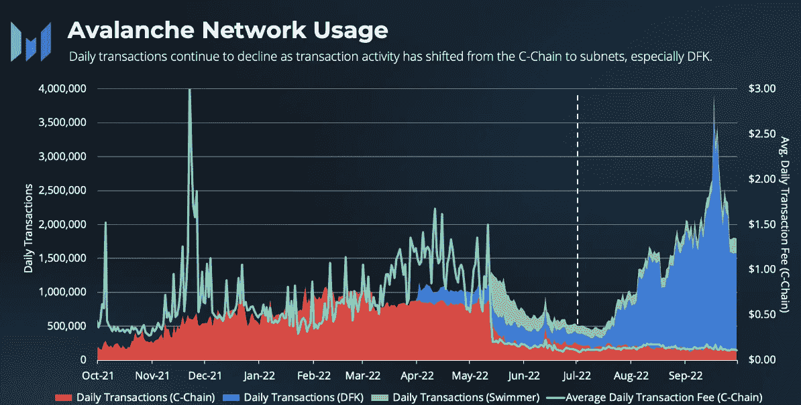

snowtrace, avax explorer — messari.io

随着交易量从 C 链转移到子网，特别是 DFK，Avalanche 在 C 链上的日均交易量从上一季度的 540，000 笔下降到第三季度的 186，000 笔。

然而，包括子网在内的整个网络的交易总数日均超过 170 万次。

# 网络每日收入

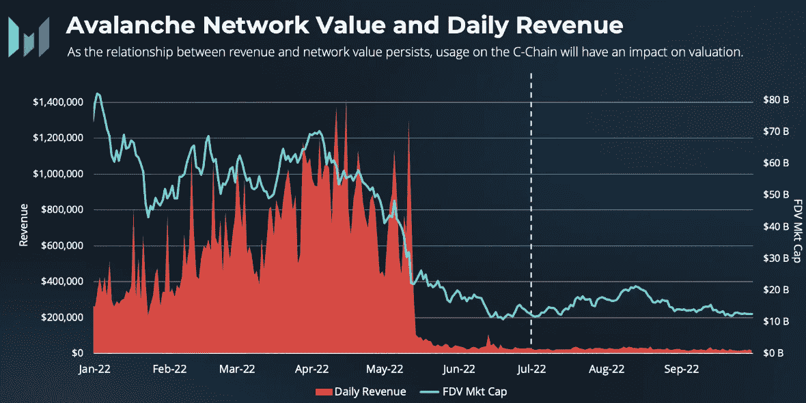

messari.io

网络收入平均每天约 2.3 万美元。正如我们在上面看到的，由于子网在自己的网络上产生流量，而不是在主链上产生流量，交易数量减少，导致网络总收入下降。这在本质上是设计使然，是 Avalanche 横向扩展能力的一部分，因为每个新形成的子网都需要锁定 AVAX，从而将主链从高额交易费用中解放出来，从而使主链在扩展时更便宜。

自网络开始以来，Avalanche 必须在安全性、交易成本、收入和网络价值之间取得平衡。

Avalanche 在主链上燃烧 100%的所有网络交易费用，由于 AVAX 的供应有限，随着采用率和可扩展性的增加，通过增加硬币稀缺性为 AVAX 硬币创造价值。

# 网络安全—验证者和删除者

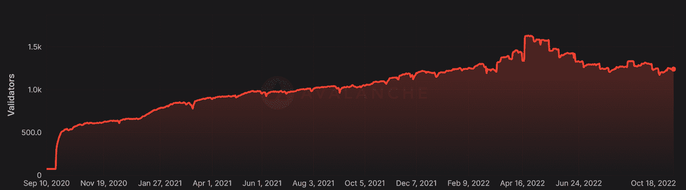

subnets.avax.network

验证器和删除器的数量变化很大。验证器数量从 1，629 下降到 1，238，这意味着网络安全参与者减少了 24%。

授权者从一个月前的大约 24000 人增加到超过 52000 人。重要的是要记住，验证者是操作节点的人，使网络更加安全。验证者从其他人委托给他们的节点中获益，因为委托者隐式地信任验证者是在线的和有效的。

尽管 AVAX 下注总额已从 3 月 21 日创下的 3.02 亿个硬币的历史高点下降，但它从 7 月 22 日的 2.43 亿个增加到今天的 2.68 亿个，表明了持续的参与、可靠性和网络完整性。

# 最新发展

# DeFi 生态系统

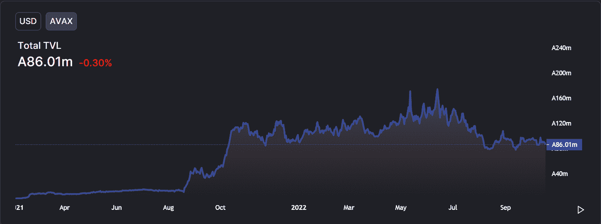

defillama

Avalanche 生态系统中锁定的当前总价值(TVL)最近平均为 8600 万 AVAX(13.9 bil 美元)。这已经证明了可持续的效用，尽管加密的冬天，不确定的宏观气候和高度竞争的 L1 智能合同区块链行业。

回到 2021 年 8 月，Avalanche 宣布了 1.8 亿美元的流动性开采激励计划，名为 Avalanche Rush。该计划旨在鼓励更多的应用程序和令牌转移到 Avalanche 的分散金融平台。该计划包括为期 3 个月的 2000 万美元的 Aave AVAX 代币和 700 万美元的 Curve over 代币。与此同时，雪崩基金会从 8 月 19 日开始拨款 300 万美元，赞助启动了雪崩网络本地的本齐 DeFi 协议。这促进了他们的 DeFi 生态系统，因为 Aave 和本齐构成了雪崩上最大的三个 DeFi 协议。

# NFTs

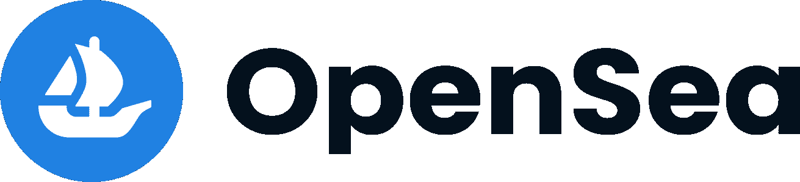

docs.opensea.io

世界上最大的 NFT 市场 OpenSea 在 10 月份透露，它已经在雪崩区块链上首次亮相。OpenSea 将在区块链与现有平台一起运营，如 NFTrade 和其他专注于雪崩的 NFT 市场，包括 Joepegs 和 Kalao。有了 Avalanche，OpenSea 用户将能够以低廉的交易费用在不到一秒的时间内完成 NFT 交易。尽管以太坊仍然占据着 NFT 二级市场约 80%的份额，但 Avalanche 在 2022 年初成功跻身前十名。

# 在 Avalanche 上标记真实世界的资产

Avalanche 在将真实世界资产(RWA)引入其区块链方面取得了重大进展。

## 什么是 RWA？

RWA 是股票、房地产、私人债务、艺术品、私人基金、批发债券等资产，这些资产已被标记化并放在区块链上以便交易。

资产令牌化的优势在于以下因素，如大众投资者的承受能力有限、缺乏财富管理专业知识、资产仅限于精英集团(在艺术品和老爷车的情况下)时的访问受限、监管障碍以及用户难以获得或交易资产的其他情况。将现实世界的资产令牌化是散户投资者获得平等投资机会的重要一步。

kkr.com

管理着 4500 亿美元资产的全球知名投资公司 KKR &公司已经与数字资产专家 Securitize 建立了合作关系，将 KKR 医疗保健战略增长基金的一部分进行令牌化，并将其放在 Avalanche 的公开区块链上。

## 什么是证券化？

Securitize 是一家数字资产证券公司，为投资者提供投资私人市场数字资产证券(安全令牌)的渠道，并利用下一代区块链技术的优势，为公司提供一套全数字化的端到端合规解决方案。

## 他们在做什么，为什么？

证券化宣布，它象征性地持有 KKR 医疗保健战略增长基金 II 的权益。证券代币在雪崩公共区块链上发行，证券化资本管理代币化基金。

这扩大了投资者的范围，因为根据目前的规定，只有净资产超过 100 万美元的合格投资者才能利用这种基金。这是个人投资者进入高质量私募股权基金的一种方式，这些基金来自一家非常知名的公司，比如 KKR，否则他们将无法进入。

这是一个重要的发展，如果成功，可能会导致更大规模的此类基金的象征性雪崩和超越。

## 资产令牌化的未来

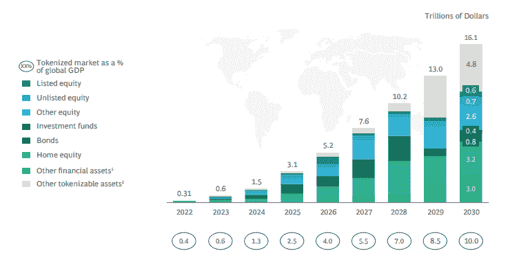

BCG report

根据波士顿咨询集团的数据，到 2030 年，链上资产令牌化机会可能达到 16.1 万亿美元，主要由金融资产组成。Avalanche 是资产令牌化领域的先行者之一，因为它的子网架构支持许可空间。每个子网都可以根据应用的具体需求进行定制，包括可调整的天然气费用、经济性、验证器设置、KYC 要求等等，这为 Avalanche 带来了巨大的竞争优势。

# 雪崩上的电影融资产品

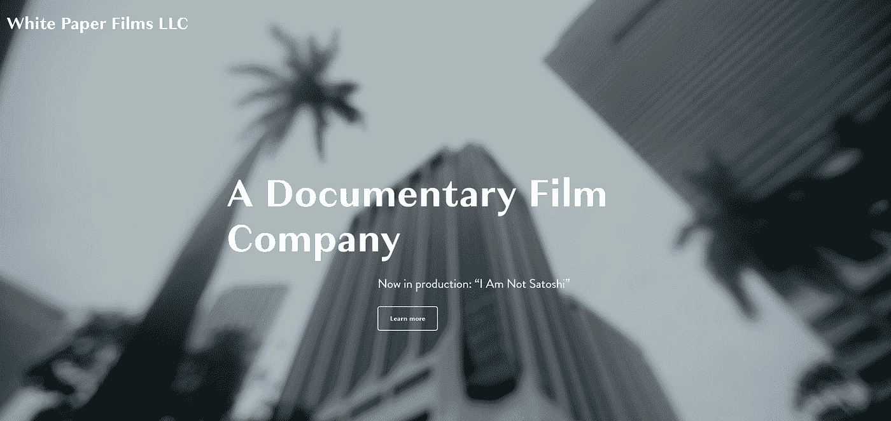

whitepaperfilm.com

Republic 是一个自 2012 年以来筹集了超过 10 亿美元资金的平台，它促成了一项利用新数字资产的发行:一项基于 Avalanche 的电影融资发行(FFO)。8 月，第一个象征化的 FFO 获得了资金承诺，开创了电影融资的新时代。

白皮书电影公司和电影制作人克里斯·坎努恰里(Chris Cannucciari)利用《雪崩》中的 FFO 来资助制作《我不是聪》(I Am Not Satoshi)，这是一部长篇纪录片，旨在全面了解这一探索。坎努恰里还导演了一部广受欢迎的网飞纪录片《比特币银行》。

正在制作中的《我不是 Satoshi》标志着 Avalanche 向不断增长的 Web3 电影世界迈出了第一步，代币和 NFT 收藏品被用来帮助电影的众筹开发。

# 雪崩上的区块链游戏

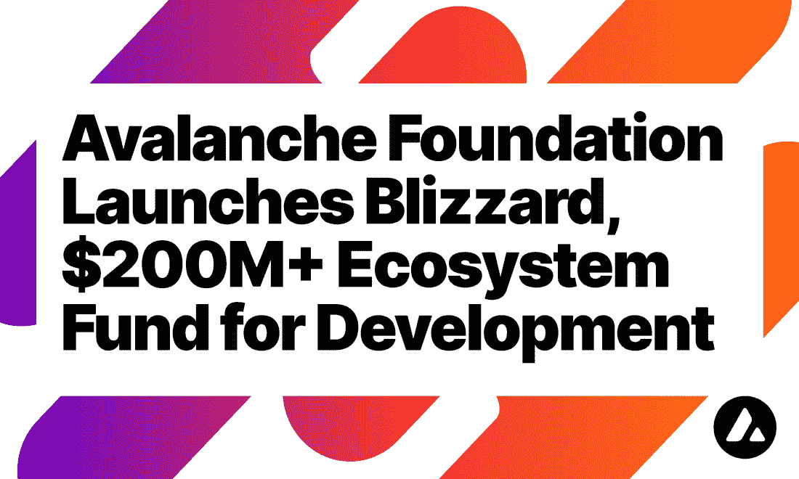

medium.com/avalancheavax

2021 年第四季度，Avalanche 推出了“暴雪”，这是一个 2 亿美元的基金，致力于加速 Avalanche 公共区块链的创作者和用户的发展、增长和创新，吸引区块链游戏发行商。与 RWA 一起，GameFi 显然开始在 Avalanche 的生态系统中找到自己的位置。

## 夏普内尔

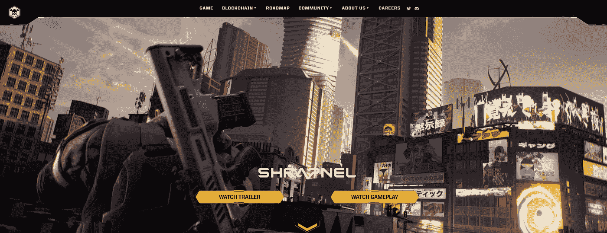

shrapnel.com

榴霰弹是一款即将推出的 AAA 级第一人称射击游戏，由一支拥有开发《光环》、《使命召唤》、《星球大战》等主要游戏背景的团队基于雪崩打造。

这是第一款区块链支持的多人竞技第一人称射击游戏，捆绑了一套丰富的玩家创建工具，将战斗、创建、管理和连接结合到一个社区中，玩家拥有这个平台并决定它的未来。SHARPNEL 支持玩家创建的内容，从纯粹的装饰物品到可以制作成 NFT 的自定义地图，为玩家提供所需的工具来根据他们的愿景塑造弹片，并从他们的创作中获利。

然而，最重要的是，下面的 SHAPRNEL 游戏很好地展示了目前正在雪崩网络上开发的游戏质量水平。

YouTube-Sharpnel

## 史蒂夫·哈维的《家族恩怨》

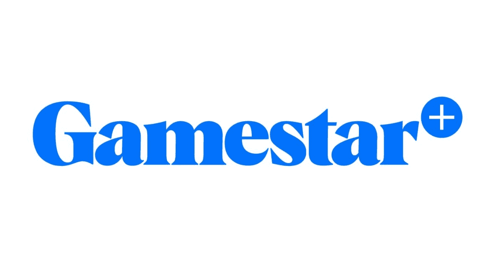

businesswire.com

“家庭不和”的名人主持人史蒂夫·哈维正在区块链的游戏世界中首次亮相，这是一个快速增长的行业，允许玩家以加密令牌和 NFT 的形式获得奖励。

史蒂夫·哈维是流媒体平台 Gamestar+的创始合伙人，该平台最近宣布与区块链开发商艾娃实验室和风险投资公司教员娱乐公司建立数百万美元的合作伙伴关系，推出热门电视游戏节目的互动版本，如“家庭不和”、“危险边缘”！、雪崩区块链上的“幸运之轮”和“一掷千金”。

除了《榴霰弹》和史蒂夫·哈维的 Gamestar+，许多其他游戏，如宇宙和 OpenBlox，以及著名的游戏发行商，如日本媒体和游戏发行巨头 GREE，正在进入雪崩生态系统。

## 区块链游戏市场潜力

根据来自 Q1 2022 的 DappRadar 和区块链游戏联盟的报告，区块链博彩业在过去一年增长了 2000%。该报告补充说，上个季度区块链游戏领域的投资为 25 亿美元，而 2021 年全年该领域的投资为 40 亿美元，表明涌入该领域的资金大幅加速。

在区块链上开发的游戏给了玩家更多的权力，将控制权交给了社区。由于智能合同，玩家可以成为游戏内资产的实际所有者，而不是传统游戏的开发者拥有和控制所有资产。此外，这种游戏中的数字资产将允许不同数字领域的兼容性，而不再局限于单一的游戏生态系统。

开发者可以利用游戏内经济在区块链运行的模式，创造可持续发展的环境，而不是一切都在一个中央实体的控制之下。

考虑到以上所有因素，传统游戏发行商很可能会选择区块链来发行他们的游戏。根据 Grand View Research 的数据，2021 年全球视频游戏产业的价值为 1956.5 亿美元，预计从 2022 年到 2030 年将以 12.9%的复合年增长率增长。

# 雪崩的关键技术发展

## 雪崩 x 射线

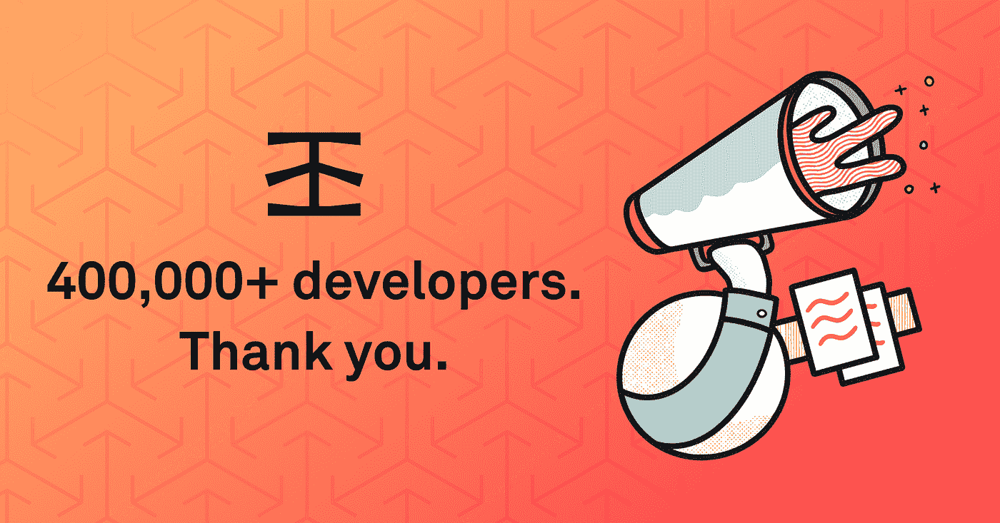

docs.infura.io

Infura 提供了工具和基础设施，允许开发人员轻松地将他们的区块链应用程序从测试阶段扩展到部署阶段——只需简单、可靠地访问以太坊。超过 40 万区块链开发者使用的 Infura 最近宣布支持 Avalanche 的 C 链，允许开发者使用易于使用的工具来利用 C 链。

## 可配置费用

可配置子网费用于 2022 年 7 月推出，无需硬分叉。自从 EVM 发布子网以来，人们最常要求的功能之一就是能够在不升级网络的情况下改变费用。在第 3 季度，可配置的费用成为现实，增强了用户体验和子网的价值。

## 建立在雪崩基础上的宇宙子网

滑坡网络是一个雪崩子网，它降低了 Tendermint 共识的终结性，并将在大多数宇宙和 Terra 生态系统上移植，以在 AVAX 生态系统内本地运行任何基于 Tendermint 的 dApp。预计将于 2023 年在 Q1 推出。

## 金融伙伴关系

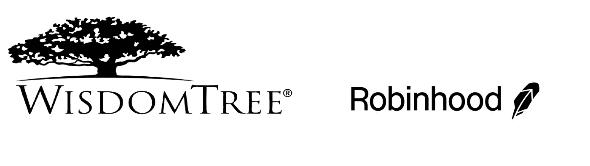

wisdomtree.com; robinhood.com

交易所交易基金(ETF)和交易所交易产品(ETP)赞助商 WisdomTree 已将 Avalanche 添加到实物支持的加密货币篮子 etp 跟踪的指数中，这些 etp 在巴黎和阿姆斯特丹的泛欧交易所(Euronext)和瑞士证券交易所(SIX)上市。

WisdomTree 欧洲区负责人亚历克西斯·马里诺夫(Alexis Marinof)说:

“我们的加密篮子旨在为投资者提供一个不断发展的加密资产环境。通过季度再平衡，像 AVAX 这样的额外硬币可以加入到指数中。在被纳入我们的指数之前，硬币要经过一个委员会的审查，必须符合一系列标准，包括足够的流动性、实际使用案例和临界质量。”

受欢迎的交易应用程序 Robinhood 已于 2022 年第四季度在其平台上实现了雪崩区块链本地资产 AVAX 令牌的交易和转让。截至 2022 年 3 月，Robinhood 拥有 2280 万个资金账户和 1590 万个月活跃用户。

## 雪崩的第 2 层解决方案

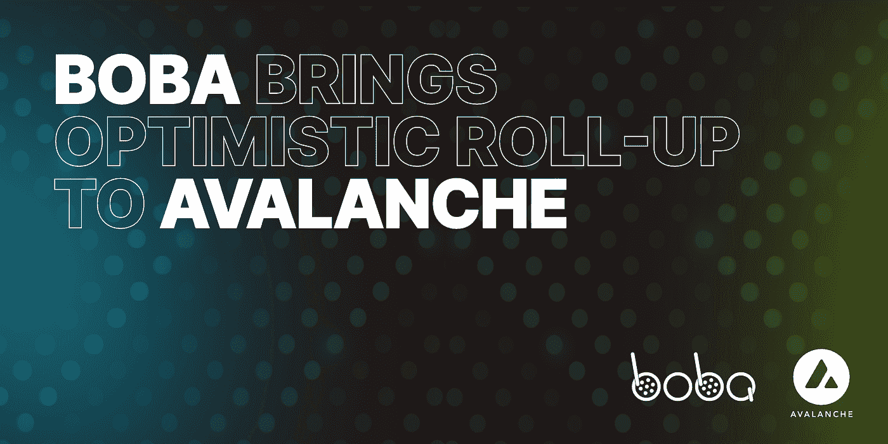

medium.com/avalancheavax

Boba Network 是区块链第二层扩展解决方案和混合计算平台，提供闪电般的快速交易和超低费用。波霸 2021 年 9 月推出。其 L2 扩展和扩充平台使用乐观汇总来实现更高的吞吐量、更低的费用和可扩展性。

波巴网络扩大了对雪崩的支持，是雪崩的第一个 L2。这种集成为 Avalanche 开发人员的扩展工具包提供了另一个强大的选择。在 Avalanche 上，Boba 将可用于 C 链上的 dApps。

## Banff:弹性子网

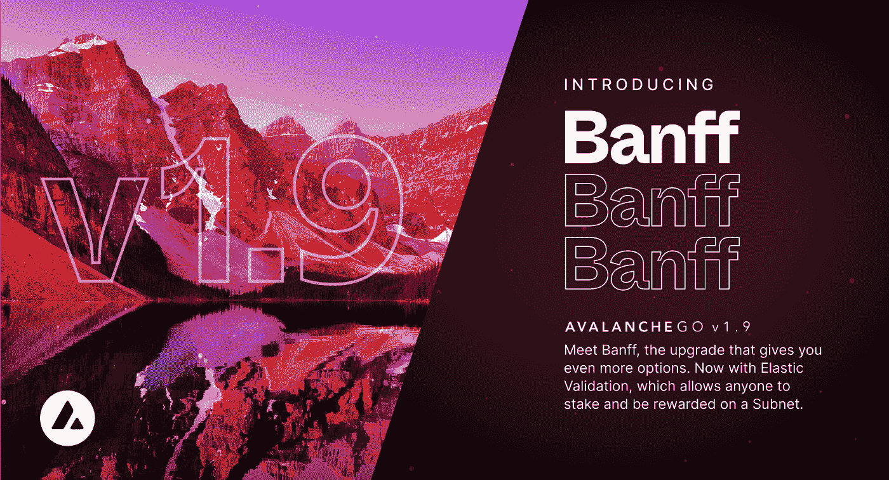

medium.com/avalancheavax

随着 Banff 的引入，雪崩升级为生态系统带来了弹性子网。Banff 允许子网创建者在自己的子网上使用自己的令牌激活利益证明验证和基于正常运行时间的奖励。这种设置为构建者在设计子网时提供了更多的选择。在子网上启用弹性验证完全是可选的，由创建者决定。10 月 18 日 Banff 在 Avalanche mainnet 上激活成功。

班夫，类似于宇宙中的 IBC，将有助于在互操作性方面释放整个雪崩生态系统的价值。它将允许跨子网资产转移，无许可子网，以及在其本地令牌中的验证器奖励。

## 富士网络

富士网络是雪崩生态系统的官方测试网。它模拟了 mainnet 的大多数条件，开发人员可以在 mainnet 中部署演示智能合约。在接下来的几个月里，富士测试网上的许多子网将开始过渡到雪崩的主网上。这将包括 Caste Crush，这是一款免费的 iOS/Android 游戏，终身下载量超过 7500 万次，月活跃用户数为 140 万，它宣布将于 2022 年 5 月扩展到 Avalanche 的子网。这种迁移将导致 P 链验证器集的增长。

# 摘要

Avalanche 一直保持着一个高度稳健的 DeFi 生态系统，该系统已经证明了其耐用性和稳定性，按锁定的总价值计算，它已成为第四大分散式金融网络。然而，Avalanche 已经超越了 DeFi 和 NFTs，拥有现实世界的资产、GameFi 和电影金融产品等独特案例，所有这些都有可能推动网络 C 链上的重大活动，并通过子网扩展验证器集。

通过独特的智能合同验证衡量的开发参与度尚未赶上 RWA、GameFi 的进度，以及 Fuji testnet 上的许多子网过渡到 Avalanche mainnet 的进度。

最后，还有 Avalanche 子网的价值案例，除了是扩展网络的好方法之外，它对开发人员来说也是一个重要的价值主张。子网使开发人员能够轻松构建独特定制的区块链环境，并允许分散的应用程序利用 Avalanche 的共识和基础架构。

对于 DFK 和克拉巴达以及正在富士测试网上开发的数百个其他人，包括拥有数百万活跃用户的 Castle Crush，子网似乎被确定为理想的解决方案，否则他们会找到不同的解决方案。

子网的增长和采用给网络带来了巨大的价值，因为子网需要验证器，每个验证器必须至少有 2000 个 AVAX。其他价值可能来自利用 AVAX 作为最终跨子网通信的 gas，或者子网选择使用 AVAX 作为它们的本地令牌。

随着网络功能的进步，如弹性子网，子网的情况继续增长，雪崩的大规模采用的任务看起来很光明。

*免责声明:本文包含的信息仅用于教育目的，并不构成 Wheatstones 的任何形式的建议或推荐，用户在做出(或避免做出)任何投资决定时也不打算依赖这些信息。*

> 交易新手？试试[密码交易机器人](/coinmonks/crypto-trading-bot-c2ffce8acb2a)或者[复制交易](/coinmonks/top-10-crypto-copy-trading-platforms-for-beginners-d0c37c7d698c)