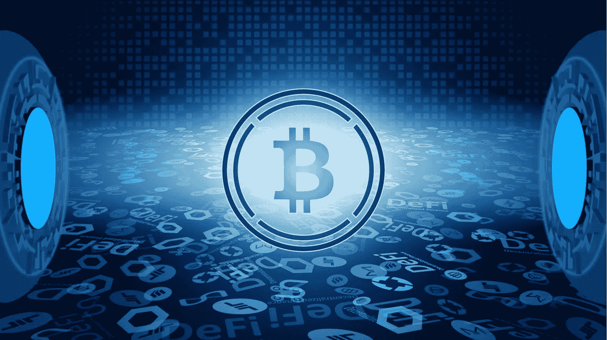

# 避免这样做，以保持你的比特币理智

> 原文：<https://medium.com/coinmonks/avoid-doingthis-to-keep-your-bitcoin-sanity-b0dbaaec194d?source=collection_archive---------20----------------------->

对许多人来说，投资比特币和密码可能是一次相当紧张的经历。也许是目前最不稳定的资产，价格的持续波动会迅速上升或下降。然后，一些人通过杠杆交易或获得加密担保贷款，让自己变得更加困难。这意味着，任何在错误时间突然出现的大规模价格下跌都有可能让大型集团破产…