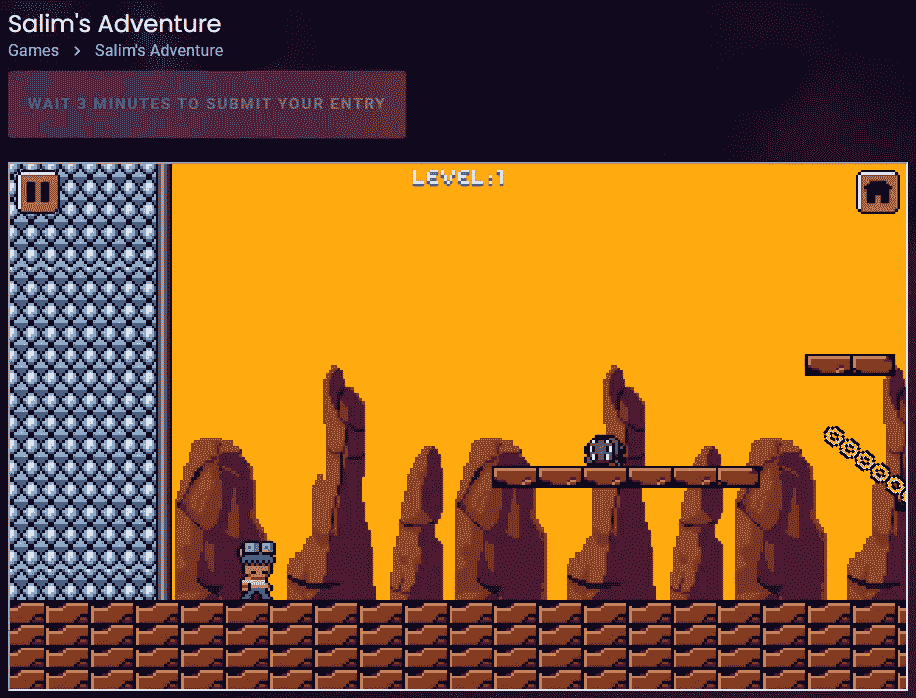

# Axie 无限游戏 NFT 下降到 3 美元。哪些 web3 游戏值得关注？

> 原文：<https://medium.com/coinmonks/axie-infinity-game-nft-drops-to-3-which-web3-games-are-worth-paying-attention-to-f5fc4cf437f4?source=collection_archive---------5----------------------->

这两天我注意到了去年的现象级连锁游戏 Axie infinity，Axie NFT 的地板价降到了 0.002ETH，约合 3 美元。

去年 8 月，Axie 的地板价格是 500 多美元。游戏需要 3 个 NFT 才能进入游戏，门槛大概是 1500 美金。现在 10 美元就可以进入游戏，降幅 99%。

Axie infinity game NFT current floor price $3

当然，AXS 和 SLP 的房价也出现暴跌，高点下跌超过 92%和 99%。

投资门槛降低了，收益也同比例下降，但崩盘前没有退出的玩家资产大幅缩水。

加密市场的大环境是这样的。BTC 已经从去年的 69，000 美元的高点下跌，跌幅也超过了 72%。

Axie Games AXS and SLP drop

目前整个密码市场进入熊市，交易热情下降，但各种区块链项目还在继续。

例如，公共链轨道 Solana、Plygon 和 Cosmos 都在继续改善和丰富它们的生态系统。新的公共链 Aptos 和 Sui 也在寻求新的用户，并进行内部测试，希望在下一轮牛市中脱颖而出。

2.0 版本中也出现了各种新项目，集成了 NFT、defi、social、DID 等玩法。Web3 项目不是一个简单的游戏或图片，而是更多 defi 经济模型的组合。

例如，Axie 允许用户通过游戏进入 web3 世界，在游戏中边玩边赚钱；还有 running STEPN，玩家可以边跑边挣钱。

Axie game page

楚小莲最近关注了一些 web3 的项目，大部分都在前期，有的在内测，有的发展缓慢。就看哪家能获得用户，继续发展。

比如建立在宇宙链上的 Levana 项目，不仅有 defi 商业内容，玩家可以交易 swap，farm farm pledge 等。，还要讲元宇宙的故事，并推出游戏板块。

普通玩家对该项目未来会讲述怎样深远的故事不感兴趣，更关心目前的切入方式，比如一边玩游戏一边赚钱。

Salim’s Adventure games similar to Super Mario

Levana 官网有 3 个游戏项目，Salim 的冒险和 Arach 的攻击都是破级游戏，都是像素图像的 NFT。

持有 NFT 的玩家可以在游戏中获得代币奖励通过玩来挣钱；或者干脆玩游戏不投资。目前只有网页版，在键盘上操作，没有手机，也没有外接手柄，体验没有那么流畅。

我在经历 Arach 攻击的时候卡在 7 级，过不去。

Arach Attack game

索拉纳链上还有瓦库兰。游戏《NFT 瓦库》的起拍价是 1.5 索尔，已经被打破了。地板价 1.2SOL，不到 40 美元。

如果你想在游戏页面中玩并赚取，你需要先投资购买 NFT，然后在游戏中玩并赚取。游戏的网页版已经上线，但是还没有手机版。

虽然 NFT 破了，但如果项目运营有效，游戏能留住用户，经济模式完善，项目能获得更长的开发周期。

这些只能靠时间来验证，看项目方是否还在继续工作。

The game Wakuland on the SOL chain

以太坊链上还有游戏以太跳跃。玩家可以构建自己的游戏场景，也可以在官方提供的游戏场景中进行游戏。

你可以直接通过关卡，也可以建造复杂的游戏迷宫，让其他玩家使用你的游戏场景，从活动中获得额外收入。

目前游戏 NFT 底价是 0.03ETH，40 多美金，也是破了，但是游戏还在进行中。如果你是逻辑思维和构造能力比较强的玩家，可以尝试体验一下。

The game Etherjump on the ETH chain

这些 web3 游戏是否昙花一现，还有待时间验证，但游戏有天然的流量属性，相对更受欢迎，更容易吸引用户。

上链的气费低，投入少的时候，了解各种 web3 玩法，积累经验和技巧也是好的，也不能说哪个项目真正完成了，现在是参与前期。

以上只是我个人的看法和总结，不含投资建议，读者的任何投资行为与作者无关。

我是褚小莲，我在了解区块链，关注元宇宙和 NFT，关注 web3。

> 交易新手？试试[加密交易机器人](/coinmonks/crypto-trading-bot-c2ffce8acb2a)或者[复制交易](/coinmonks/top-10-crypto-copy-trading-platforms-for-beginners-d0c37c7d698c)