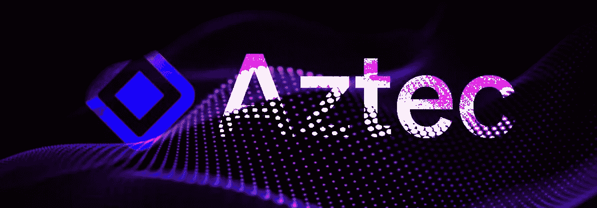

# Aztec 网络，关注隐私的总结(第 1 部分)

> 原文：<https://medium.com/coinmonks/aztec-network-a-rollup-focused-on-privacy-part-1-682a69d1d29b?source=collection_archive---------6----------------------->

非常好的密码阅读器，你可能已经知道，Monero 和 Zcash 是两个早期的隐私产品，允许用户从一个点到另一个点进行简单和私人的交易。然而，最近对 Tornado Cash 的制裁表明，各国政府并不支持金融隐私。尽管如此，DeFi 的隐私工具的创新并没有停止。