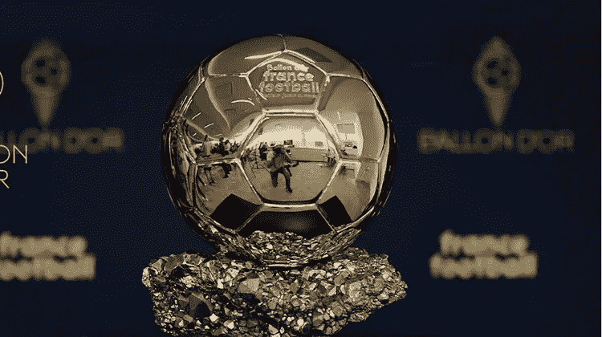

# 金球奖将首次亮相 NFT 颁奖典礼

> 原文：<https://medium.com/coinmonks/ballon-dor-set-to-debut-nft-awards-96b9d22b37c?source=collection_archive---------19----------------------->

当今世界的驱动力是什么？收入来源，新技术，以及休息日放松的好方法。

然而，对大多数男人来说，这可能意味着要么去足球场，要么在家舒舒服服地看足球比赛。不管是在周六下午还是在寒冷的周二晚上，真正的球迷总是会抽出时间来支持他们最喜爱的足球俱乐部，并为他们的明星球员做好准备。

如果你是一个狂热的足球爱好者，那么你应该已经知道，比赛中最大的个人奖项是留给成功竞选后的最佳表现者的——无论是在足球赛季结束时还是在日历年结束时。

坐在最令人垂涎的足球个人奖项之首的是金球奖，该奖项通常由法国媒体集团 Equipe Media 颁发。该组织通常通过收集国家队教练和队长以及少数选定的记者的投票，得出这项声望很高的奖项的得主。

在过去的 66 年里，这一全球性的奖项每年都颁发一次，到目前为止，它已经被证明是世界足坛最负盛名的奖项。

# 跟随技术趋势

从下一个奖项开始，法国媒体集团最近宣布打算开始向这个享有盛誉的奖项的获奖者发放 NFT。

Equipe 认为 NFT 的采用是颁奖典礼发展的下一个合乎逻辑的步骤，因为它寻求与技术趋势一起发展。每位获奖者还将获得一个与实物奖励相关的数字令牌(NFT ),从而将该成就永久保存在区块链上。

不仅仅是获奖者有资格获得 NFT 奖。该组织计划创建三个国家森林公园，在活动开始前进行拍卖。这些 NFT 将授予买方 VIP 权限，以参加 2022 年 10 月 17 日举行的颁奖仪式。

此外，会有数百份 NFT 在赛后发放给公众。根据 Equipe 的说法，“随着 Ballon d'Or，更广泛地说，Equipe 和 Amaury 集团希望以可持续的方式将自己融入 web3 世界，即去中心化互联网的新时代，第一批产品将会陆续推出。”

# 继续将 NFT 纳入主流

Equipe Media 宣布发行 NFTs 作为奖项只是近一段时间主流采用 NFTs 趋势的延续。

今年早些时候，国际游泳联合会(FINA)也向在匈牙利布达佩斯举行的第 19 届世界游泳比赛中的破纪录者颁发了国家游泳比赛奖金和现金奖励。

这还不算已经从 NFT 销售中获得的快速收入，该收入在 NBA 已经翻了一番。最近的报道也显示了[体育 NFTs](https://www.prnewswire.com/in/news-releases/-1-3-billion-sports-nft-market-doubles-in-2022-a-100-growth-10-years-cagr-36-3-says-market-decipher-850146589.html) 是如何在一年内收入翻倍的。这还没有提到体育巨星的个人 NFT 发布以及与加密平台的合作(如 CR7 和币安之间的合作)。

# 最后的想法

Equipe Media 采用 NFT 奖是将非技术人员纳入主流的一个显著事件。这表明非功能性测试已经存在，而且随着时间的推移，其采用率只会增加。现在，让我们祈祷最佳足球运动员在明年 10 月获得他的奖项和相应的数字奖项。

> 交易新手？试试[密码交易机器人](/coinmonks/crypto-trading-bot-c2ffce8acb2a)或[复制交易](/coinmonks/top-10-crypto-copy-trading-platforms-for-beginners-d0c37c7d698c)