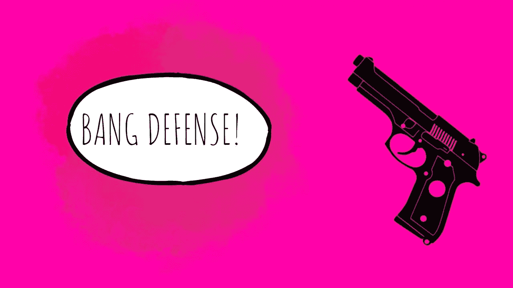
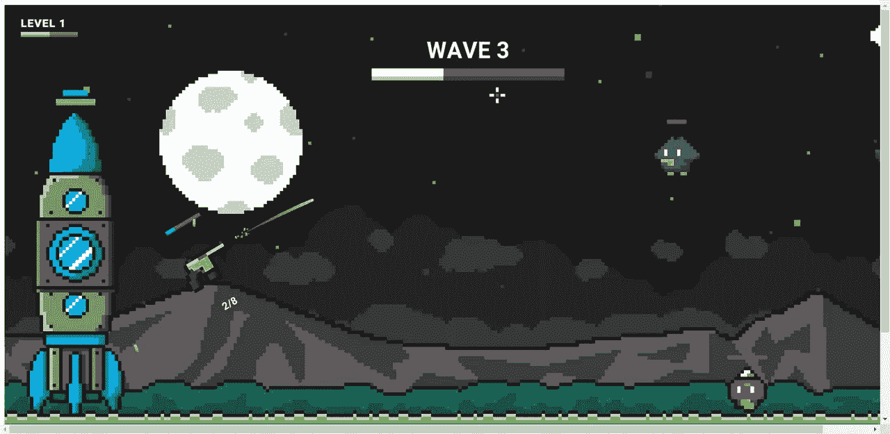
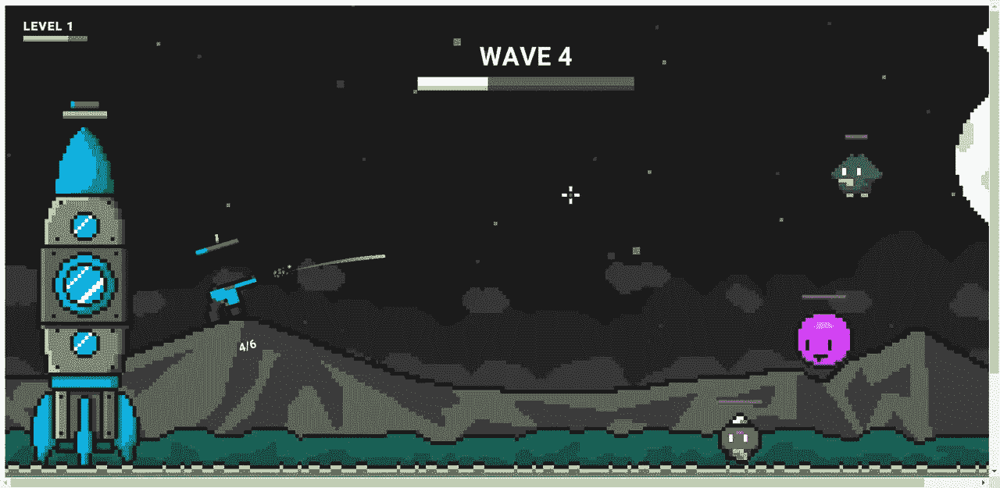
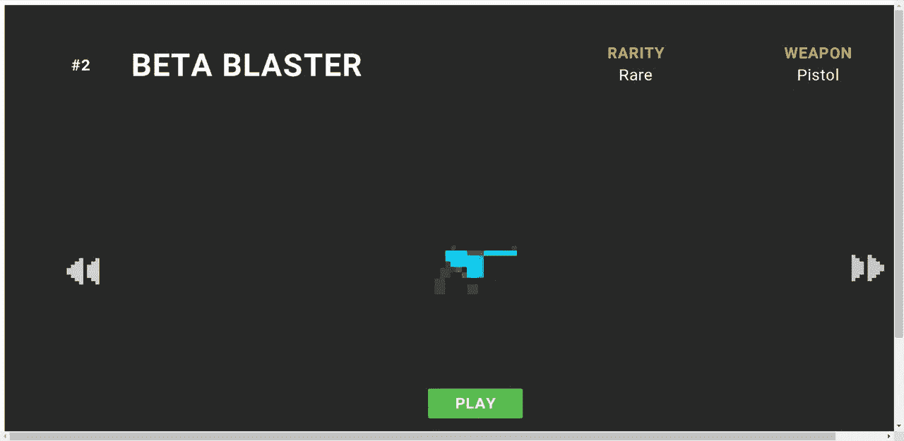
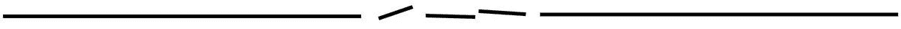

# 爆炸防御第一印象

> 原文：<https://medium.com/coinmonks/bang-defense-first-impressions-3aaca1d91e10?source=collection_archive---------27----------------------->

# 区块链上新的第一人称射击游戏

首先，我是从令人敬畏的杜阿·利帕那里看到这条赛道的，当我因为头像而想到玩这个游戏时，我的脑海中就有这条赛道！

这是一个令人敬畏的缓慢和 reverbed 版本。当我告诉你我发现的这个伟大的游戏时，请点击播放。

[来源](https://bangdefense.net/home/index.html)

这是一个 2d 卷轴风格的射击游戏，你可以控制手枪并干掉坏人。这是一个令人上瘾的游戏，干掉坏人是非常令人满意的。你需要试着正确判断你的镜头，以便在地图上显示出来。

[来源](https://bangdefense.net/home/index.html)

它是由哈什金游戏工作室的人带给你的，他们似乎喜欢编写区块链游戏。这是目前为止只有在测试版，所以你只能玩到目前为止，但有一些水平和各种坏人，你可以在游戏中杀死。

根据[的报道](https://ecency.com/hashkings/@hashkings/bang-defense-litepaper-new-hive-blockchain-game)，它将围绕拥有各种游戏中使用的 NFT 的玩家来构建，比如头像皮肤。

玩得很愉快，我很想看看会有什么结果，以及令牌学将如何发挥作用。

**学分:**

本人在 canva 中使用 image【来源】创建的标题图片。([https://pix abay . com/de/illustrations/pistole-M9-waffe-silhouette-555656/](https://pixabay.com/de/illustrations/pistole-m9-waffe-silhouette-555656/))
截图来自游戏网站，注明[来源](https://bangdefense.net/home/index.html)。
链接的视频不是我的，我只是分享了版权所有者的视频链接。没有侵犯版权的意图。
根据 1976 年版权法 107 节合理使用条款使用。

**我们来连线:** [mypathtofire](https://linktr.ee/mypathtofire)

> 交易新手？试试[加密交易机器人](/coinmonks/crypto-trading-bot-c2ffce8acb2a)或者[复制交易](/coinmonks/top-10-crypto-copy-trading-platforms-for-beginners-d0c37c7d698c)