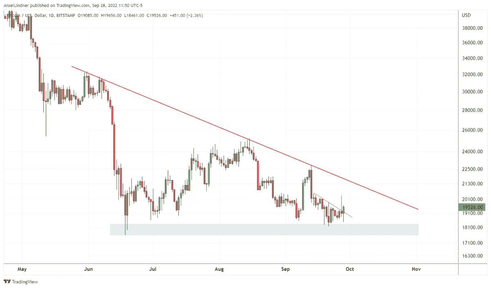
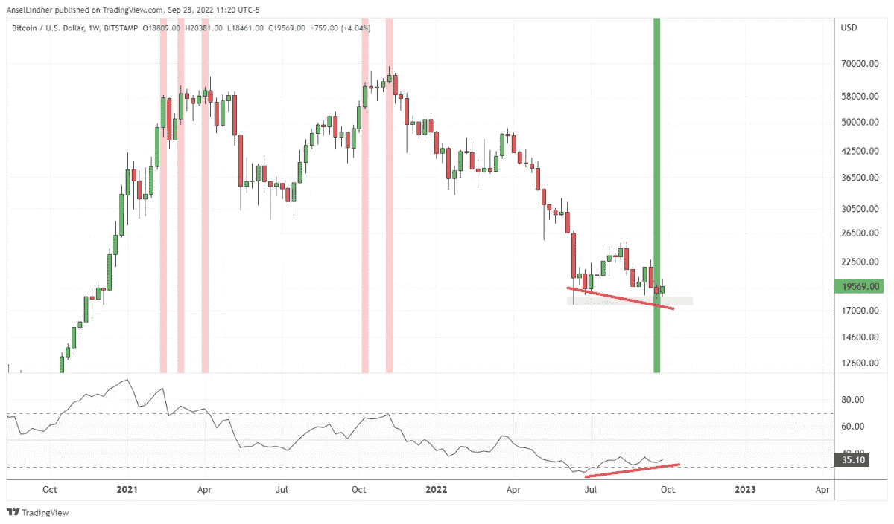
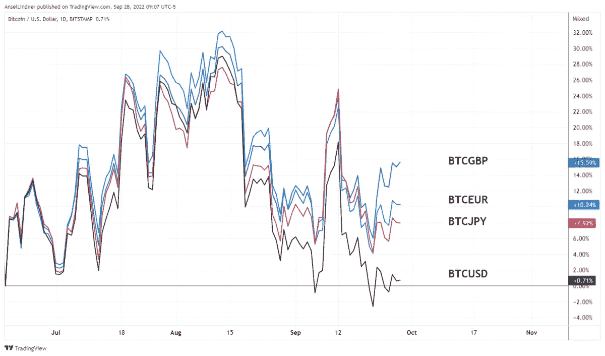
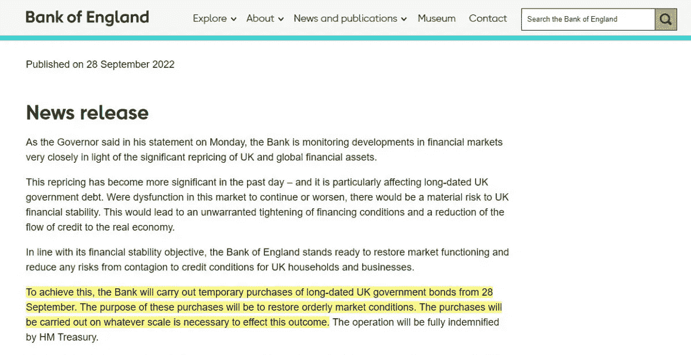
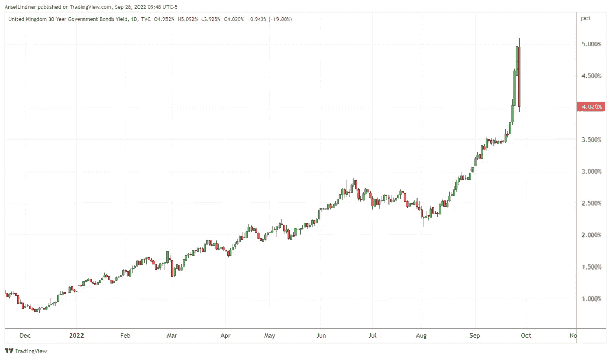

# 英格兰银行转向避免金融危机

> 原文：<https://medium.com/coinmonks/bank-of-england-pivots-to-avoid-financial-emergency-fd602fc137b5?source=collection_archive---------30----------------------->

英格兰银行率先转向量化宽松，声称要恢复市场功能并降低传染风险。

“美联储观察”是一个宏观播客，符合比特币的反叛本性。在每一集里，我们都会从宏观角度审视全球各地的时事，对主流观点和比特币叙事提出质疑，重点是央行和货币。

[在 YouTube 上看这集](https://youtu.be/5OvWpHNGKeA)或者[隆隆](https://rumble.com/v1luvsi-brighter-bitcoin-future.html)

听听这一集:

*   苹果
*   [Spotify](https://open.spotify.com/episode/2dBhegitqFosQ9Fg0PSrSR)
*   [谷歌](https://podcasts.google.com/feed/aHR0cHM6Ly9iaXRjb2lubWFnYXppbmUubGlic3luLmNvbS9yc3M/episode/YjBmYTNlYmMtZDBhNC00OTNmLTkwNDYtN2YxNjczNjI2MGMy?sa=X&ved=0CAUQkfYCahcKEwi4gLHU57z6AhUAAAAAHQAAAAAQAQ)
*   [Libsyn](https://bitcoinmagazine.libsyn.com/bank-of-england-pivots-first-ft-david-lawant-fedwatch-114?_ga=2.223197663.555451432.1664204263-101851676.1657559804&_gac=1.26531151.1661261769.Cj0KCQjw9ZGYBhCEARIsAEUXITVDRmgGVvPla7nkSTnMPGCJnIt5uj2QLZyvXcYwLb7OUMTaSM6E3GAaAlP3EALw_wcB)

在这一集里，我和 CK 有幸与 Bitwise 的大卫·拉万特坐下来讨论宏及其与比特币的关系。我们涵盖了 Bitwise 和 Lawant 对当前比特币市场、价格和 ETF 可能性的看法。在宏观方面，我们涵盖了英国紧急货币政策的变化和中国对一带一路贷款实践的支点。

# 比特币市场、价格和 ETF 地位

我们从谈论按位和比特币市场的总体状况开始播客。拉万特描述了他有史以来最看好比特币的原因。

首先，我们来看一些图表。第一个是日线图，显示了 18000 美元附近的支撑区和当前价格上方的趋势线。这种模式已经在四个月的时间框架内形成，所以当价格突破下降趋势时，移动应该相对较快。

*The bitcoin chart daily timeframe shows support around $18,000*

我用下面的周线图缓和了轻微看跌的日线图。正如你所看到的，绿色的棒线表示看涨的周线背离。这是比特币历史上第一次出现这样的背离！如果本周价格收于 18，810 美元上方，背离将被确认。

*This bullish weekly divergence is the first bitcoin’s history.*

下面是我们在直播中看到的下一张图。它以英镑、欧元、日元和美元显示了比特币自 2022 年 6 月低点以来的价格走势。这是一个迷人的图表，因为比特币既像一种风险资产，在金融危机时抛售，也像一种风险资产，在兑最差货币时表现最佳。

*The bitcoin price action in various currencies since June 2021*

# 英国紧急货币政策变化

我们今天报道的重大新闻是英国的发展形势。由于金融危机，英国银行在本周三重启量化宽松(QE)。

> *“根据其金融稳定目标，英格兰银行随时准备恢复市场功能，并降低英国家庭和企业信贷状况蔓延的任何风险。*
> 
> *“为了实现这一目标，银行将从 9 月 28 日起临时购买长期英国政府债券。这些购买的目的是恢复有序的市场环境。为了实现这一结果，购买将以任何必要的规模进行。”——*[*英格兰银行*](https://www.bankofengland.co.uk/news/2022/september/bank-of-england-announces-gilt-market-operation)

*Source:* [*Bank of England*](https://www.bankofengland.co.uk/news/2022/september/bank-of-england-announces-gilt-market-operation)

这一紧急政策公告的效果立竿见影。下面是 30 年期英国政府债券，显示单日波动从 5.0%一直下降到 4%，这是英格兰银行应对严重金融危机的巨大波动。在撰写本报告时，这一比率已经稳定在 4%。

30 年期英国国债年初收益率略高于 1%，慢慢走高，直到 2022 年 8 月形势变得更加严峻。

*The 30-year U.K. government bond with a 5% downward move in a single day*

我们的讨论涵盖了英国危机的许多不同方面，包括这是否是全球转向央行的开始。你得听听 Lawant 和我的预测！

# 中国的一带一路 2.0 贷款

我们本周讨论的最后一个话题是中国内部人士开始称之为一带一路 2.0 的话题。中国共产党的领导人已经开始意识到指导一带一路的金融哲学是可怕的。他们向盈利能力可疑的项目提供了 1 万亿美元的融资。目前，60%的一带一路倡议贷款接受国陷入了财政困境。在许多情况下，中国金融家押注于国际货币基金组织(IMF)和巴黎俱乐部(Paris Club)向其债务人发放贷款，只是为了获得回报。整件事适得其反。

我推荐阅读《华尔街日报》的这篇文章，关于这种情况，以及中国如何试图解决这个问题。

关于这个话题，我要说的最后一件事是，中国人正在选择一个时间来改变他们的贷款策略，就在这个时候，世界正进入衰退，而那些新兴市场最需要贷款。这可能会给那些以前与中国走得更近、现在在融资上比西方更依赖中国的国家带来大麻烦。

这是安塞尔·林德纳的客座博文。表达的观点完全是他们自己的，并不一定反映 BTC 公司或比特币杂志的观点。

*原载于 2022 年 10 月 1 日*[*【https://bitcoinmagazine.com】*](https://bitcoinmagazine.com/markets/bank-of-england-pivots-to-avoid-emergency)*。*

> 交易新手？尝试[加密交易机器人](/coinmonks/crypto-trading-bot-c2ffce8acb2a)或[复制交易](/coinmonks/top-10-crypto-copy-trading-platforms-for-beginners-d0c37c7d698c)