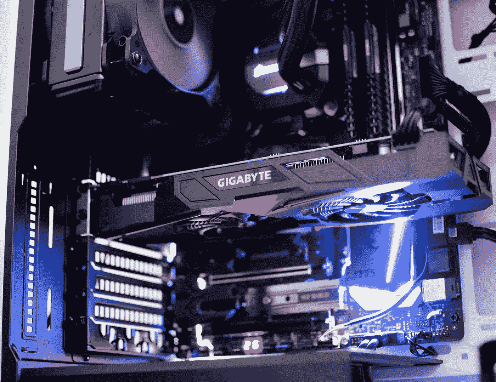
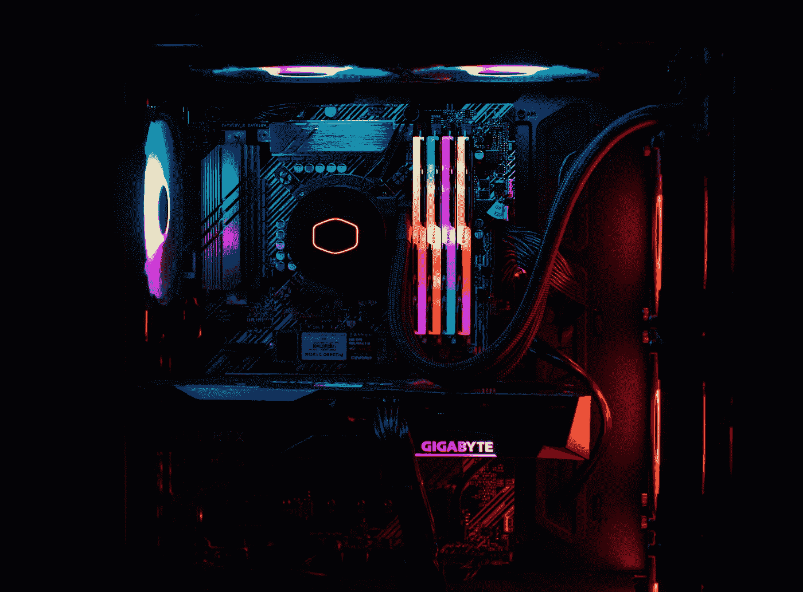

# 基本采矿池概念

> 原文：<https://medium.com/coinmonks/basic-mining-pool-concepts-158d9dfe3c9c?source=collection_archive---------44----------------------->

在 proff of Work 协议下工作的所有货币都是可开采的，但是，盈利能力因不同因素而异，如设备、电力成本或服务、空间租赁等。

photo by [Rafael Pol](https://unsplash.com/@rapol?utm_source=unsplash&utm_medium=referral&utm_content=creditCopyText) on [Unsplash](https://unsplash.com/es/s/fotos/gpu?utm_source=unsplash&utm_medium=referral&utm_content=creditCopyText)

在采矿的早期，所需要的只是一台连接互联网的基本个人电脑，创建和配置钱包，并安装负责通过计算过程生成新令牌的应用程序，以解决算法问题。

然而，目前有许多人使用专门的设备工作，以在解决和创建新块时获得奖励，因此越来越难以察觉个人计算机的利润，实际上有必要在 gpu 或 gdu 中拥有具有高处理能力的设备。使得投资更高。

从前面提到的，它演变成一个基础设施，称为采矿池，基本上允许矿工组合资源，以产生一个更好的机会，在行动中赚取奖励，将在参与者之间共享。

在采用工作验证(PoW)共识机制的区块链协议中，这种开采过程需要以大型团队的形式部署专用集成电路(ASICs ),以便在开采一个区块所需的时间内完成复杂的数学问题。

photo by [Voice + Video](https://unsplash.com/@voiceandvideo?utm_source=unsplash&utm_medium=referral&utm_content=creditCopyText) on [Unsplash](https://unsplash.com/es/s/fotos/gdu?utm_source=unsplash&utm_medium=referral&utm_content=creditCopyText)

Slush Pool 是第一个与比特币一起工作的采矿池，现在有许多流行的加密货币采矿池，如 Ether)、Zcash (ZEC)、比特币现金(BCH)、比特币 SV (BSV)等可供选择。

矿池拥有自己的仪表盘，可提供采矿硬件状态、当前散列率、估计利润和其他参数等信息，为加密货币用户提供了持续参与特定加密货币采矿过程的机会，并根据贡献的计算能力获得定期奖励。

## 了解加密货币挖掘流程

首先，对于任何 PoW 区块链协议，挖掘其原生令牌的过程涉及使用计算能力解决数学问题，其中正确答案被表示为块的散列数，并且奖励被呈现给解决最快的实体。

photo by [Timur Garifov](https://unsplash.com/es/@timgarifov?utm_source=unsplash&utm_medium=referral&utm_content=creditCopyText) on [Unsplash](https://unsplash.com/es/s/fotos/gpu?utm_source=unsplash&utm_medium=referral&utm_content=creditCopyText)

这些奖励以本地令牌的形式呈现，挖掘过程被编程为在特定持续时间之后挖掘新的交易块。在比特币的情况下，这个时间大约是 10 分钟，复杂性或哈希速率根据网络上可用的计算能力进行调整。

计算能力越强，散列率成比例地增加得就越高，并且需要更多的计算能力才能在每个时间周期内有机会解决数学难题。

这就是为什么加密货币矿工已经从使用个人电脑或 CPU 矿工转向使用图形处理单元(GPU)，现在已经完全转向使用数百个 ASICs 来挖掘加密货币的定制设备。

这些 ASIC 矿工继续进化，并使用最新的芯片技术来提供哈希速率，可以增加挖掘比特币或任何其他加密货币的机会。这取决于散列率、功耗、产生的噪声和每天的收益。

无论是向系统中释放新的令牌，还是以块的形式验证和添加交易到分类账中，随着更多的矿商争夺它，挖掘过程变得更加困难。

## 泳池的运行

加密货币矿池是一组一起工作的矿工，矿池操作员管理各种活动，如记录每个池成员所做的工作，管理他们的哈希，向每个成员分配奖励费用，甚至是单独完成的工作。

作为回报，从分配给每个成员的奖励中扣除采矿池费用，该费用基于池的共享机制计算，并且取决于这些加密货币采矿池如何分配奖励，它们可以是比例型、按份额付费型或完全分散的点对点(P2P)池型。

在比例开采池中，贡献其计算能力的矿工获得份额，直到该池成功开采一个区块，然后这些份额被转换成与每个池成员获得的份额数量成比例的奖励。

每股付费资金池与比例资金池略有不同，因为每个成员都可以收集每天收到的股份，而不管资金池是否成功开采了某个区块。
最后但同样重要的是，P2P 加密货币挖掘池是更高级的版本，其中所有池活动都集成为一个单独的区块链，以防止运营商或任何个体实体欺骗池成员。
无论选择哪种类型的池，在分析所需的计算能力、涉及的电力成本、适用的挖掘池费率和加密货币挖掘池的支付频率后，检查加密货币挖掘池是否具有成本效益是很重要的。

选择哪种加密货币开始挖掘取决于其价格的稳定性、持续获得体面回报所需的哈希比率以及将从总收入中扣除的挖掘平台费用。

除了注册加密货币挖掘平台之外，个体矿工还需要一个或多个 ASIC 矿工形式的挖掘硬件、安装的挖掘软件和安全的加密货币钱包，以存储交易的奖励和其他加密货币持有量。

先进的挖矿设备投入的资本越多，获得更高回报的机会就越大，只要所有的硬件都专用于加密货币挖矿。

此外，拥有快速的互联网连接和不间断的电源对于以最快的速度完成矿池运营商分配的工作至关重要。

## 优势

*   加密货币矿池为小矿工提供了获得奖励的可能性。
*   有固定收入是有可能的。
*   它让你在投资和盈利方面有所增长。
*   定期付款。
*   保证参与，即使你没有大型设备。

## 不足之处

*   并非所有的加密货币矿池都是安全的，因为它们可能具有低流动性，从而产生可能的断开。
*   每个成员的实际收入比单个矿工的收入要低得多。
*   资本的回报可能会慢一点。

> 交易新手？试试[加密交易机器人](/coinmonks/crypto-trading-bot-c2ffce8acb2a)或者[复制交易](/coinmonks/top-10-crypto-copy-trading-platforms-for-beginners-d0c37c7d698c)
> 
> 多样化的密码持有，了解[币安替代品](https://coincodecap.com/binance-alternatives)
> 
> 加入 Coinmonks [电报频道](https://t.me/coincodecap)和 [Youtube 频道](https://www.youtube.com/c/coinmonks/videos)获取每日[加密新闻](http://coincodecap.com/)

## 另外，阅读

*   [复制交易](/coinmonks/top-10-crypto-copy-trading-platforms-for-beginners-d0c37c7d698c) | [加密税务软件](/coinmonks/crypto-tax-software-ed4b4810e338)
*   [网格交易](https://coincodecap.com/grid-trading) | [加密硬件钱包](/coinmonks/the-best-cryptocurrency-hardware-wallets-of-2020-e28b1c124069)
*   [密码电报信号](/coinmonks/top-3-telegram-channels-for-crypto-traders-in-2021-8385f4411ff4) | [密码交易机器人](/coinmonks/crypto-trading-bot-c2ffce8acb2a)
*   [最佳加密交易所](/coinmonks/crypto-exchange-dd2f9d6f3769) | [印度最佳加密交易所](/coinmonks/bitcoin-exchange-in-india-7f1fe79715c9)
*   开发人员的最佳加密 API
*   最佳[密码借贷平台](/coinmonks/top-5-crypto-lending-platforms-in-2020-that-you-need-to-know-a1b675cec3fa)
*   [免费加密信号](/coinmonks/free-crypto-signals-48b25e61a8da) | [加密交易机器人](/coinmonks/crypto-trading-bot-c2ffce8acb2a)
*   [杠杆代币的终极指南](/coinmonks/leveraged-token-3f5257808b22)