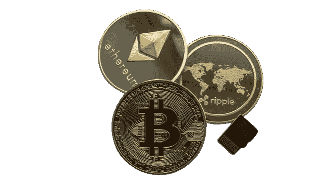
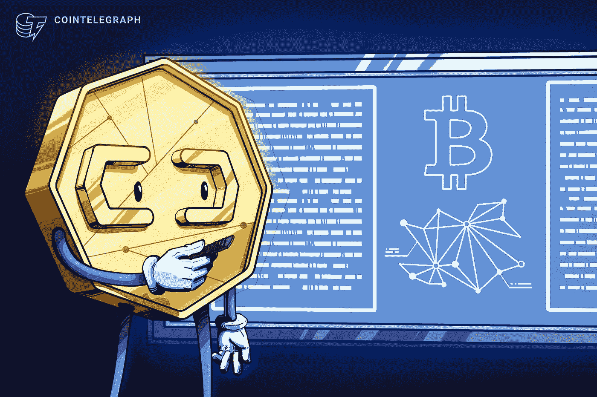
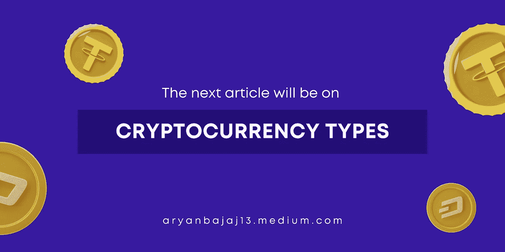
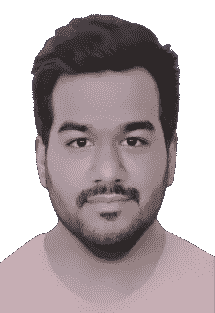

# 加密货币的基础知识

> 原文：<https://medium.com/coinmonks/basics-of-cryptocurrency-fa4985216ca4?source=collection_archive---------25----------------------->

## 订阅我的媒介账号:[https://aryanbajaj13.medium.com/subscribe](https://aryanbajaj13.medium.com/subscribe)

## 这是加密货币系列的第一篇文章…保持联系了解更多！

比特币、莱特币、以太坊、Monero 和其他加密货币是新的交易方式。

但是每枚硬币是什么，它们是如何工作的，你在哪里买的？请继续阅读这篇内容丰富的文章，了解更多关于加密货币的信息。

# 什么是加密货币？

加密货币是一种数字或虚拟资产，使用加密技术来确保安全。加密货币是分散的，这意味着它们不受政府或金融机构的控制。比特币是第一种也是最知名的加密货币，诞生于 2009 年。加密货币通常在分散的交易所交易，也可以用来购买商品和服务。

# 它在现代经济中是如何运作的？

加密货币是一种数字资产，它使用加密技术来保护其交易并控制新单位的创建。加密货币是分散的，这意味着它不受政府或金融机构的控制。比特币是第一种也是最知名的加密货币，诞生于 2009 年。

加密货币利用区块链技术工作。区块链是所有加密货币交易的数字分类账，通过加密技术不断更新和保护。交易以块的形式添加到分类账中，每个块与前一个块相链接，形成一个链。这允许安全、透明和防篡改的记录保存。

加密货币可以用来购买商品和服务，也可以作为投资持有。过去几年，加密资产的价格波动很大，但许多人认为，由于其有限的供应和不断增长的需求，它们具有巨大的投资潜力。

无论你是加密初学者还是有经验的投资者，在投资之前了解加密货币的工作原理都很重要。做你的研究和跟上行业新闻将有助于你对你的加密投资作出明智的决定。

# 与加密货币相关联的优势

加密货币最近越来越受欢迎，这是有原因的。加密货币提供了许多优于传统法定货币的优势，包括去中心化、安全性和匿名性。

分散化意味着没有中央权力机构控制货币。这是一个重大优势，因为它让人民币更能抵御腐败和操纵。

安全性是加密货币的另一个优势。加密货币交易通常由加密技术保护，这使得它们很难被伪造或篡改。

匿名是加密货币的另一大优势。当您使用加密货币时，您的交易与您的个人身份无关。这使您可以在完全保密的情况下进行交易，并避免身份被盗的风险。

# 挑战和劣势加密货币的局限性是什么

加密货币有很大的潜力，但也有一些严重的局限性。加密货币面临的最大挑战之一是可扩展性。像比特币和以太坊这样的加密货币目前仅限于每秒处理几笔交易。这与 Visa 等传统支付处理器相去甚远，后者每秒可以处理数千笔交易。加密货币面临的另一个挑战是缺乏监管。加密货币不像传统法定货币那样受制于相同的规则和法规。这让它有点像狂野西部，也意味着投资者没有真正的保护。最后，加密货币仍然是一项相对较新的技术，它在不断发展。这意味着仍然有一些主要的错误和安全风险需要解决。

# 结论

加密货币是一种数字资产，旨在使用加密技术作为交易媒介，以确保交易安全，并控制特定加密货币新单位的创建。加密货币被归类为数字货币的子集，也被归类为替代货币和虚拟货币的子集。比特币创建于 2009 年，是第一种去中心化的加密货币。自那以后，许多其他加密货币被创造出来。这些硬币通常被称为替代硬币，是替代硬币的混合体。

## 这是加密货币系列的第一篇文章…保持联系了解更多！

# 关于作者

我最近完成了 BBA(商业分析)从基督大学，拉瓦萨，浦那校区。

**网站—**[**【acumenfinalysis.com】**](http://acumenfinalysis.com/)**(看看这个)**

# 联系人:

如果你对我下一篇文章的内容有任何问题或建议，请给我写信，地址是**aryanbajaj104@gmail.com**。

如果您想了解我的最新文章和项目，请在媒体上关注我。

## 订阅我的媒介账号:[https://aryanbajaj13.medium.com/subscribe](https://aryanbajaj13.medium.com/subscribe)

# 通过以下方式与我联系:

[**领英**](https://www.linkedin.com/in/aryan-bajaj-b62364191)

> 交易新手？试试[加密交易机器人](/coinmonks/crypto-trading-bot-c2ffce8acb2a)或者[复制交易](/coinmonks/top-10-crypto-copy-trading-platforms-for-beginners-d0c37c7d698c)