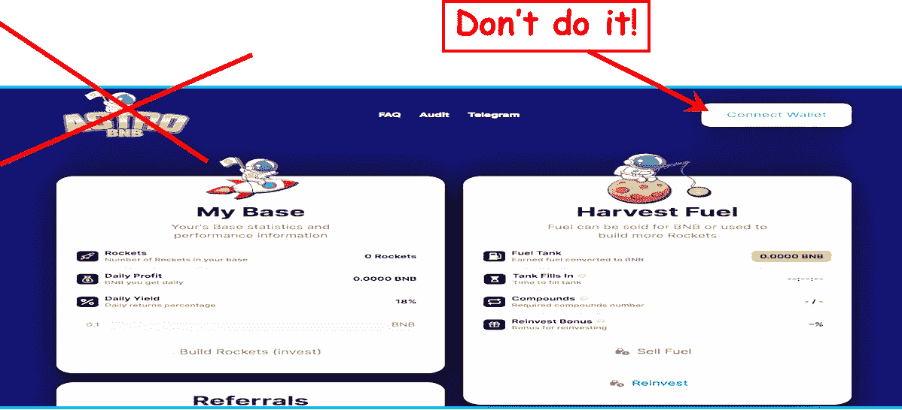
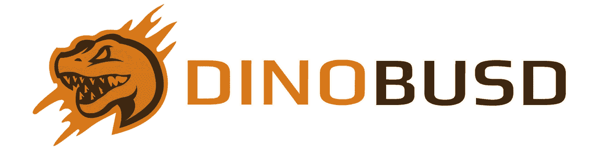
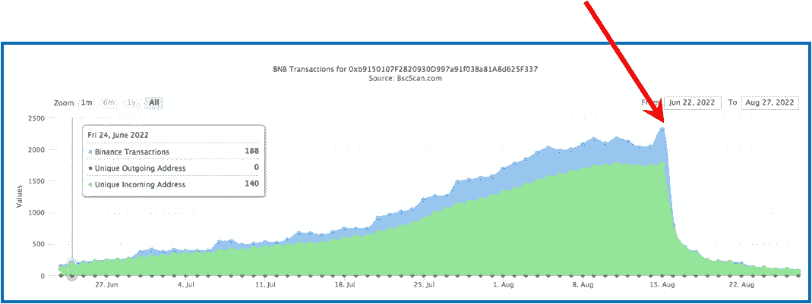
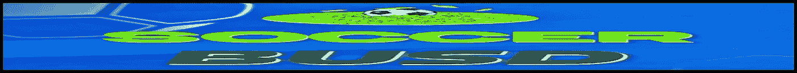
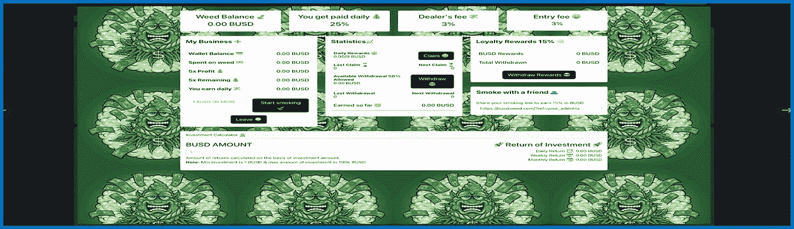
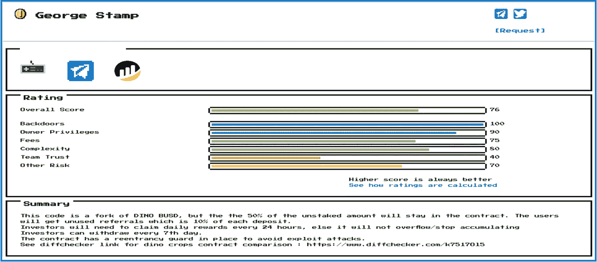
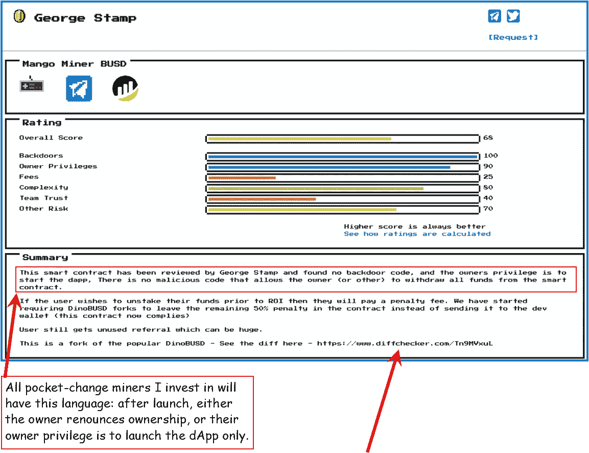
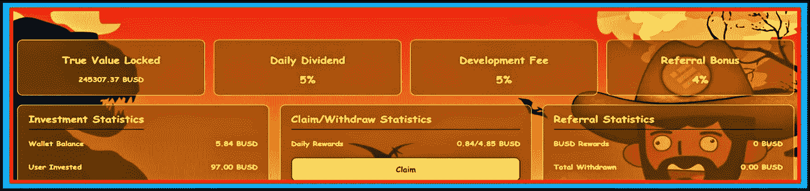
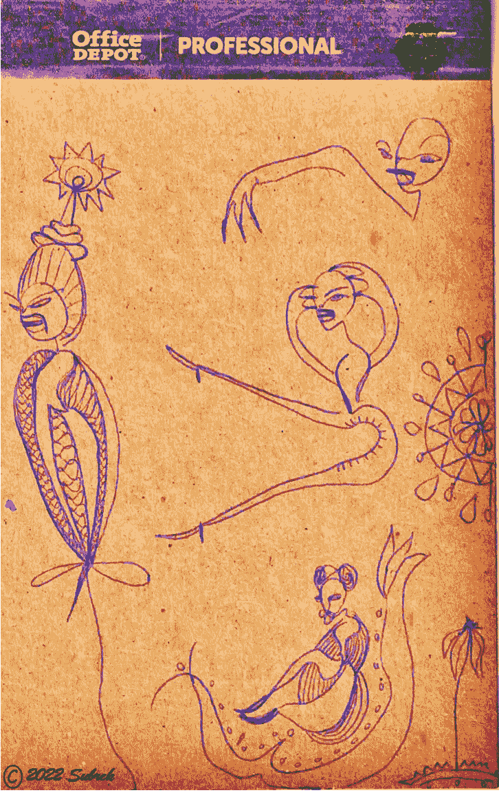

# 这个 DeFi 空间里的混蛋

> 原文：<https://medium.com/coinmonks/bastards-in-this-defi-space-c5d487ff89ab?source=collection_archive---------1----------------------->

8 月份最新和即将推出的地毯清单+一些好消息

Carnage! Dino was here…

> 今天的课程:小心恐龙诅咒！

## 邪恶的拉地毯的混蛋

辛苦赚来的密码被盗，而在这些口袋里改变赌注协议是一个普遍的定期发生；预期。不应该。

打击盗窃的一个方法是传递关于被污染协议的信息。这就是为什么我们都在这个空间:为了(互相帮助)更好地了解 DeFi 世界的这个疯狂的角落。

> 所以我先说:远离 AstroBNB！这是最新的拉地毯的零钱矿工，如上图所示。这一点尤其阴险:似乎每次有人复合都会掏空钱包。肯定的迹象:它今天也删除了它的电报帐户。

> 很少有人投资这个协议，这是个好消息。但是我指出它是有原因的:这是**恐龙诅咒协议**的一部分。

The Dino Curse started here…

## 恐龙诅咒

事情是这样的:仲春，一个全新的口袋变化赌注协议推出。它有一个独特的界面，叫做**仪表板投资平台。**效果不错。就我个人而言，我爱上了它，并从中获得了很多投资回报。它被称为 **DinoBUSD** &它很新颖，因为它持有投资者资金的时间更长&每周只提供一半的回报——这加强了延长合同的寿命&。它越来越受欢迎。该项目的 TVL 超过了 50 万美元，高达 80 多万 BUSD。

然后，在一个残酷的月里，它被复制，[克隆，&分叉，令人作呕](/coinmonks/attack-of-the-forking-clones-302b5718d0f5)——&它仍然是。

> 一个主要问题是:它的合同很容易被邪恶的开发者篡改，造成了一个又一个灾难性的恐龙克隆。大约在 8 月 15 日，甚至迪诺拉下了地毯，让世界再次知道，这个空间里有混蛋。这个协议不再值得信任了…我不再信任它了。

我不相信地狱；然而，我希望那些从信任他们的人那里偷钱的开发者有一个因果报应的地狱…

Dino falling off a cliff. Above is **a classic Rug-Pull**. Never trust a pocket-change miner protocol that allows the developer to retain ownership after launch of the project. Your money will go to hell, along with the evil dev.

上图中的绿色代表唯一的传入地址，这是进入协议的新投资。请注意，当项目开发人员窃取剩余资金时，收入刚刚趋于平稳。这突然结束了迪诺布斯看似短暂，但富有成效和影响力的一生。

## 其他最近的丑闻

这些最近的恐龙克隆体都遭受了恐龙协议拉地毯的诅咒:

SpaceBUSD、SoccerBUSD、BNBTheLostWorld 和 BUSDWeed 等等。

WeedBUSD? Love that it’s legal, but the project was schwagg!

## 接下来是什么？

我预计贪婪将会胜出&除了那些在发布时放弃所有权的人之外，每一个有上述协议的零钱包矿工都有可能成为一个拉地毯的人。

> 从这两个即将推出的协议来看——**bus dextra**&**atom miner**——我没有看到他们放弃所有权，&他们也有迪诺协议的诅咒。请注意&远离。

## 不要责怪审计

过去，当一个零花钱协议遇到麻烦时，我会责怪审计公司。然后我开始阅读审计报告。

> 这些审计没有明确地告诉你“这将是一场地毯式搜索！”
> 
> 然而，他们会让你知道这种可能性。以下注释以某种转述的形式包含在所有经审计的 Dino-curse 地毯拉条的审计中:

> “利益相关者注意:请注意，有效的智能合约所有者权限对智能合约的安全性和安全性有较大影响。”

## 再说一遍？

> **主动**智能合约**所有者特权**对**安全&安全**构成提升**影响**

如果口袋改变矿工所有者保留能力控制合同的货币方面在发射之后，小心…

> ***这样理解:如果开发商保留所有权，他/她绝对会偷走合同中的所有钱——可能就在合同开始变得平稳时，在达到历史最高水平后，就像不诚实的迪诺·德夫那样。***

咻。在加密空间的这个角落里，这是有点疯狂和令人兴奋的事情；然而，并没有失去一切。

## 乔治出现了…

GeorgeStamp.xyz 是一家智能合同审计公司。他们有一个由 4 名编码人员组成的团队，负责检查 dApp 协议的准确性&真实性，&从一开始，他们就一直在与这些采矿项目一起发展。

Georgestamp 的 George 最近购买了一个受欢迎的零花钱矿工特许经营权——最近的是[侏罗纪农作物农场主](https://jurassicbusd.cropsfarmer.online/?ref=0x024ee915c2BF9d12F98b750119051A752e18CAa0) — &然后自己保证审计。《作物种植者》是最大的&也许是最著名的口袋改变协议之一，拥有无数的项目；你可以在这里看到他们所有活跃的矿工。

<<see the="" class="ae mg" rel="noopener" href="/coinmonks/sweet-ownership-renounced-3bce652e9610">深潜侏罗纪的庄稼汉 > ></see>

在迪诺布斯地毯公司制造了这么多的屠杀之后，也许乔治买下了《庄稼农夫》来给现场带来一些稳定。

> 有些派对最好有监护人陪同…

GeorgeStamp.xyz has entered the room…Above is a segment of a typical GS.xyz audit. Hopefully this company will start the trend of creating a little order in this corner of the DeFi space…

## 它是这样做的:

GeorgeStamp.xyz 正在评估这些较新的恐龙克隆体&除非它们放弃所有权和/或在上市后严格限制它们的股份，否则不会对它们进行审核。该公司的一个建议是，鼓励将未使用的推荐重新存入合同，这是一个可持续发展的功能。另一个——也是最重要的——是以几种不同的方式验证所有者不能在项目启动后破坏它。一种方法是放弃合同所有权。

> 鼓励在项目启动时放弃项目所有权的协议将把阻力减少到零；这改变了游戏规则。

Georgestamp 正在敦促开发商在发布时放弃所有权，这提供了更多的安全性:我一直为 TVL 可能耗尽资金做好准备——这包括在我的计算中。然而，我们永远不应该准备好一个项目，随机地毯&偷我们的零花钱。

Cool feature: GeorgeStamp.xyz links to DiffChecker, which lets you compare two smart contracts side-by-side, looking for differences between them.

## 上面来自 Georgestamp 的审计添加了一些令人欣慰的注释:

## 后门

"没有后门方法可以把资金抽到非投资者的钱包里."

## 复杂性

“这种智能合同相当复杂&没有所有者的灵活性；一旦部署，就设置好了。”这些是我们都想听到的话…

## 研究

通读他们网站上的所有(大量)审计报告，你会发现一些言外之意。该公司奖励积分的审计领域之一，称为团队信任，是对开发人员知名度的衡量。该注释可以是:

> 团队信任:团队是未知的，有一个活跃的社区。

这使我去[电报](https://t.me/mangofinanceofficial)检查所有的活动。这是他们的第一个口袋改变矿工项目；然而，他们有一个庞大的兴奋的社区。见证了许多人在电报上签名。

沿途收集的所有重要信息。

## 外卖食品

毫无疑问，这里有拉地毯的混蛋。然而，还是有好人搬进来——或者已经来过——努力纠正这些错误。它可能正在(非常缓慢地)发挥作用。

不过，继续研究和探索这个空间，可以最大限度地减少损失，为我创造更多的零花钱。这里有很棒的东西，找到它是乐趣的一部分。这一切鼓励我**继续回来** …

谢谢你走到这一步。我希望你能在这篇关于我们生活的疯狂密码世界的评论文章中找到一些有价值的东西。我不是财务顾问；我喜欢研究密码。总是很高兴有你**跟着我** …

我鼓励朋友们只玩你不需要的东西。又是 Thx。

Borrowed from @shamelesslyplugged

## *不要脸的塞*

> 我喜欢探索&剖析新的零钱加密赌注协议。我要么把他们分开，要么决定投资这个项目，鼓励他们的可持续性和长久性。这些矿工中很少有人会升到最高层；那些是我正在寻找的。

> *注意:当我成功地从一个协议中赚了钱——不一定是我的全部投资回报，只是现在——我会写下我的经历。如果你喜欢这个协议，决定投资进去，那是我的目标，我很激动。投资于该议定书有助于其可持续性。*
> 
> *使用这篇文章的推荐链接会给我一点补偿&这是一个让我知道这些对话是有益的极好方式。如果你使用我的推荐链接，谢谢！*

> *在我的世界里，一个最成功的零花钱矿工开发团队已经开始使用我最喜欢的被动收入加密赌注协议之一…*
> 
> *漂亮的混血结果是 7 天大的* [*侏罗纪农作物农夫*](https://jurassicbusd.cropsfarmer.online/?ref=0x024ee915c2BF9d12F98b750119051A752e18CAa0) *。*

我很兴奋。这似乎是一个伟大的项目，我觉得随着时间的推移，它会提供巨大的被动收入收益。毫无疑问，这不是一个快速致富的场景。它每天有 5%的投资回报，内置了一系列智能的可持续/长寿和反鲸功能。所以你不会每天赚 5%,但你会…

这个项目最好的部分可能是开发商的声誉——参见《侏罗纪农作物农夫》的深度报道。

我的期望是，这款仪表盘和它的全体工作人员将会开创一个袖珍矿工协议的新时代。我想在这里见证投资。仪表板的样品刚刚被吹制。点击它会把你带到网站。

Ever imagine investing hard-earned crypto pocket-change into something called Jurassic Crops Farmer? Me neither. However, here I am…

这个协议的一个很酷的概念是在我能够收集我的回报后一周内我意识到的:

我每周能拿到一半的奖励。然而，我没有把剩下的一半放在钱包里，而是把它放回了我的投资金额中，因此每周的复利都在增加。如果这种情况持续很长时间的话，那将会增加很多……到目前为止，我已经进行了第二周了，一切都很顺利。又是 Thx。

 [## 侏罗纪 BUSD 农民

### 8%的每日稳定币奖励

jurascibcusd . crops farmer . online](https://jurassicbusd.cropsfarmer.online/?ref=0x024ee915c2BF9d12F98b750119051A752e18CAa0) 

我的朋友什么都画！我称之为他的账本系列。我喜欢下图。

Professional

> 交易新手？试试[加密交易机器人](/coinmonks/crypto-trading-bot-c2ffce8acb2a)或者[复制交易](/coinmonks/top-10-crypto-copy-trading-platforms-for-beginners-d0c37c7d698c)