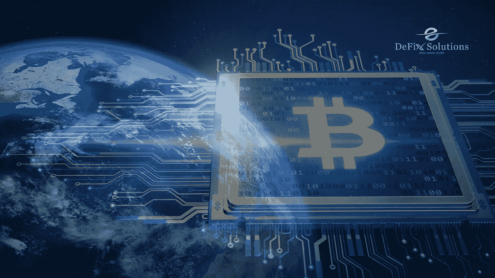

# 成为成长中的秘密世界的一部分

> 原文：<https://medium.com/coinmonks/be-a-part-of-the-growing-crypto-world-a8ce59808840?source=collection_archive---------29----------------------->

近来，对数字资产的大肆宣传一直是一种趋势。金融业日新月异，为经济独立创造了很多机会。加密货币是新的热潮，因为它们的巨大回报，吸引了大量的人投资它们，并增加了需求。由于市场波动很大，一些交易者沉迷于赚取良好的收入来源。自 2009 年第一枚加密硬币问世以来，加密货币发展迅猛。除了作为一种快速致富的方案，总部位于区块链的加密货币还提供了广泛的用途和应用。由于未来世界是高度数字化的，所以主要是以技术方面为后盾。

今天的年轻人是数字一代，他们理解投资的价值，并被利润丰厚的加密市场所吸引。由于年轻时代希望生活自由，所以在任何地方工作并在睡觉时赚钱的想法对他们来说意义重大。密码产业让年轻人的生活变得轻松。加密货币没有物理组件。区块链是唯一能找到它们的地方。不需要中介来促进这些数字资产的交换。

## **成为职业选手**

在区块链世界有太多的投资选择，不仅是加密，还有其他一些项目，你可以投资并赚取巨额利润。投资前你应该问的最重要的问题是你投资的动机。你是想以交易作为副业收入，还是想成为一名密码爱好者？目前有无数的投资选择，其中许多都比数字货币提供了更好的一致性和更小的波动性。

有一些具体的简短策略可以用来建立一种自我的方法，目标是有一天把自己称为一个可以立即实施的密码专家。

*   对软件和技术有初步的了解可能是有益的。总是对市场进行深入研究是明智的。不要着急；只要花时间去理解市场趋势，并遵循其中的一致性。
*   所有新工程师都应该首先阅读白皮书。有可能买到数万种不同的加密货币，每种都有白皮书。做一个快速搜索，然后使用深入的研究技巧来限制你的搜索。不要简单地浏览白皮书；完整阅读。
*   加入各种致力于交换关于加密货币的想法和信息的在线社区。注意专家们要说的话。查看你选择的主题的视频，对所有元素进行广泛的研究，尤其是技术。

**DeFiX:实现财务自由的解决方案**

DeFiX 是一款钱包，它是您进入 DeFi 和加密相关服务领域的入口。DeFiX 钱包允许您直接通信，无需任何中介，从而使您能够存储、传输和接收加密货币资产。当你使用这个钱包时，你可以完全控制你的钱。

DeFiX 应用程序可让您通过使用 DeFiX 应用程序访问存储在您的设备上的受保护密钥，以进行解密。

像 DeFiX 这样的钱包软件是一个非常好的选择，也非常方便。由于该平台收费适中，您可以节省运行费用。请访问 DeFiX 应用程序，并使用许多有用的功能来了解更多有关各种定价水平的信息。

> 交易新手？试试[加密交易机器人](/coinmonks/crypto-trading-bot-c2ffce8acb2a)或者[复制交易](/coinmonks/top-10-crypto-copy-trading-platforms-for-beginners-d0c37c7d698c)