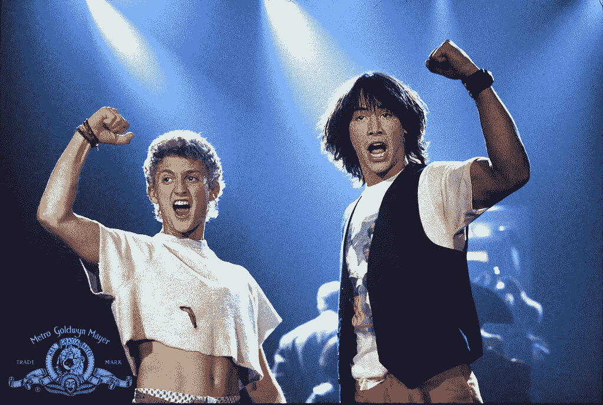

# 彼此优秀

> 原文：<https://medium.com/coinmonks/be-excellent-to-each-other-3562547c69cf?source=collection_archive---------43----------------------->

Ct MGM

“比尔和特德的精彩冒险”是一部经典的 80 年代电影，讲述了两个高中懒鬼为了完成他们的历史报告而穿越时空的故事。这部电影充满了可引用的台词，但最令人难忘的可能是“彼此优秀”

在当今世界，人们很容易陷入消极之中，忘记优秀对彼此的重要性。这句话提醒我们，我们都应该以尊重、善良和同情的态度对待彼此。

当我们彼此优秀时，我们让世界变得更美好。无论是为某人开门，捡垃圾，还是仅仅打个招呼，这些小小的善举都可以带来很大的不同。在我们做的每一件事上，我们都应该努力做到最好。我们应该记住彼此优秀的重要性，每天努力让世界变得更美好。通过尊重和同情他人，我们可以有所作为，为每个人创造更美好的未来。

所以，让我们都从比尔和特德的故事中吸取教训，记住“对彼此都要优秀。”

> 交易新手？试试[加密交易机器人](/coinmonks/crypto-trading-bot-c2ffce8acb2a)或者[复制交易](/coinmonks/top-10-crypto-copy-trading-platforms-for-beginners-d0c37c7d698c)