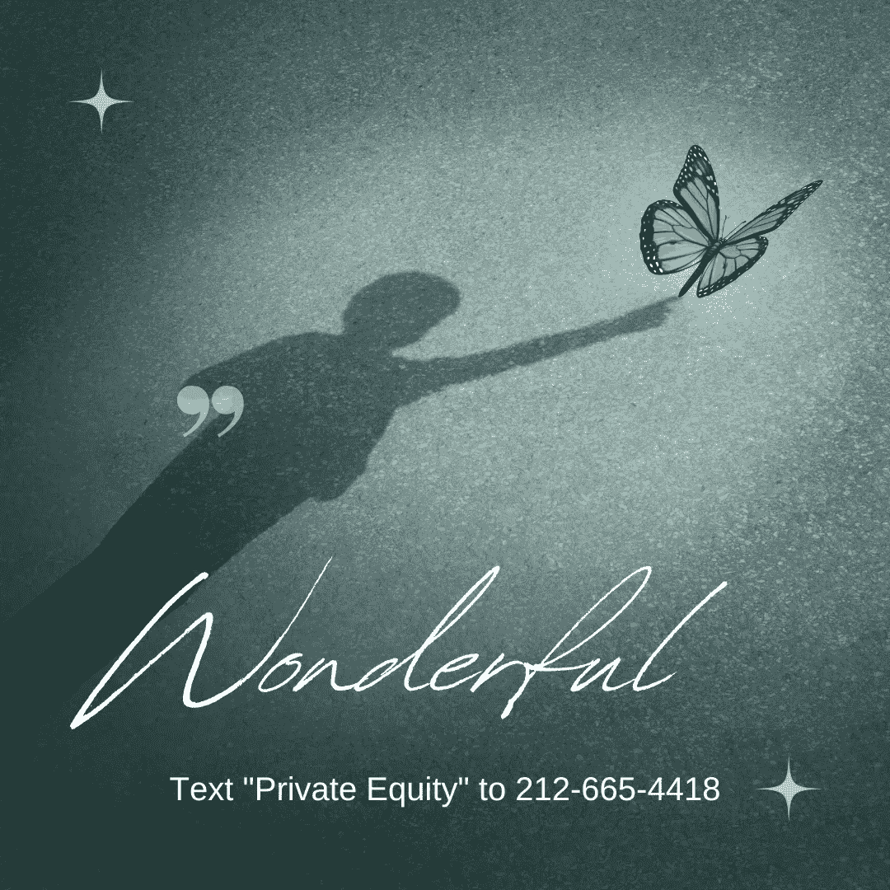

# 是你的银行吗

> 原文：<https://medium.com/coinmonks/be-your-on-bank-6f9d19c181b1?source=collection_archive---------42----------------------->

你是艺术家、企业家、家庭主妇，你想以艺术家、企业家或家庭主妇的身份谋生。我听到了。最近我一直在说，有一句话我希望自己年轻时就学会了:做自己的银行。

直到我 50 多岁的时候，我才学会这样做的必要步骤。所以现在我知道了，我很乐意分享这些知识！