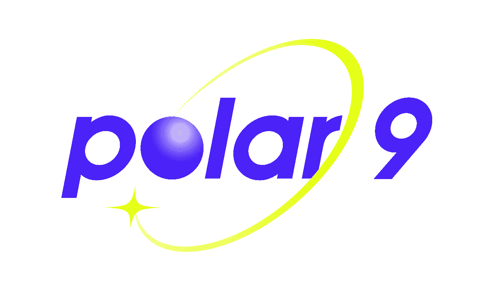
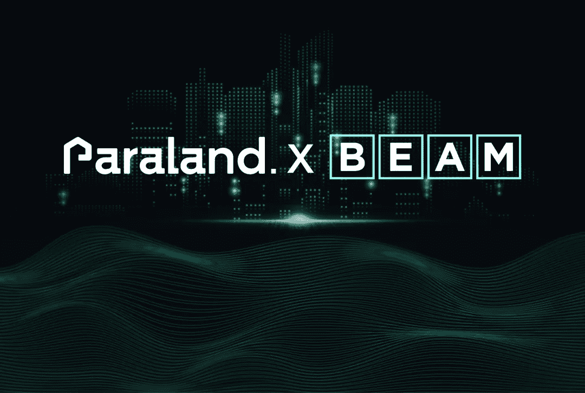
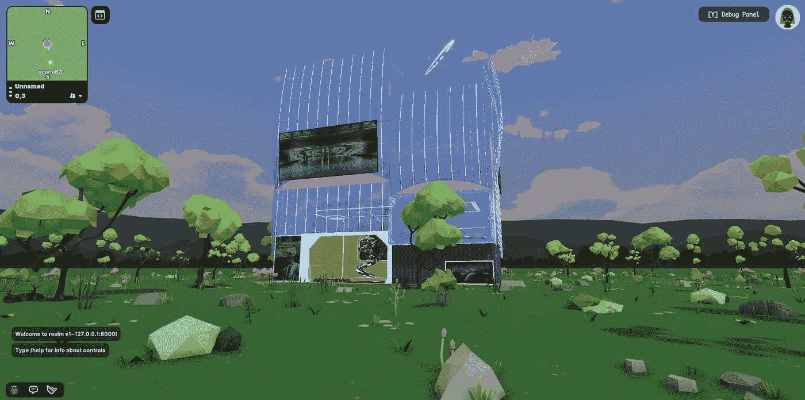
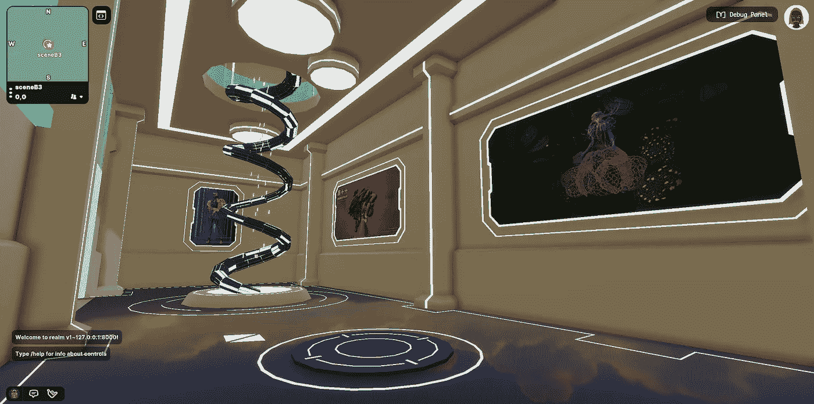
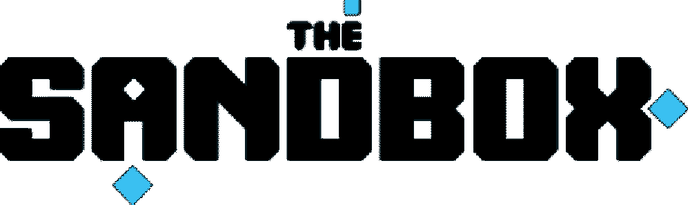
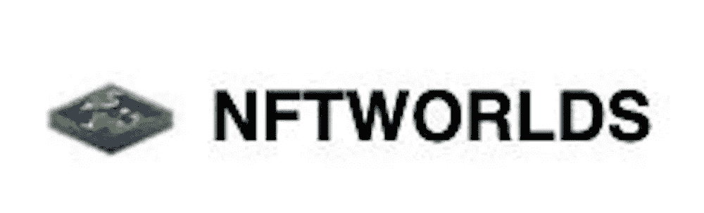
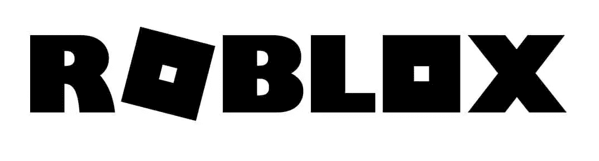

# BEAM Studio 和 Paraland 推出新品牌 Polar 9

> 原文：<https://medium.com/coinmonks/beam-studio-and-paraland-launch-new-brand-polar-9-f4e45702b8eb?source=collection_archive---------51----------------------->

Polar 9 Logo

Polar 9 是 BEAM Studio 和 Paraland 联合推出的 Web3 原生元宇宙创意空间和沉浸式体验的先锋品牌。

# ***我们的任务***

*   **我们相信年轻一代的数字消费能力**

我们相信千禧一代和 Z 世代(数字原生代)正在引领数字消费潮流，拥有巨大的数字购买力。

*   **我们提供 Web3 社区和文化协同，在新的环境中激活和激发品牌力量**

我们以建设 Web3 社区文化为己任，继续支持和孵化数字原生青年社区。Web3 社区文化独特的叙事方式将在新的语境中激活和激发品牌力量。

*   **我们在元宇宙探索新的场景和体验**

我们探索元宇宙或数字原生的新产品类别，并使用数字方法以更深入和更全面的方式与消费者互动。

# 我们的服务

*   **沉浸式密码展示空间**

Polar 9 支持身临其境的展览，它位于数字艺术、加密文化、前沿技术和 NFT 革命的交汇处。这将是一个唤醒想象力的实验场。它将是自由的形式，拒绝停滞不前，并从一个包容的全球社区中寻求灵感和领导。

*   **创新的虚拟体验**

Polar 9 可以为所有 IP、品牌、机构定制互动体验。利用多媒体和增强的空间规划，我们希望让更多的观众参与到我们想要传递的内容中，这从营销和战略的角度来看都有利于我们的客户。

*   **全面智能推广&元宇宙运营**

Polar 9 提供了构建下一代数字和虚拟活动的工具，以一种新的令人兴奋的方式连接新的观众并加强与现有粉丝的联系。
我们通过自建的智能系统提供全面的 Web3 推广和运营服务，包括数字场馆、NFT 门票、销售和分销、门禁、Web3 营销工具、活动前和活动后的 NFT 货币化工具、活动中的游戏化选项以及用于详细活动分析的活动仪表板等。

# 我们的优势

*   跨多个元数据的 Web 3 本地创新业务空间
*   一站式 web3 商务登陆服务
*   革命性的工具包和活动架构，让品牌、艺术家和企业只需轻轻点击几下鼠标，就能启动虚拟活动

# 极地 9 号首次亮相元宇宙平台——分散地

位置:(126，-16)

Polar 9 outside

Polar 9 inside

***极地 9 即将来到以下元宇宙平台:***

# **联系我们**

Polar 9 将致力于汇聚具有前瞻性眼光和创新力的品牌、企业和个人创作者，为大众带来优秀的设计，为参与者带来身临其境的体验，让每个人不再受身体条件的限制，可以在不同风格的设计作品中随意徜徉。欢迎感兴趣的品牌和个人与媒体沟通合作。

电子邮件:postmaster1@beamstudio.pro

推特:[https://twitter.com/BEAMstudio_pro](https://twitter.com/BEAMstudio_pro)

不和:【https://discord.gg/QKHhNq8RzD】T2

> 交易新手？试试[密码交易机器人](/coinmonks/crypto-trading-bot-c2ffce8acb2a)或[复制交易](/coinmonks/top-10-crypto-copy-trading-platforms-for-beginners-d0c37c7d698c)