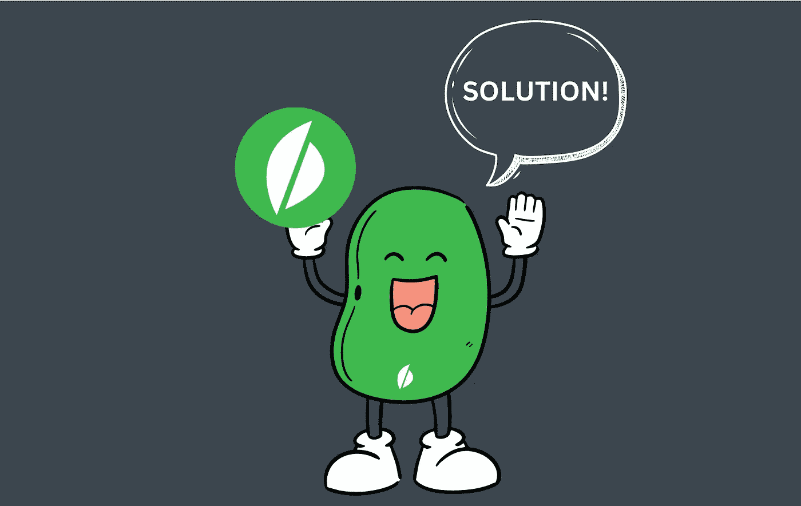
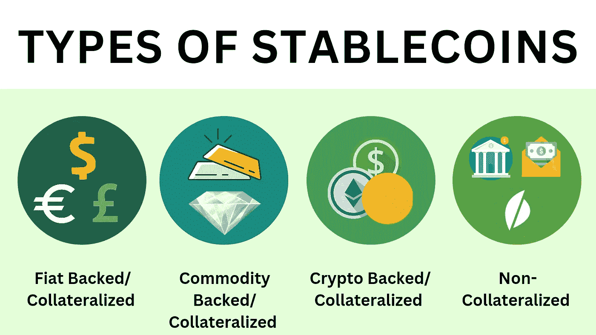
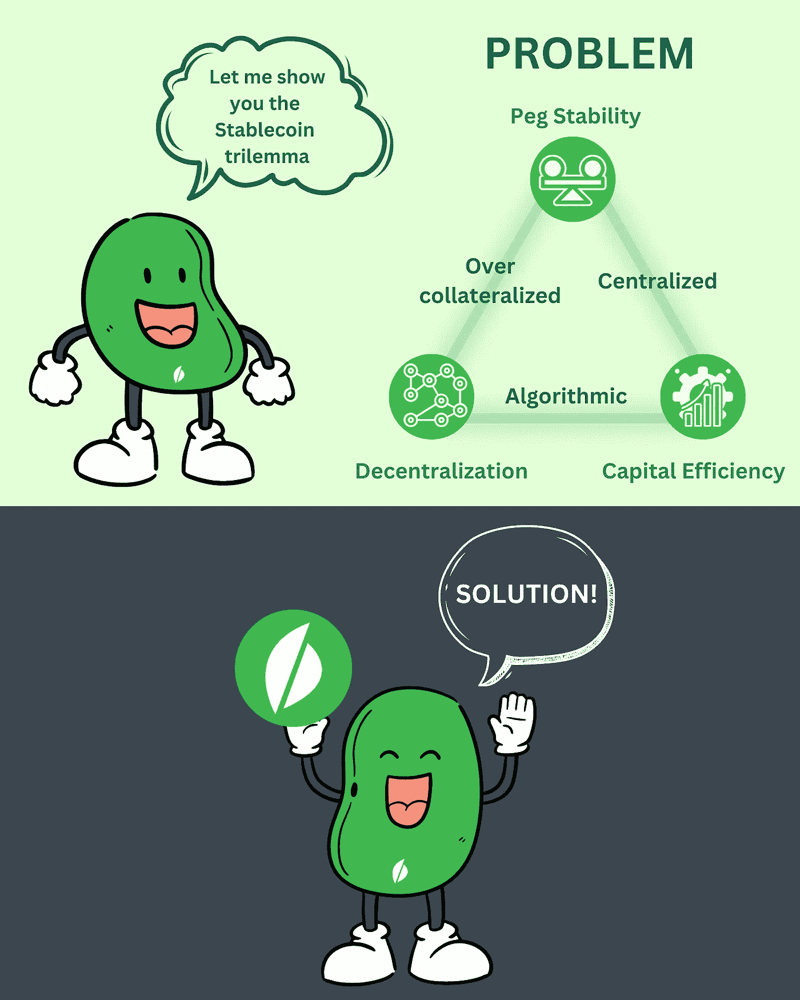

# 豆茎系列豆茎的种类第一章

> 原文：<https://medium.com/coinmonks/beanstalk-series-types-of-stablecoins-ch-1-57fb461d3ec6?source=collection_archive---------28----------------------->

**Primer** — [Beanstalk](https://bean.money/) 是一个未经许可的菲亚特 stablecoin 协议。Beanstalk 依靠**信用**而不是**抵押品**，旨在补救寻租抵押稳定币市场。它旨在创造一种分散的、流动的、区块链本土的资产，这种资产相对于非区块链本土资产的价值是稳定的。

**免责声明** —本文是关于豆茎系列的第二篇。我写这篇文章是作为豆茎社区资助项目的一部分。
第 0 集— [豆茎系列—浴火重生第 0 集](https://www.publish0x.com/life-contests-and-more/beanstalk-series-rising-from-the-ashes-ch0-xzgqwjw)

# 介绍

Stablecoins 被吹捧为将加密货币的去中心化、易变和匿名世界与法定货币的无波动世界结合在一起的关键组成部分。Crypto 的高度投机性使得它对一些投资者很有吸引力。然而，这一引人注目的特点限制了它在支付和贸易中的使用。此外，加密货币市场的极端波动性是其大规模采用和接受的重大障碍。

前述的波动性和不稳定性激发了 Stablecoins 的诞生和设计。Stablecoins，顾名思义，指的是提供价格稳定和稳定估值的一类资产。这些硬币在区块链交易，并与另一种货币(通常是美元)挂钩。这种安排使得稳定硬币能够消除波动性，实现相对稳定的价格，不像其他硬币那样经历巨大的波动。

钉住汇率/价格的稳定性是通过抵押或算法机制实现的。不同的 stablecoins 部署不同的方法来实现稳定性。

然而，每个稳定币都存在于下面提到的光谱中:

1.  **-稳定指的是无论市场状况如何，稳定的货币保持其固定汇率的能力(没有大的变化)。**
2.  ****效率** -描述了确保稳定货币所需的资本数量。锁定超过 1 美元的抵押品来创造 1 美元的稳定硬币被认为是低效的，并可能导致稳定硬币供应的限制。**
3.  ****去中心化**——指的是稳定的核心依赖于集中的系统/实体的程度。**

**价格稳定至关重要，不幸的是，实现高价格稳定需要在系统的分散化或资本效率之间进行权衡。因此，没有一个稳定的硬币能够体现所有这三个特点。**

**这三者共同构成了所谓的稳定币三元悖论。三难设计阻碍了 stablecoin 设计对这些权衡的最佳平衡。**

****

# **稳定曲线的类型**

**稳定图标可分为以下几组:**

1.  ****平背硬币** (1:1 抵押)**

**最受欢迎的是，法定支持的硬币指的是由法定货币支持的硬币，如美元。例子包括美元硬币(USDC)和系绳(USDT)。在这种方法下，保管人/中央组织/中央发行人按照流通硬币的数量比例持有法定抵押品/货币。这样做是为了保证硬币的发行和赎回。然而，这种设置在很大程度上是集中的，并受到政府的监管和干预。**

**2.**加密硬币**(超额抵押)**

**加密支持的硬币类似于法定支持的硬币，除了底层抵押品是另一种加密货币而不是法定货币。在这种设置中，没有中央实体/保管人，因为硬币采用智能合同在链上发行，因此本质上是分散的。他们的购买需要用户对他们的头寸进行超额抵押，这意味着一个较高价值的硬币被锁定，以发行一个较低价值的稳定硬币。超额抵押起到了缓冲抵押品波动的作用。戴就是属于这一类的一个通俗的例子。**

**3.**商品支持币****

**顾名思义，这些硬币以贵金属/石油/房地产等商品作为抵押。黄金是最受欢迎的抵押商品，因为它使个人能够投资黄金，而无需实际购买或储存黄金。这一类别包括 Tether Gold 和 Paxos Gold(大多数液体金支持 stablecoins)。这些硬币促进了对某些散户投资者可望而不可及的资产的投资。**

**4.**算法币**(欠抵押)**

**这些硬币通过使用专门的算法和智能合约来维持价格稳定，而不是由任何现实世界的资产/商品来支持。该算法旨在燃烧/移除或铸造/创造新的硬币，以调节供应并保持平衡。**

**Stablecoins 是 DeFi 基础设施的重要组成部分，也是迄今为止密码市场上最常被借用的资产。**

# **公用事业**

*   **价值储存和交换媒介(跨境支付、汇款和电子商务)**
*   **作为加密资本市场的主要进出点**
*   **大多数交易对(在 CEXs 和 dex 上)都以 stables 命名**
*   **用于其他货币的进出交易，而不会脱离链条**
*   **用于获取加密资本市场的收益**
*   **永久协议提供的流行衍生品大多以稳定债券为抵押**

# **挑战**

**stablecoins 的受欢迎程度正在飙升，因为它们能够提供两个世界的最佳选择——加密领域的隐私和速度，以及传统货币的稳定估值。然而，人们不能忽视法定支持硬币的**集中化**问题，商品支持硬币的**过度抵押**问题，以及抵押不足的算法硬币的**不稳定性**问题。**

**此外，由于**抵押品要求**，现有的 stablecoins 无法扩展以满足不断增长的需求。对稳定债券需求的增加意味着需要存在大量的抵押品。问题是没有足够的抵押品，无论是在链上还是链下，来满足这种需求。因此，与需求相比，目前 DeFi 的稳定玉米严重短缺。这种现象导致供应有限，借贷利率高企。**

**虽然纸币支持的硬币是理想的，并允许显著的缩放，但它们本质上是集中的。加密支持的硬币是分散的，相对稳定，但它们的资本效率不高，而且更难扩大规模，因为它们需要超额抵押。算法硬币解决了资本效率和可扩展性差的问题(没有抵押品支持，可以扩大供给以满足需求)，但代价是失去挂钩。算法币(多年来)的几次迭代已经崩溃，失去了价值。最近的一次是 Terra 的 UST。UST 的灾难性崩溃让人们对抵押不足的算法硬币在波动面前回归钉住汇率的能力失去了信心。**

****

**输入**豆茎**。旨在解决稳定币三难问题的协议。Beanstalk 是**分散的、无抵押的、基于信用的**。当然，这是一项正在进行的工作，因为罗马不是一天建成的。**

**这是一个未经许可的法定稳定币协议，它依赖于信用而不是抵押品，旨在补救寻租抵押稳定币市场。在下一篇文章中，我将解释 Beanstalk 协议是如何工作和维护它的钉住的。**

**敬请期待下一章！**

**如果您觉得这很有帮助，请考虑通过订阅和关注来支持。**

****万物区块链**🧐——自由思想家、作家✍、区块链探险家🔭
为了简化元宇宙链的不同模块**

****社交****

**[Substack](https://everythingblockchain.substack.com/account?utm_source=menu-dropdown) ， [Twitter](https://twitter.com/EverythingB0x) ， [Youtube](https://www.youtube.com/channel/UCkcc6EceEAu1sMoi2dKczCQ) ， [Medium](/@everythingblockchain) ， [Reddit](https://www.reddit.com/user/cyekmyster)**

****下线****

**[智囊团](https://app.usebraintrust.com/r/everything1/)，[预研](https://www.presearch.org/signup?rid=2491437)，[币安](https://accounts.binance.com/en/register?ref=12626399)，[库科恩](https://www.kucoin.com/ucenter/signup?rcode=rJCLFS2)**

**本文提供的信息仅用于教育目的，不得视为投资建议。在正确呈现任何信息方面的任何失误都是我们的责任。我们否认与使用此内容相关的任何责任。**

> **交易新手？试试[加密交易机器人](/coinmonks/crypto-trading-bot-c2ffce8acb2a)或者[复制交易](/coinmonks/top-10-crypto-copy-trading-platforms-for-beginners-d0c37c7d698c)**