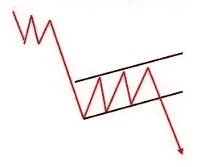
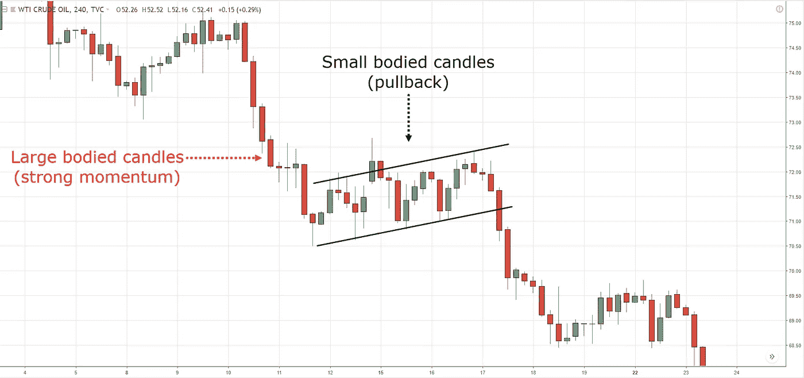
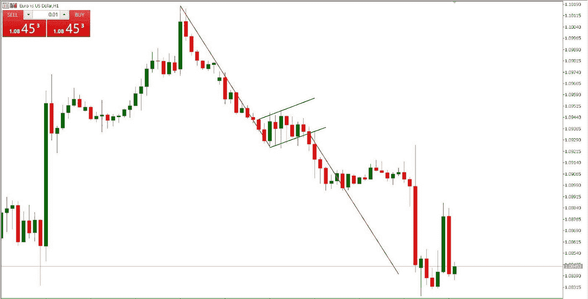
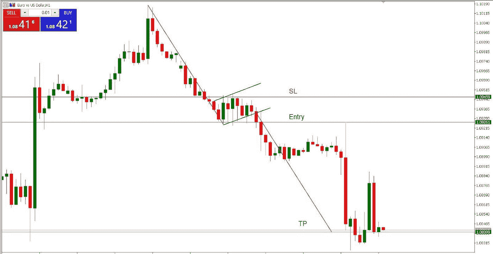

# 熊旗烛台图案

> 原文：<https://medium.com/coinmonks/bear-flag-candlestick-pattern-ce146e84e9b9?source=collection_archive---------39----------------------->

**熊旗图案**

**熊市标志**是一个烛台图表模式，一旦暂时的停顿结束，它就标志着下跌趋势的延续。作为一种延续形态，熊市旗有助于卖家进一步压低价格。

在强劲的下跌趋势之后，价格在两条平行的趋势线内以与下跌趋势相反的方向盘整。一旦支撑趋势线被打破，当价格继续走低时，熊市形态被激活。

在这篇文章中，我们来看看什么是熊旗，它的结构，以及它的主要优点和缺点。此外，我们还将分享一个简单的交易策略，向**展示如何交易熊市旗并获利。**

# 熊旗告诉我们什么

熊旗由旗杆和旗帜组成。它是在价格下跌时形成的，形成了较低的高点和较低的低点。

一旦新的低点到位，随着卖家的喘息，价格开始反弹走高。这种盘整发生在平行通道中，不像熊市中的三角或楔形盘整。

买方利用盘整来试图削弱卖方的动力，卖方控制着价格行为。另一方面，空头后退一步巩固最近的涨幅，并准备再次下跌。

这个巩固阶段不应该持续太久。根据下跌趋势的强度，反弹可能会更剧烈或更温和。一般来说，反弹不应该超过旗杆的 50%斐波纳契回撤线。

在教科书的例子中，回调应该在大约 38.2%的斐波纳契回撤点结束。反弹时间越短，下跌趋势越强，突破预期越强。

**这三个要素是熊市出现的必要条件:**

*   旗杆**——资产价格必须在一系列更高的高点和更高的低点中走低；**
*   **标志** —在上升趋势中，盘整必须发生在两条平行趋势线之间；
*   **突破** —支撑趋势线的突破标志着形态的激活。

# 优势和劣势

如前所述，熊市标志*是一种延续模式*，有助于延伸降低。作为一个图表模式，熊市标志确保交易者能够识别下跌趋势目前所处的阶段。

更准确地说，这个标志将告诉我们，随着卖方增加压力，盘整阶段是否已经结束。突破为我们提供了精确定义的关卡，你会在下面的例子中看到。

一般来说，熊市旗被认为是强势技术形态。当回撤在 38.2%左右结束时尤其如此，形成了教科书式的熊市形态。因此，它的最大优势是它提供了一个非常有吸引力的风险回报比，因为级别是明确定义的。

明显的弱点是，盘整阶段**可能导致趋势方向**的变化。随着盘整的持续，卖家可能会失去动力，而买家可能会越来越有信心，认为目前的阶段不是盘整，而是反转。

***因此，建议不要交易盘整阶段长且起伏不定的旗帜，以及延伸超过 50%的旗帜。***

# 发现熊旗图模式

如前所述，*熊市旗是熊市延续形态*。识别熊市的第一步是寻找下跌趋势。接下来，反弹应该发生在上升通道内，同时我们监控修正的程度。

**欧元/美元**在温和反弹开始之前，一直在积极下跌趋势中走低，鉴于最初走低的整体强度，温和反弹是短暂的。不过，在空头重新控制局面之前，价格走势在两条平行线内盘整。

在这种情况下，反弹甚至没有延伸到 23.6%的第一个斐波纳契回撤水平，卖家就成功地将价格推低了。因此，总体下跌趋势通常决定了反弹的力量和速度。

# 交易熊旗模式

交易熊市旗的过程是基于我们交易其他蜡烛图时应用的相同原则。一旦我们发现了这个标志，我们就开始观望，看支撑趋势线是否会被打破。

许多交易者太急于进入市场，经常在突破发生之前就“抢跑”。因此，一定要记住，只有当突破发生时，模式才是“活的”。

在我们的例子中，突破发生后，我们有两个标准的进场选项。第一种选择是当突破蜡烛线收盘低于旗帜时，开始交易**。**

另一方面，我们可能最终会选择等待一个回归，当价格行为回到“犯罪现场”重新测试破裂的通道。这种选择提供了更好的风险回报，因为进场价格较高。相反，第一种选择意味着你不能错过交易，因为没有任何保证会发生倒退。

为了确保我们在交易中，我们选择第一个选项。因此，在突破蜡烛线舒适地收于较低趋势线以下后，进入卖出交易。[止损点](https://www.thinkmarkets.com/en/learn-to-trade/intermediate/stop-losses-and-take-profits/)比进场点高 20 个点，在通道区域内。与牛市旗一样，干净利落地移动到旗的内部会使熊市旗模式无效。

通过测量旗杆的距离来计算获利水平。然后趋势线被复制粘贴，从突破发生的点开始，结束点发出信号，如果机会出现，我们应该考虑在这个水平记录我们的利润。

最终，我们的止盈单被击中，这导致大约 85 个点的收益。一旦与 20 个点的相关风险相比，**这就形成了一个非常有吸引力的 R: R 比率**。

> 交易新手？试试[密码交易机器人](/coinmonks/crypto-trading-bot-c2ffce8acb2a)或[复制交易](/coinmonks/top-10-crypto-copy-trading-platforms-for-beginners-d0c37c7d698c)