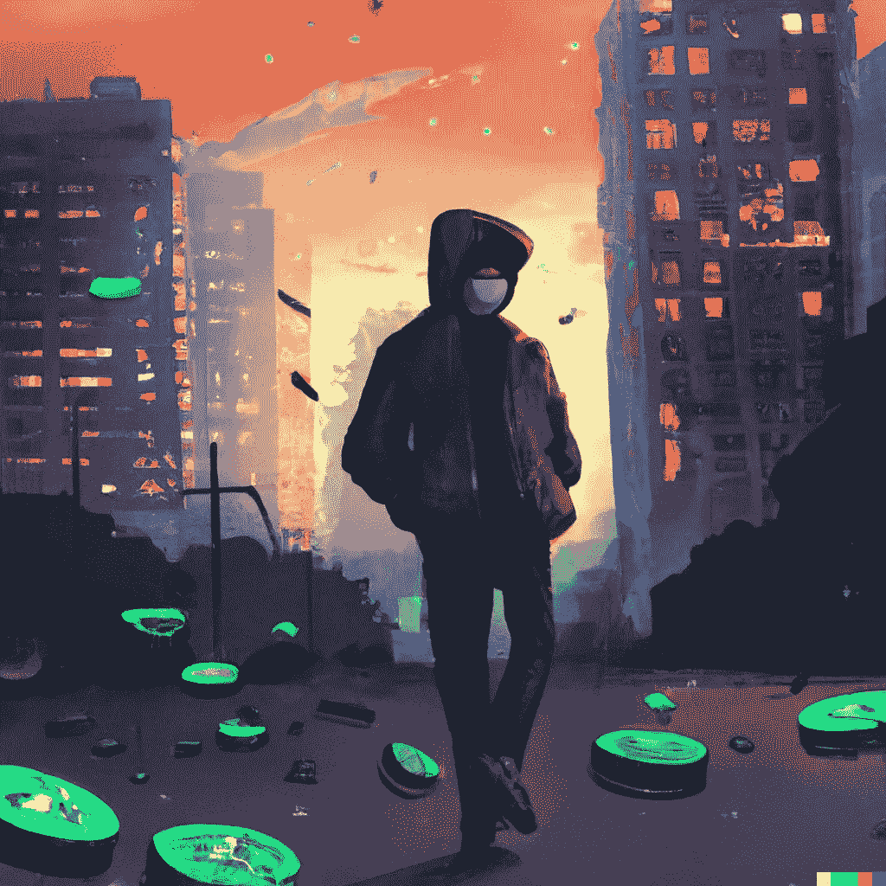

# 熊市损失——建立坚强的心态去承受

> 原文：<https://medium.com/coinmonks/bear-market-losses-building-a-robust-mindset-to-endure-55c4a927c04?source=collection_archive---------16----------------------->

这篇文章讨论了处理损失和为下一个加密市场周期建立毅力。

秘密市场周期的金融过山车会削弱决心和道德品质。这是一个很容易陷入的陷阱，但却是你想远离的陷阱。

# 这是怎么回事？

__________________________________

如果你是一个活跃的交易者或投资者，你的净资产很可能在 2022 年减少。即使没有，这篇文章也不可避免地适用于你。

从 2020 年到 2022 年，市场似乎处于“只涨不跌”的模式。然后，流动性的水龙头关闭了。全球各经济体现在都感受到了政府抗击通胀努力的影响。

加密货币市场今年尤其遭受了巨大损失。许多公司倒闭，数十亿美元损失，许多人的生活被毁了。很不幸，但是上升的东西一定会下降。

# **变得精神强大**

__________________________________

奋斗塑造性格。当你克服困难时，你会变得更强大。

就像你的肌肉在通过体育锻炼挑战后增长一样，当你克服生活中的障碍时，你的成功意志和性格也会增强。

你面对失去的挑战会让你走上两条不同的路。你要么变得软弱，选择一条不道德的道路，要么用勇气和诚实与它正面对抗。

如果你主动面对损失，你会发展出帮助你长期超越痛苦的特质。

损失不一定是完全的损失。放弃你的净资产高点并不容易，即使你还在起点之上。不管怎样，面对失败会把你带到岔路口。

# **责任感如同坚毅**

__________________________________

乔丹·彼得森建议你需要有责任感。并不是因为这是一个“好”公民所做的，而是因为你需要生活的深刻意义。

把这个深层的意义或目的想象成一个“锚”一些情感上的基础，有助于注意力和动力。责任是至关重要的，因为你需要生活中的深刻意义来抵消失去的痛苦，这样你就不会感到痛苦和失落。

你通过承受沉重的负担，推动自己取得更大的成就，并对自己的决定和结果负责来实现这一目标。

Joe Rogan 和 David Goggins 也从物理意义上讲了很多。当你鞭策自己，耗尽你的能量时，继续你需要做的事情会容易得多。激素跟这个有很大关系，尤其是体力消耗。

心理上也差不多。问题是，你对交易和投资等投机行为的结果没有多少控制权。你可以为自己的决定负责，并帮助影响结果，但最终你的控制权会比你在大多数其他追求中的控制权小得多。

# **重新获得控制权**

__________________________________

你可以通过设定目标来重新获得控制权。

这就是我所说的承担责任。做开发者就是一个例子。学习需要执照的技能是另一个问题。追求你在市场内外都能用到的技能。你不仅可以用来为自己服务，也可以用来为他人服务的技能。

交易往往会让你过度专注于某一特定类型的任务。那就是在从市场中赚钱方面击败你的竞争对手，并且比他们做得更好。这是我们为他人和自己服务并承担责任的健康需求的必然结果。社交媒体上的影响者不断敦促你努力成为他们那样的人，这无助于你。尽管他们中的许多人要么不交易，要么通过撒谎来积累资本，直到他们足够富有才开始交易。

关键点如下。你可以通过专注于帮助你周围的人来从市场中获取并保持责任感。当事情进展顺利的时候，这很好。但是当他们不是的时候，那种对你关心的人的责任感开始变得脆弱，它会侵蚀你的自我价值感。你努力的焦点与积极承担责任服务于自身之外的事物正好相反。

当你思考你认为最值得做的事情时，你倾向于思考那些包含很多责任的事情。

# **倒向黑暗面**

__________________________________

在一般市场中，尤其是在加密市场中，人们在遭受损失后开始相信市场欠他们什么。

“市场”是一群试图互相赚钱的人(在这种情况下)。它本质上不是零和的，但生态系统的一些子域是。不管怎样，名义资金进入这个领域，从一个参与者流向另一个参与者。一般通过推测。

当你把钱输给别人时，很自然地会觉得在未来的某个时候，你被欠了那笔钱，连本带利。这可能是一件积极的事情。它鼓励责任感。你有责任学习更多的知识，积累技能，以避免将来再次失败。

如果把它作为一种向善的力量，我指的不一定是给予他人意义上的“善”，你就塑造了性格。你朝着未来的成功前进，同时也建立了积极的自我价值感。目标可以是你自己的需要，并且仍然是一个积极的进展。你要为自己的结果承担更大的责任。

“坏”的力量是由于损失导致的道德品质的退化，特别是如果损失是由于从你的损失中获利的行为者的恶意造成的。这个空间有很多骗子和骗局，很不幸。幼稚是一回事，它存在于这个生态系统中。但是彻头彻尾的骗局对个人意志的破坏最大。

一些人开始将一连串的诈骗视为一种成年礼。如果其他人都在这么做，而你因为诈骗而赔了钱，那肯定没问题。或者至少，这是报复和克服损失的方法。

# **性格决定命运**

__________________________________

除非某人真的是精神病患者或反社会者，否则他们未来的自我可能会对不道德行为的成功感到不安。

你有责任在艰难中变得坚强和勇敢。由你自己行动之外的事件带来的困难更容易原谅自己。当你做决定并遇到一个消极的结果时，你更容易攻击自己，并使自己容易贬低自己的人格。然而，最终前进的道路是相同的。

你对决定和结果负责。然后集中精力克服困难，达到你想要实现的生活状态。

# **前进**

__________________________________

从长远来看，你为达到目标所做的追求将会很重要。

承担责任是一切的开始。追求塑造你的性格而不是贬低它的目标是你如何在一个有强烈自我价值感的地方结束的。这也有助于你克服未来的挣扎，因为你在情感上更强大，拥有更有价值的技能。

让这成为你旅程的起点吧，如果你还没有开始的话，不仅要为市场积累技能，还要追求其他能让你为他人提供与市场或金钱无关的服务的东西。

我将会写更多关于如何实现这一点的内容，特别是通过学习 Crypto 和 Web3 的技术和市场技能。这个领域正在发生许多令人惊奇的事情。

感谢您的阅读。下一集见。

# 时事通讯

__________________________________

我在我们的生态系统中制作与市场和开发者相关的内容。

这篇文章是我的免费每周时事通讯的一篇专题文章的例子。在那里你还可以找到独家内容，所以一定要注册！

你的邮件不会用于其他任何用途(我甚至都不看它们)。

【https://www.getrevue.co/profile/thecryptoclimax? element = subscribe-through-revue

# 推特

__________________________________

此外，请务必在 Twitter 上关注我的帖子和其他重要内容。

[https://twitter.com/TheCryptoClimax](https://twitter.com/TheCryptoClimax)

直到下一次，从您的首要加密/Web3 出版物。

麦克斯——隐秘的高潮

我们正在为 Crypto Climax 制作网站，让它成为一个在线出版物。敬请期待！

> 交易新手？试试[加密交易机器人](/coinmonks/crypto-trading-bot-c2ffce8acb2a)或者[复制交易](/coinmonks/top-10-crypto-copy-trading-platforms-for-beginners-d0c37c7d698c)