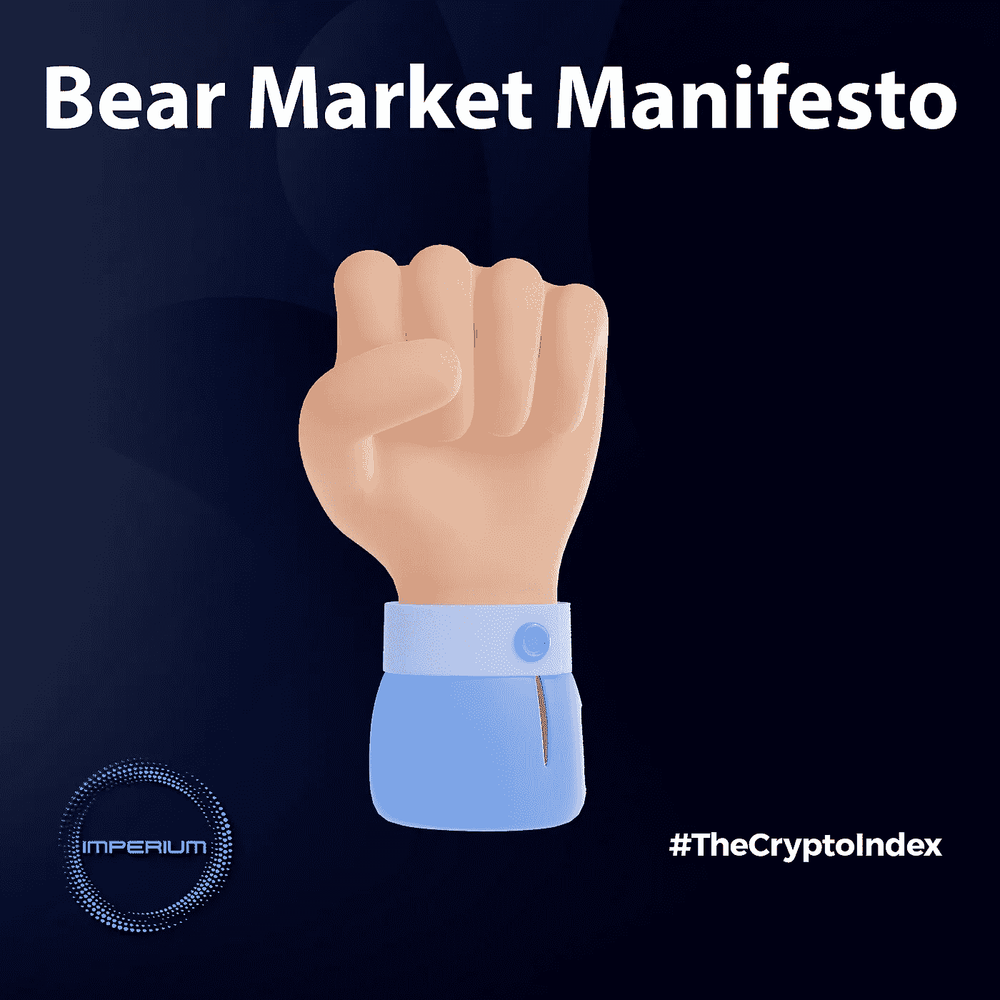

# 熊市宣言

> 原文：<https://medium.com/coinmonks/bear-market-manifesto-12d62dccabce?source=collection_archive---------29----------------------->

由于这场熊市现在已经持续了相当于 2014-15 年和 2018 年的时间，加密领域的人们开始感到绝望和绝望。

每个人都受到影响，从偶尔的投资人到专业的交易者，从开发团队到风投，从 DeFi 粉丝到“月光族”(尤其是月光族)。

在这个黑暗的时代，这是我们的宣言。我们以此为生。它将帮助你在熊市中生存、应对甚至茁壮成长。尽管如此，这份宣言中的一些观点普遍适用于市场中的任何时候。

这就是:

# 冷静

“恐惧是精神杀手”，引用自弗兰克·赫伯特的科幻小说《沙丘》。超越它，不要让它消耗你和遮蔽你的视野。

相反，花点时间放松，把自己从环境中分离出来。这会让你头脑清醒，帮助你…

# 寻找解决方案

把自己放在解决问题的心态中。这是一个人可以拥有的最重要的技能之一(这是为什么在每份工作描述中都提到它的原因)。

每个挑战至少有一个解决方案。找到它是你的责任。这可能不容易，但是做大量的测试和跳出框框思考绝对有帮助！

# 建设

不要停止建设。像平常一样投入工作。最终会有回报的。

# 相信你自己

虽然老生常谈，但有信心和积极的心态真的有帮助。拒绝放弃，要知道你有足够的能力和力量去克服任何障碍。

# 学习

“学得越多，赚得越多”。沃伦·巴菲特的名言是常青树。

继续学习。它会拓展你的视野，帮助你获得新的技能。

阅读是好的，但是从日常活动中学习也同样重要。通过给自己设置一个反馈回路来做到这一点。这样你会提高十倍的速度。

# 适应

灵活快速地适应新情况。这是关键，尤其是在像 crypto 这样不断变化的市场中。

# 合作

我们是群居动物。直到现在，我们作为一个物种，通过合作而繁荣。我们一起度过了最黑暗的时光。加密空间也不例外。

这项技术的基础是基于人类的联系和合作。此外，由于同样的原因，DeFi 发展如此之快，因为通过开放源代码和可比较的设计，许多开发已经成为可能。

因此，我们认为协作是关键。找到你的部落。跟紧了。团结一致。

向同龄人学习，需要的时候自己帮一把。说好话，欣赏别人。它也会让你振作起来！

此外，建立一个共同的目标，因为一起战斗比单独战斗更有力量。

# 展望未来

历史总是重演。到目前为止，你可能已经听说过经济周期理论。上涨之后，下跌就来了，以此类推。

要意识到我们现在所处的位置只是一个短暂的时刻，事情会变得更好。这是自然的本性。

有一些长期的目标和良好的计划会帮助你从对一时的情况做出反应中解脱出来。

# 对冲自己

当然，未雨绸缪是必须的。强烈建议在菲亚特储蓄并分散投资。

和往常一样，不要投资超过你能承受的损失！

# 积聚

财富是在熊市中创造的。为什么？因为这些时候是买入的最佳时机，因为资产已经降价。在 crypto 中，这意味着高达 90%的折扣！

准备好资本应对熊市，当牛市回来时，你就可以乘风破浪了。

当然，DYOR，不要随便买一些骗子卖给你的垃圾硬币。

# 寻找/提供心理支持

心理健康很重要，加密有时真的会让你精神紧张:牛市中的 FOMO，熊市中的普遍恐慌，以及对损失/盗窃/黑客/欺诈的额外恐惧。

总的来说，为了保持良好的精神卫生，心理支持是很重要的。在加密中这是必须的。此外，不要拒绝帮助需要帮助的人。

> 交易新手？试试[加密交易机器人](/coinmonks/crypto-trading-bot-c2ffce8acb2a)或者[复制交易](/coinmonks/top-10-crypto-copy-trading-platforms-for-beginners-d0c37c7d698c)