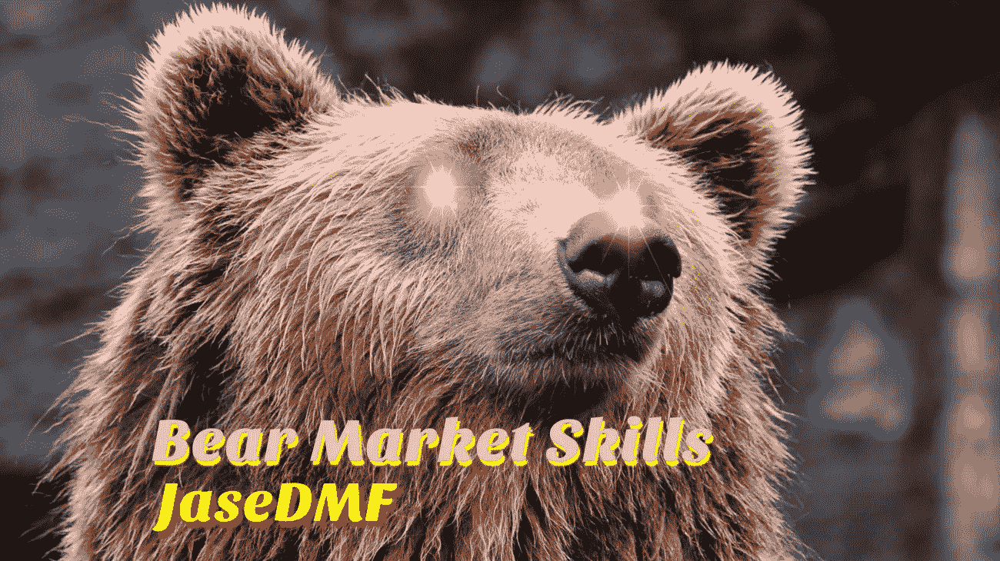

# 熊市技巧

> 原文：<https://medium.com/coinmonks/bear-market-skills-4e9365992c1b?source=collection_archive---------49----------------------->

Image [source](https://www.pexels.com/photo/brown-bear-35435/) (modified)

亲爱的读者:

我不知道你怎么想，但是牛市让我紧张。投机和盲目的炒作变得势不可挡。价格和实际效用之间的相关性被夸大了；因此，我对这场不可避免的熊市持乐观态度，这种感觉我自 2021 年 5 月 19 日以来一直在培养。

不要误会，我讨厌看到别人赔钱，但同时，如果你明白…