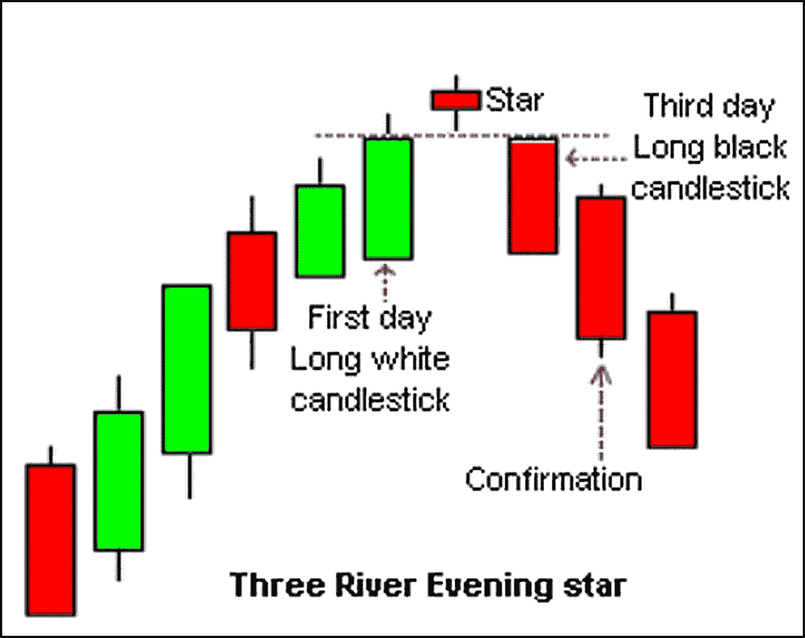
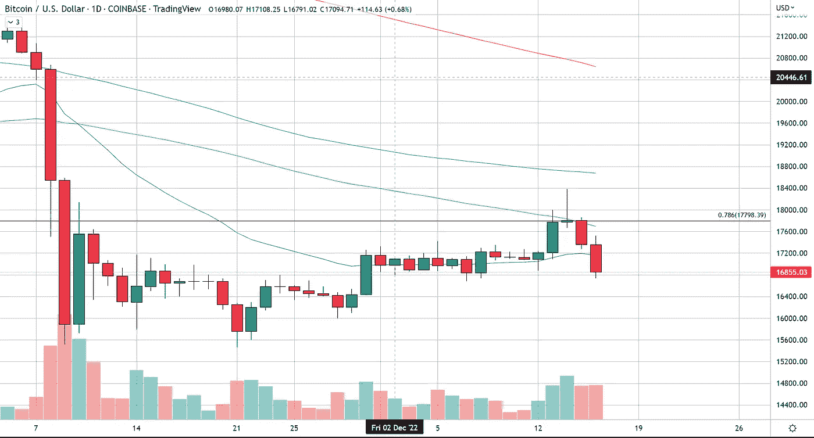
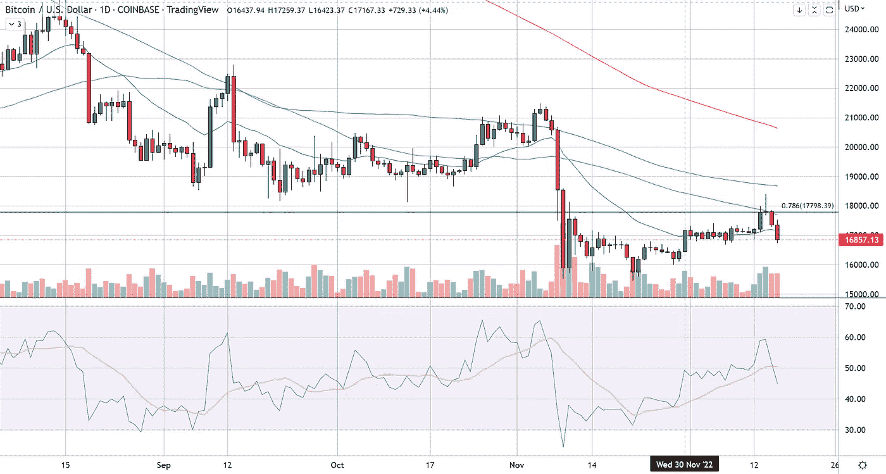

# 比特币中确认的看跌烛台模式

> 原文：<https://medium.com/coinmonks/bearish-candlestick-pattern-confirmed-in-bitcoin-186ca5b8e0b0?source=collection_archive---------27----------------------->

昨天，比特币在长期 78%回撤点(17，779 美元)的阻力下下跌，损失约 450 美元，完成了最准确的烛台模式之一，“三河晚星”。

这种为期三天的烛台模式包括一个上升日(绿色蜡烛)，一个在其他两根蜡烛之上或之上的星星(小蜡烛)，以及一个最后的下降日(红色蜡烛)。

三天后，市场应该接近该模式开始时的价格，一旦我们得到一根具有较低低点和较低高点的最终红烛，就可以采取行动。正确的行动通常包括从这里做空市场，在今天的开盘价之上设置保护性止损。

三江晚星另一个要看的是 RSI 或相对强弱指数。我们希望看到 RSI 的峰值与定价峰值或星烛期间的峰值重合。RSI 在 70 以上见顶是我们希望在这种模式中看到的，我们在 BTC 还没有达到这种水平，但我们确实在 60 以下看到了一个星烛峰值。

对于那些希望从事这项交易的人，你可以在这里查看我的适当行动。

> 交易新手？试试[密码交易机器人](/coinmonks/crypto-trading-bot-c2ffce8acb2a)或者[复制交易](/coinmonks/top-10-crypto-copy-trading-platforms-for-beginners-d0c37c7d698c)