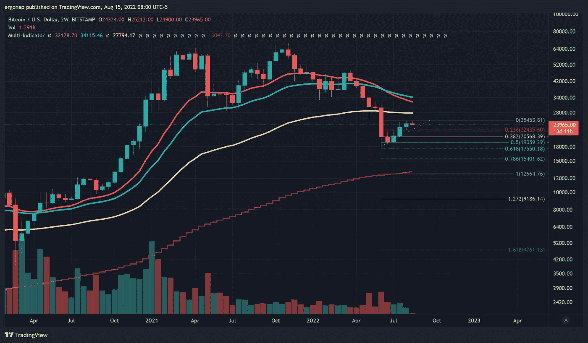
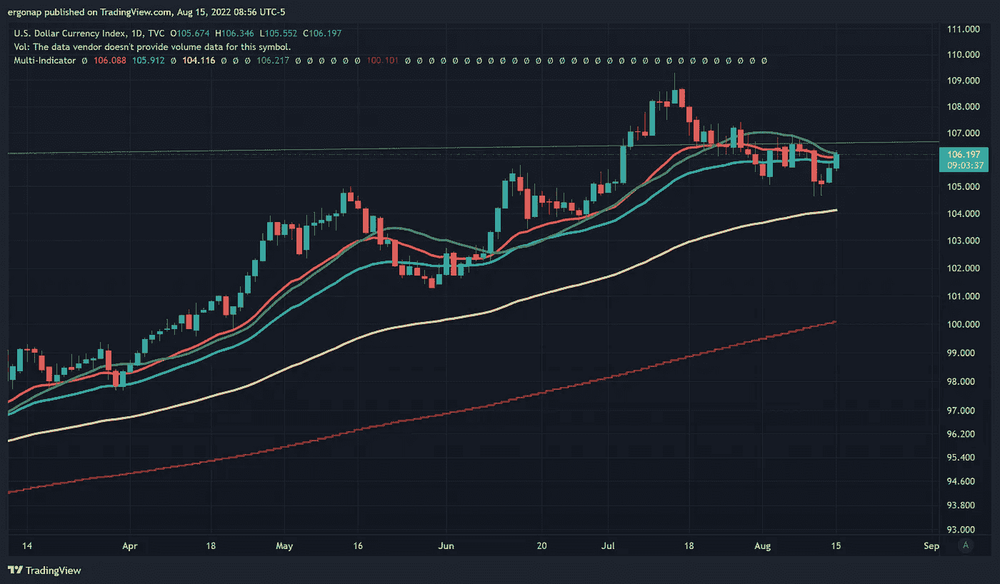
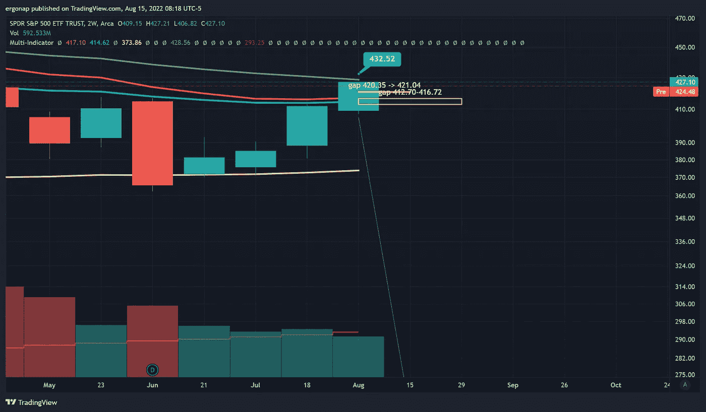
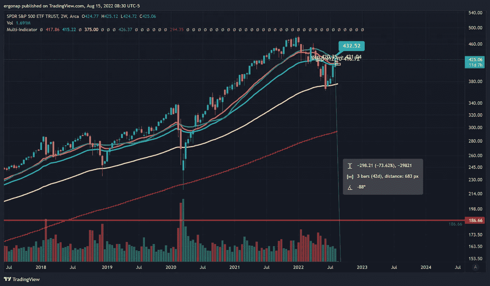
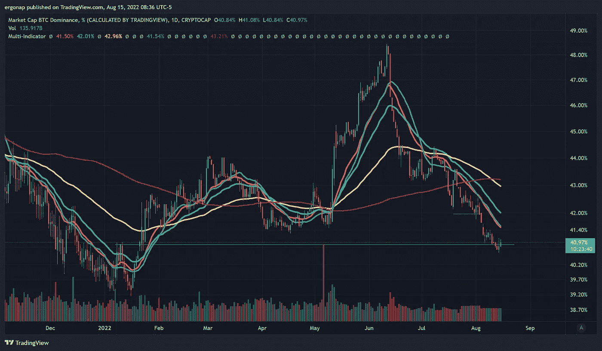
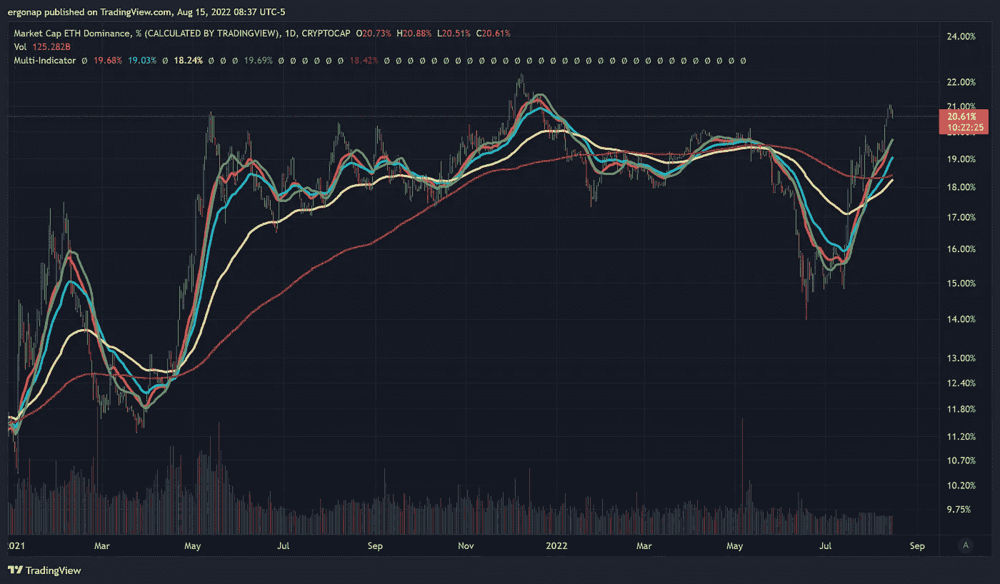
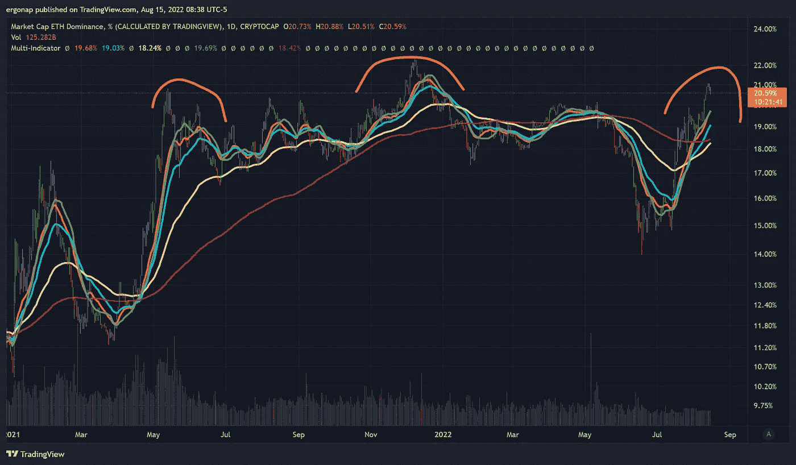
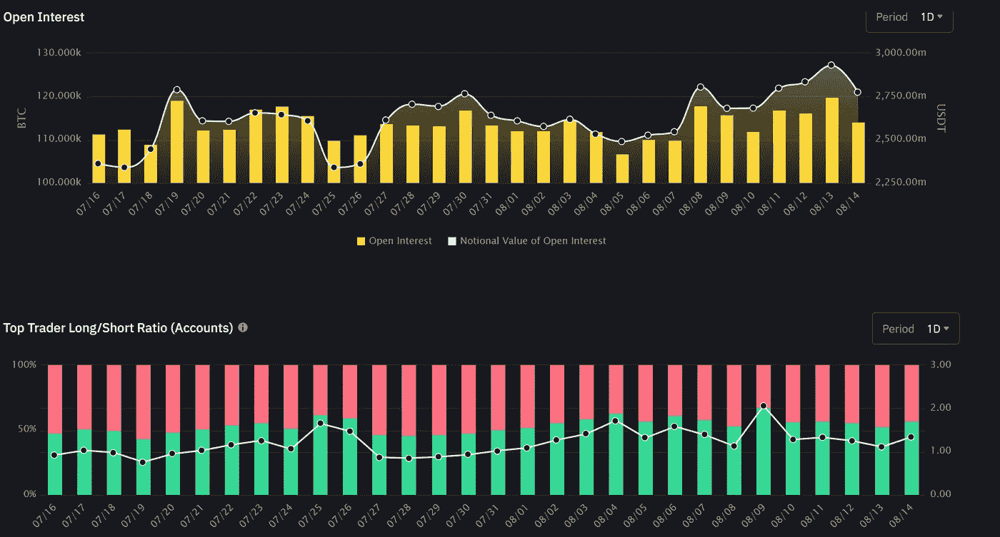

# 看空在这里🔍

> 原文：<https://medium.com/coinmonks/bearishness-is-here-673a36be3a97?source=collection_archive---------16----------------------->

加密货币市场/比特币分析 8/15

所以，我缺🔻btc。还没有考虑其他事情，但可能会做一些轻微的改变。编辑:是的，alt。我也看好 BTC 在币安的优势，因为它也在上升。这是这里的关键。

我们拒绝了一个真正讨厌的楔子。一些著名的有影响力的人一直在互相引用，这一次我认为[冉诺伊纳](https://medium.com/u/2b126efbc7ab?source=post_page-----673a36be3a97--------------------------------)是[正确的](https://twitter.com/cryptomanran/status/1557656214321868800)。(通常我认为他是可笑的错误，是一个完美的顶级信号，但无论如何，每个人都有自己的想法)。Ref:字面意思[前一天他在哪里说看涨](https://twitter.com/cryptomanran/status/1557355194660298752)。别忘了 [Mt Gox $3b+](https://capital.com/mt-gox-bitcoin-btc-black-swan-refund-price-fall-sell-pressure) 要来了。

this by itself is bearish, but there’s more. [https://www.tradingview.com/x/2ssiJx5V/](https://www.tradingview.com/x/2ssiJx5V/)

你喜欢撒谎吗？这里有一些小谎言。

This is if we’re going down for real now, which is possible, some targets that line up. [https://www.tradingview.com/x/9g5PkYof/](https://www.tradingview.com/x/9g5PkYof/)

不管怎样，让我们来看看为什么看跌，为什么我不看好。首先，[我们加息了，还涨了](https://www.cnbc.com/2022/07/27/fed-decision-july-2022-.html)。与此同时，叙述是“哦，有这么多的通货膨胀”，但这忽略了美元在面对通货膨胀时相对于世界其他地区是多么的强劲，世界其他地区目前完全依赖于主要的全球问题。请看:[中国](https://twitter.com/caolei1/status/1558806272719425538)——这是他们的房地产市场对 GDP 的贡献百分比，潜台词:

> 房地产和建筑业对 GDP 的贡献率在 2020Q1 达到最高值 21%后持续下降，2022Q1 已降至-2%的负值

另见:[欧洲](https://ihsmarkit.com/research-analysis/europes-road-to-recession.html)，[南美](https://www.bloomberg.com/news/articles/2022-01-31/all-roads-lead-to-recession-for-biggest-latin-american-economies)，[南非](https://mg.co.za/business/2022-06-22-south-africa-on-weak-footing-amid-global-recession-fears/)，[俄国](https://twitter.com/jakluge/status/1542220132856090624)。没有人过得很好，他们所有的货币都显示了这一点，除非他们被操纵，但仍处于严重的困境中(见:[俄罗斯](https://twitter.com/jakluge/status/1557851176145657858))。与此同时，DXY 凭借*未*受到如此强烈的影响而领先。因此，美国正转向收回更多的金融权力，因为它不会像其他国家那样受到太多的损害。

这也意味着，DXY 是 mooning(多么惊喜)。

seriously, top signal for btc. [https://www.tradingview.com/x/GUSl7z0Z/](https://www.tradingview.com/x/GUSl7z0Z/) DXY is bullish and BTC is back to inversion.

在 2w 20SMA 上是完美的拒绝，普通/主要的那种。这一切看起来有点像死猫反弹，因为我们已经连续 4 周看涨，恢复了 6 月的 2 周(红色)，但继续向下整合，因为间谍无论如何都引领市场。

It’s here we pivot either way, my expectation is down. [https://www.tradingview.com/x/ub9UTkY1/](https://www.tradingview.com/x/ub9UTkY1/) Look micro and it looks bullish right?

现在让我们缩小一点。有人发现这里的问题了吗？音量。看看谁控制了 2022 年的大部分时间，不是公牛。Vs 看 2018–2021。2020 年小跌，大看涨应对。这一次，小水滴和……回应在哪里？

this is hyper tiny volume in a big bear/bull fight. With a lot more sustained bear than in a long time. [https://www.tradingview.com/x/a4yoTH4N/](https://www.tradingview.com/x/a4yoTH4N/)

如果这还不够的话，BTC 的主导地位开始攀升，一个老的阻力变成了支持。

yeah, this is not good. we had a big h&s but this looks like bottom retracement. [https://www.tradingview.com/x/udySqmUn/](https://www.tradingview.com/x/udySqmUn/)

最重要的是，我经常看到瑞士联邦理工学院领先于 BTC 的%的跌幅，这将重振 BTC。d 显著(和 ETH。另一个方向的 d)。有人能在 ETH 上看到这个危险的屁股图案吗？d？

world’s ugliest head and shoulders, everyone. And I’m not talking the dip, but the 3 major peaks.

yeah, macro bearish is great! 😔[https://www.tradingview.com/x/A3DJvjfe/](https://www.tradingview.com/x/A3DJvjfe/)

这是你拿出一些资金买底的机会，因为它就要来了。所以如果 ETH。d 下降 BTC。d 上升，我们有什么？超级垃圾场和超级水泵，因为 BTC 只有这两种方式。d 上升:要么 BTC 下降的比其他国家少，要么 BTC 上升的比其他国家多。鉴于目前的情况，我显然倾向于后者。

[融资数据](https://www.binance.com/en/futures/funding-history/4)显示零售正在做多，然而……OI 并没有支持它。所以零售即将被打垮，尤其是最后两天。具体来说，看看未平仓权益/多空比率的最后两根棒线:

see the Longs going up, and OI completely drops? Why is that? That’s because **Longs Are Not Leading The Market Right now.**

最重要的是，恐惧和贪婪在哪里？再来一滴再合适不过了。我们昨天刚刚保持中立(47)，今天又回到恐惧(45)。正好可以再喝一杯。看看人们在一无所有的情况下转动得有多快。

尽管和 covid 打了一架，我也没感觉那么糟，但是是的。这可不太妙，范姆。在股票市场，他们称之为从绿色到红色的一天。我倾向于绿色阅读《星期》。一旦我们填补了周五的空白(可能在一个小时左右)，我们就下去。

随着时间的推移，我想指出更多的人退出今天，以及为什么这不是看涨，即使间谍有点看涨！

> 密码量子警报，[2022 年 8 月 15 日上午 8 点 47 分]
> 🐳🐳🐳4375.00 # BTC(＄105318781)
> 流入#Bitfinex 的资金总额
> 
> 密码量子警报，[2022 年 8 月 15 日上午 11:01]
> 🐳1，203.00 # BTC(＄29，170，893)
> 流入#Bitfinex 的资金总额
> 
> 密码量子警报，[2022 年 8 月 15 日上午 11:39]
> 🚨1，396.42 # BTC(＄33，834，739)
> 合计流入#比特币基地 Pro

稍后我会在 youtube 上直播。你们可以欣赏我的病人声音，我的声音很低沉。

 [## 交易员午睡

### ERC20: tradernap.eth 媒体:https://medium.com/@ergonap 推特:twitter.com/nap_trader

www.youtube.com](https://www.youtube.com/channel/UCajLemke-0plft-exjixZtA) 

> 交易新手？尝试[加密交易机器人](/coinmonks/crypto-trading-bot-c2ffce8acb2a)或[复制交易](/coinmonks/top-10-crypto-copy-trading-platforms-for-beginners-d0c37c7d698c)