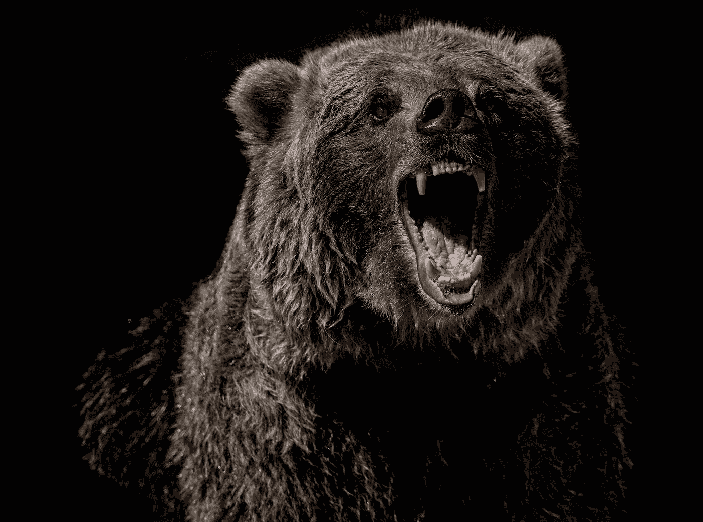
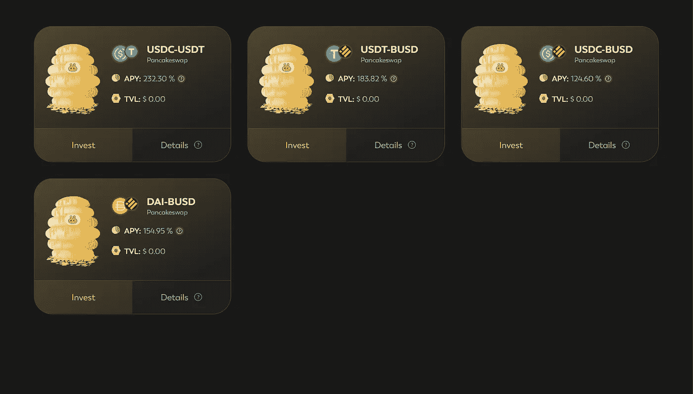
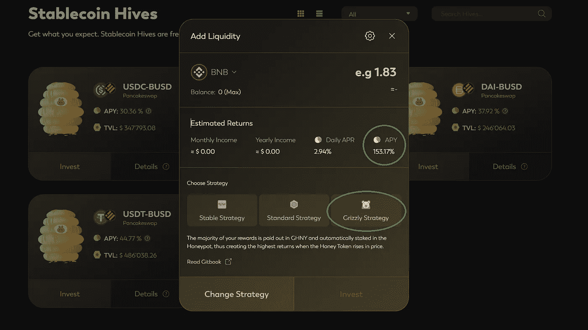
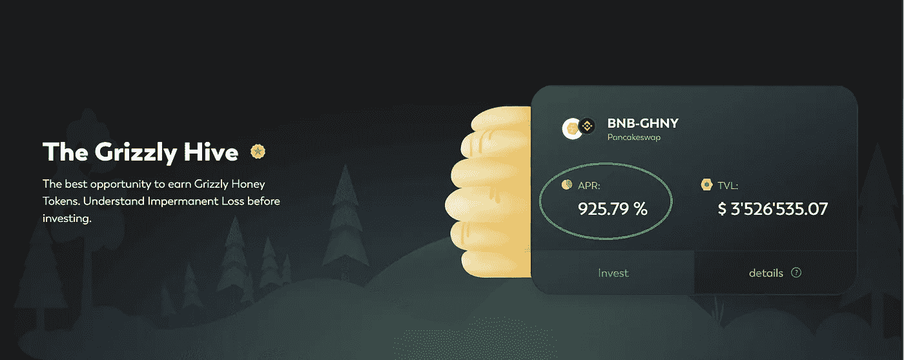
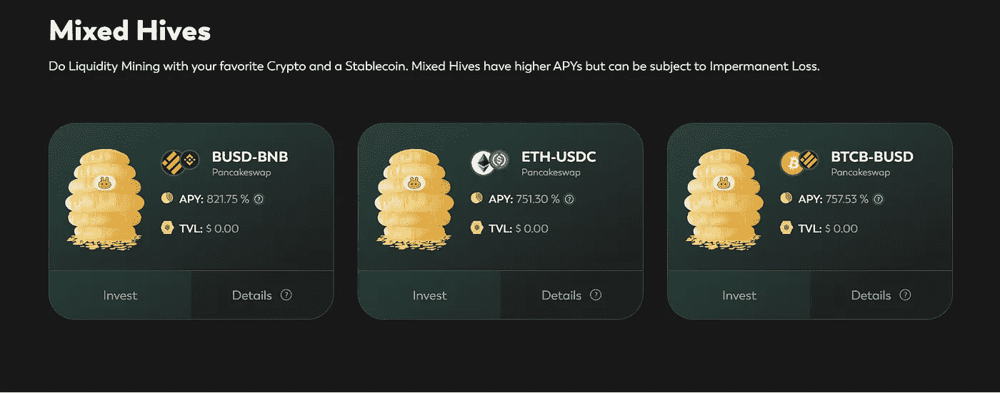

# 成为熊市赢家！

> 原文：<https://medium.com/coinmonks/become-a-bear-market-winner-791b7d4533cd?source=collection_archive---------35----------------------->

Photo by [mana5280](https://unsplash.com/@mana5280?utm_source=unsplash&utm_medium=referral&utm_content=creditCopyText) on [Unsplash](https://unsplash.com/s/photos/grizzly?utm_source=unsplash&utm_medium=referral&utm_content=creditCopyText)

*这是一个创造回报的机会，高达 240%的年回报率！在熊市中保护你的初始资本。*

*经过一周的使用和研究，这款应用似乎可以合法分享了。*

是[grizzli . fiT7！](https://app.grizzly.fi/referral-program/0xfC2B89D22195045161e6419BDf3E5D2744Fbbae7)

> GrizzlyFi 没有付钱让我发表这篇文章。
> 
> 我分享[一个附属链接](https://app.grizzly.fi/referral-program/0xfC2B89D22195045161e6419BDf3E5D2744Fbbae7)，你可以自由关注或者不关注。
> 
> 每个人都会承担责任，管理自己的风险。

# **为大多数人简化 DeFi。**

原则是以尽可能简单的方式进入**稳定的玉米种植**。

这样做的好处是，你不会受到非永久性损失或波动性的影响。

所以使用你的 BTC，BNB，马厩，或任何其他已知的 BSC 令牌开始耕种。

通常，稳定币每年有 5-10%的回报。

[**grizz ifi**](https://app.grizzly.fi/referral-program/0xfC2B89D22195045161e6419BDf3E5D2744Fbbae7)提供的 **APY 收益从 30%到 240%不等。**

Screenshot from GrizzliFi

进入泳池时，你有三种选择。首先，你必须通过激活一个智能合约来确认你的策略，这将花费你 0.025 到 0.03 BNB。

这些费用很高，因为[**grizzly fi**](https://app.grizzly.fi/referral-program/0xfC2B89D22195045161e6419BDf3E5D2744Fbbae7)**为你激活了几个智能合约**。目标是让挑战变得更容易。

一切单独运作。

Screenshot from GrizzliFi

*[***grizzifi***](https://app.grizzly.fi/referral-program/0xfC2B89D22195045161e6419BDf3E5D2744Fbbae7)**赚它的钱也是必不可少的。这让我对他们的商业模式感觉良好。***

**你的奖励在**GHNY**T42【灰熊蜂蜜】里。这些灰熊会被自动转卖和再投资。不用自己动手！**

**申请于今年 8 月 16 日开始。48 小时内超过 2700 万美元被锁定在该协议上。**

**我知道 GHNY 是一个低供应量的代币 (582625 代币)和大约 3500 万美元的小市值。然而，这是一个巨大的上升潜力！**

**交易价格为 86 美元，在发布的高峰期，它的价格飙升至 320 美元。**

**如果灰熊 成为时尚并进入市值前 100 名，它可能价值几百美元(720 美元)。**

**当加密货币的总资本增加时，肯定会更多。我在考虑 2024/2025 年左右。所以这将是一个长期投资的问题。**

****这个产品给 DeFi 带来了新的东西。****

**它简化了流程。你可以在熊市中获得回报，而不会看到你的资本缩水。**

**该团队还在路线图中宣布，他们希望推出一个名为 Moneta 的 DAO 协议。**

**他们还想发行一种分散的稳定货币，如戴，由瑞士法郎支持。**

**因为瑞士法郎在危机时期保持稳定的价值，这将允许分散投资于稳定的货币。好处是美国不会管制这种稳定的货币。像 USDT、USDC 或 BUSD。**

**GrizzlyFi **的第一批用户应该会享受到来自 Moneta 的空投。**现在是在 app 上下单的时候了。至少对以后空投有好处！**

**[**GrizzlyFi**](https://www.lacircum.com/administrator/Certainly%20more%20when%20the%20total%20capitalization%20of%20cryptocurrencies%20increases.) 目前正在币安智能链上运行。不过，应该很快就可以在以太坊上看到了。**

**使用一周后，我很满意，我打算加强我的地位。**

**随着灰熊的下跌，一周后我的实际回报率相当于灰熊策略的 33%。**

**我当然很满意。但是，为了赚取更多，你也可以把这些收益花在 BNB-格尼泳池上。它支付超过 900%的年利率来实现利润最大化。在写这篇文章的时候。**

****

**Screenshot from GrizzliFi**

**为什么不在一把 [**金星**](https://app.venus.io/dashboard) 型刀上也解锁一个稳定币信用呢？**

**然后进入你选择的一个游泳池。只要你赚的钱超过你的信用成本，就留在那里。**

**GrizzlyFi 还提供对 BTC、BNB 和瑞士联邦理工学院等不稳定资产的投资。这个泳池。**

****

**Screenshot from GrizzlyFi**

**总是这个逻辑，没有风险就没有收获。**

**以下是该项目的链接。 [Twitter](https://twitter.com/GrizzlyFi) ，[télégram](https://t.me/grizzlyfinews)T4【不和】， [Youtube](https://www.youtube.com/c/Grizzly-fi) 。**

**别忘了做你的研究。**

**我祝你成功！**

> **交易新手？尝试[加密交易机器人](/coinmonks/crypto-trading-bot-c2ffce8acb2a)或[复制交易](/coinmonks/top-10-crypto-copy-trading-platforms-for-beginners-d0c37c7d698c)**