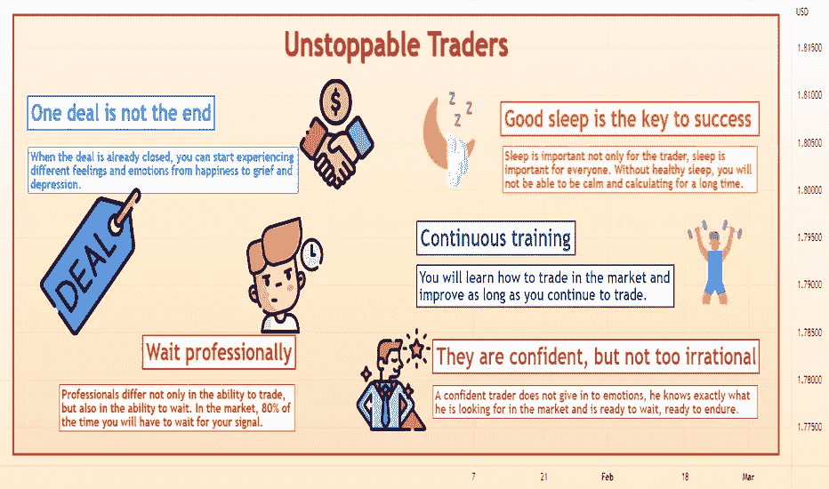

# 成为不可阻挡的交易者

> 原文：<https://medium.com/coinmonks/become-an-unstoppable-trader-2595262686ef?source=collection_archive---------25----------------------->

做一个盈利的远程交易者并不容易。这需要纪律、大量的耐心和热情。此外，你需要拥有某些大多数人根本没有的习惯。

所有的交易者在某些方面是不同的，每个人都有自己的交易策略，但是有一些东西把所有成功的交易者团结在一起。
我们来说说这些一般特征。

**1。一笔交易不是终点**

当交易已经结束时，你可以开始体验不同的感觉和情绪，从快乐到悲伤和沮丧。
新人淹没在这一波情绪中，最终失去控制和金钱。

> 交易新手？试试[密码交易机器人](/coinmonks/crypto-trading-bot-c2ffce8acb2a)或[复制交易](/coinmonks/top-10-crypto-copy-trading-platforms-for-beginners-d0c37c7d698c)

专业人士的行为不同。每一笔交易对他们来说都是很平常的事情，而他们不会经历一场会把新手引入歧途的情绪风暴。
如果你将以下想法内化，你会更容易处理情绪:

交易成功不是一天的事，是几个月的交易，几百次的交易。为了了解你有多好，你必须按照你的策略交易足够长的时间。有时候一年不足以理解一个交易者准备好了，一天更是不够。因此，做好长途旅行的准备，不要对亏损的交易反应过度。

风险管理非常重要。在开交易之前，计算好自己愿意损失多少，不要因为这个损失而发疯。损失不应该把你引入歧途。你必须保持冷静，遵守规则。还有，不要让有利可图的头寸把你逼疯了。在任何情况下，你都应该冷静谨慎。

**2。他们很自信，但并不太不理智**

对自己有信心是非常重要的。交易者对自己和交易策略的信心来自于时间。要做到这一点，你需要学习如何清楚地遵循交易规则，遵守纪律，最终，利润会来到你身边。当你收到一系列亏损的交易时，信心应该在这些时刻表现得最明显。这是不可避免的，只有最优秀的人才能有尊严地通过这样的考验。专业人士不会在同样的情况下改变规则，不会改变交易方法，冷静地继续前进。
自信的交易者不会屈服于情绪，他清楚地知道自己在市场上寻找什么，并准备等待，准备忍耐。你应该感到刀枪不入，市场不再能左右你。

**3。专业等待**

专业人士不仅在交易能力上不同，在等待能力上也不同。在市场上，80%的时间你必须等待你的信号。最好的交易者准备等待他们的高利润机会几天，甚至几周。即使他们在漫长的等待后损失了一些钱，他们也准备再次等待。新进者痛苦是因为他们想一直待在市场上。这是一个很大的错误。很多时候，市场是不可预测的，尤其是对一个新手来说。离开病态的欲望，不断地在市场中，不断地建立新的头寸。学会像最好的交易者一样等待。

为了以对你有利的优势进行交易，你必须耐心等待明显的交易设置，如果几天都没有出现，你就不应该这样进入市场。这段时间值得花在其他工作或爱好上。不可阻挡的交易者不会担心几天甚至几周不交易，等待下一个好的设置进场。

**4。良好的睡眠是成功的关键**

睡眠不仅对交易者重要，对每个人都很重要。没有健康的睡眠，你将无法长时间冷静和计算。
此外，如果你交易得当，即:
、不要冒太多资金风险、
、不要建立不必要的头寸、
、遵循你的交易计划、
、遵守纪律、
那么你在真正交易时就不会有任何睡眠问题，因为你没有什么可担心的。

嗯，如果你每天都坐在显示器前，焦虑地看着价格变动，而此时你应该在睡觉，这迟早会导致金钱的彻底损失。

跟着策略走，不要追行情，休息一下，精神饱满的回来。

**5。连续训练**

所有有经验的交易者都知道交易很难，因为市场波动很大，更难的是靠自己，靠自己的原则。

交易有一个很好的特点——帮助你了解自己。很不愉快，但很有用。这项工作很难，但结果很美。

因此，要成为一个不可阻挡的交易者，除了交易策略，你还必须了解自己，提高自己。你会学会如何在市场中交易，只要你继续交易，你就会有所提高。但是你必须现在就开始做，开始为正确的交易方法打下基础。

如果你决定投入战斗，接受以上所有，你的道路会容易得多。

请跟随 more☯☸
**好运！**