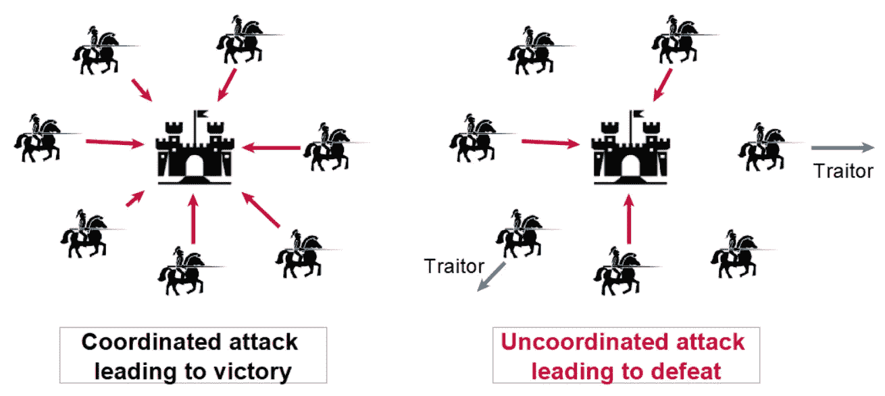

# 区块链初学者指南

> 原文：<https://medium.com/coinmonks/beginners-guide-to-blockchain-2a8f3cb1b188?source=collection_archive---------29----------------------->

Photo by [André François McKenzie](https://unsplash.com/@silverhousehd?utm_source=medium&utm_medium=referral) on [Unsplash](https://unsplash.com?utm_source=medium&utm_medium=referral)

除非你住在山洞里，否则很难不听到“Web3”、“区块链”或“以太坊”这个词。多半是因为很多负面的东西(负面卖对了！)但核心逻辑经常被忽视，没有人花时间去理解和认识一切是如何完美地工作，并使这个网络成为迄今为止最安全的网络。

# 为什么是区块链？

想一想，我们今天使用的每一个数字东西都是由一个中央实体管理的，这个实体可以做任何事情，他们可以暂停某个特定用户使用该应用程序，或者他们可以推广某个特定内容，使其比其他内容更容易被看到。这是相当普遍和众所周知的，但除了在某些情况下，反响并不致命。

但不太为人所知的是，同样的事情也可能发生在你银行账户里的钱上，而且过去也不是没有发生过。控制我们钱的金融机构都是封闭的中央集权的体系。我们相信他们会公平地使用这种权力，但有时他们最终会将这种权力用于错误的目的，因此，特别是在金钱的情况下，公开不属于任何人的东西是有意义的，同时确保所有规则都得到遵守。在区块链之前，这是一个问题，但在中本聪关于比特币的论文发表后，事情发生了变化，我们发现了一种实现开放的无信任系统的方法，这种系统可以代表价值。

现在，让我们深入了解一个开放的、不可信的系统到底意味着什么，而不只是把它们扔给你。

1.  所谓**开放，**我们指的是一个系统，其中不再有由一群中介控制的孤立、封闭的数据。每个人都拥有自己的数据。
2.  所谓**不信任，**我们指的是中介机构消失的时候。我们可以创造一个由个人控制的系统，规则由计算机设定，不能被破坏。基本上，这是一种自动化中介的方式。这是一个你可以信任的系统，它可以存储你的金钱账户余额和类似的东西，计算机将设置规则，所以你可以信任它们，如果你的区块链支持程序，那么智能合同(基本上是由计算机运行的合同)将设置什么规则。

区块链可以真正以数字形式表现价值，因为数据将在网络上分发和保护，每个人都将拥有数据的副本，每个人都可以看到数据是否有变化。前所未有的透明度。

# 什么是区块链？

区块链做了很多它处理的事情或责任，这就是为什么它的组合或者你可以说有不同的定义方式。总的来说，区块链可以被认为是三样东西的结合:

1.  **网络:**从某种意义上来说，这是一个网络，它是一个任何人都可以访问的公共网络，你只需要互联网连接到一个区块链
2.  **数据库:**它是一个数据库，因为它存储了不同计算机之间共享的信息
3.  **计算机:**之所以是计算机，是因为它有计算开销，或者使用计算资源来运行程序(不是所有的，但有些区块链确实支持程序)。

既然我们已经建立了一些关于区块链是什么的共同基础，让我们一个接一个地讨论它们。

现在你可以看到，**区块链是一个任何人都可以加入的网络**，但这次不同的是，一旦你上了区块链网络，你就成了整个网络的用户，而不仅仅是你习惯的某个应用程序的用户，我的意思是，如果你注册了谷歌，你就成了谷歌的用户，但成为谷歌的成员并不意味着你也是脸书的成员，对，你必须像你注册谷歌一样注册脸书。但是在区块链就不一样了，一旦你上了网络，你就成为了网络的一员，你的数据被存储在网络上，你可以访问网络上的任何东西。现在，就像你需要一个谷歌账户来使用他们的服务一样，你也需要一个区块链账户，这实际上是你的地址(也就是通常所说的钱包地址)，这个地址代表你在区块链的身份。

你通过单个节点连接到一个网络来访问整个网络，所以只有一个 URL 可以让你连接到整个网络。你可以自己运行这个节点，也可以使用别人的。

转到**共享数据库**，现在任何网络用户都可以访问这个数据库。这个数据库由事务组成，什么是事务？任何时候区块链上发生的事情都会创建一个事务，您可以把它想象成传统数据库(MongoDB 或任何类似的数据库)中的一条记录。事务不同于传统数据库的地方在于它是不可变的，也就是说，它不能改变。一旦事务被执行，它将永远留在那里。让我们以金钱为例，假设我们使用区块链来处理金钱，那么每次你给某人寄钱或收到钱，它都会创建一个可以在你的地址看到的交易。一切都被存储为记录，每个人都可以看到交易历史，可以看到保存在区块链中的一些基本细节。现在，由于区块链不断发生许多变化，这些交易被组合成称为块的记录束，这些块被链接在一起形成(猜猜是什么)区块链，这就是区块链这个名字的由来。

这个区块链形成了一个公共账本，这是最终的真相。它展示了区块链的现状，以及它从开始到现在的历史。因此，如果您在区块链拥有一个地址，任何人都可以查看您的地址的整个历史，了解它过去是如何达到当前状态的。

转到最后一点，即**台计算机**，我们之前提到过，您需要连接到一个节点，因为区块链是一个点对点连接的节点，这些节点基本上是计算机，这就是为什么区块链整体上是一组计算机一起工作，以在公共账本上达成共识。

# 区块链是如何工作的？

现在我们知道了区块链的基本概念，我故意抛出了一句对很多听众来说可能很陌生的话*“一组计算机一起工作以达成共识”。*让我们写下我们所知道的，我们知道区块链是一个分散的点对点网络，它存储一些信息并维护一个状态，这个状态被认为是迄今为止区块链上发生的所有事情的圣杯，但是围绕这个肯定有一些问题，对吗？

当每个节点都有数据副本时，节点如何知道哪一个是正确的状态？他们是如何处理任何差异的？如果一些节点做了一些事情，一些节点做了另一些事情，这些事情是如何处理的？那么不同的节点是如何都达成一致认为这是正确的状态(达成共识)的呢？

Thanks, [Cos](/swlh/bitcoins-proof-of-work-the-problem-of-the-byzantine-generals-33dc4540442) for this image

这个问题与**拜占庭将军的问题**非常相似，后者描述了分散的政党在不依靠可信的中央政党的情况下达成共识的困难。问题是这样的，假设 6 个将军试图从城镇的不同方向进攻，并且决定是否进攻。一个将军可以和另一个将军交谈的唯一方式是通过马信使，所有的将军需要就是否进攻城市达成共识。现在，如果所有的将军都同意并且一起进攻，他们将会赢，但是如果他们中只有少数人进攻，他们将会在战斗中被消灭。现在从将军们的角度来看，他们在是否进攻或撤退以多活一天的问题上发生了冲突。为了让他的军队生存下去，一个将军可能会对另一个将军撒谎，甚至一个马夫也可能会撒谎，或者在去见另一个将军的路上被杀死。你如何达到协调或达到完美的沟通，并以一种不信任的方式工作？

在比特币出现之前，这个问题被认为可能无法解决。计算机科学家在 1982 年宣称，将军们的问题最多可以归结为一个“指挥官和中尉”的问题，所有的中尉都必须按照指挥官的命令行事，只要他们是忠诚的。他们已经表明，只有三分之二以上的将军是忠诚的，这个问题才能有一个解决方案。

共识机制可以因链而异，例如，以太坊目前使用工作证明作为共识机制，但很快将切换到利益证明机制。这有优点也有缺点，但是我们将在下一节研究以太坊中工作证明是如何工作的。

# 以太坊共识？

每个链可以有不同的机制来达成共识。由于我们已经描述了上面需要解决的问题，我们将准备好以太坊如何通过工作证明来解决这个问题。

每次你在以太坊上创建一个交易，除了你想要发送的 ETH 金额之外，你还需要支付一小笔费用来完成交易。比方说，我想发送 1 ETH 到某个地址，我将进行 1 ETH 的交易+一笔小额交易费来完成交易。为了做到这一点，我将我的交易提交给网络，网络为矿工创造了一个要解决的难题，矿工们竞相尽快解决这个难题。矿工通过创建一堆猜测来解决这个难题，每个猜测都通过哈希函数运行，每个猜测都与原始难题解决方案进行比较，最先猜测的矿工获胜，并获得我在交易中发送的费用奖励，该费用包含在区块链中。每当它被添加到区块链，我的帐户就会更新(我的 ETH 金额被扣除)以及我发送 ETH 的帐户(ETH 金额增加)。

Thanks to [Edureka](https://www.edureka.co/blog/blockchain-mining/) for this image.

你一定想知道，当一切都由计算机控制时，为什么不可能篡改存储在区块链上的数据？既然每个节点都可以访问它，存储它，并拥有区块链拥有的所有数据的副本，为什么仅仅一台计算机就不能处理区块链上的所有数据呢？

为了改变或调节平衡，你将不得不改变过去发生的所有交易，因为你当前的平衡状态是过去发生的所有交易的结果。如果您要更改一个事务，您将不得不更改过去发生的每一个事务，这将导致“已更改的事务”以及区块链上的所有后续事务，这将需要非常强大的计算资源来完成，这几乎是不可能的。如果您能够做到这一点，您将不得不重新计算发生的块或事务，然后每隔一个后续计算重新计算，以赶上区块链的速度，并且随着每个事务的增加，它会变得越来越复杂。这也称为 51%攻击，之所以称为 51%是因为您需要控制 51%的资源计算能力来处理数据。

是的，我知道你们都厌倦了在这一点上消费的信息，让你的头在这一新技术，相信我，我花了很多时间来四处走动，并正确理解如何美丽的每一个区块链作品，以及如何令人难以置信的想法是给予每一个激励被放置。这是一项美丽的技术，你可能讨厌它，但你不能讨厌它背后的思想或技术。

有更多的概念是关于钱包是如何创建的，以及一切是如何工作的，不是从理论的角度，而是从密码学的角度，这使得这个网络成为我们迄今为止开发的最安全的平台。我会在接下来的文章中写更多，请关注我的最新文章。

> 交易新手？试试[加密交易机器人](/coinmonks/crypto-trading-bot-c2ffce8acb2a)或者[复制交易](/coinmonks/top-10-crypto-copy-trading-platforms-for-beginners-d0c37c7d698c)