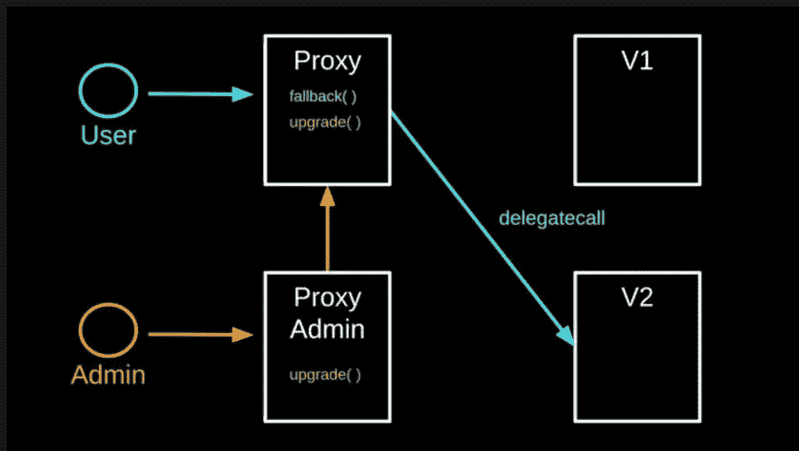
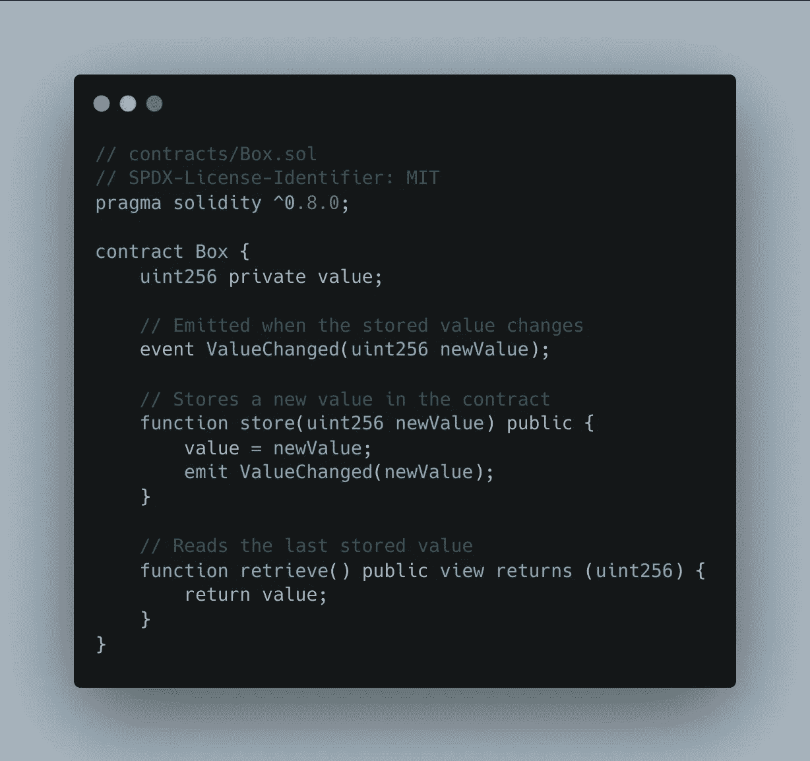
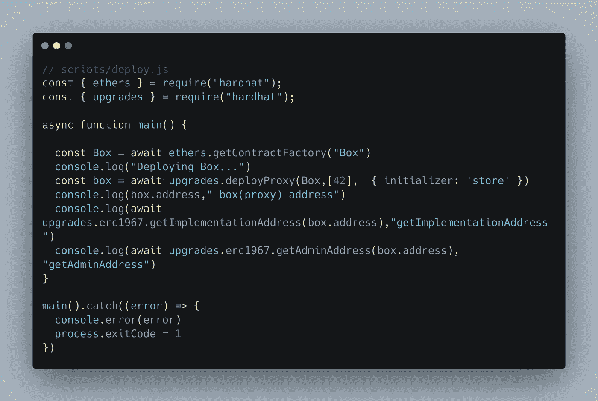
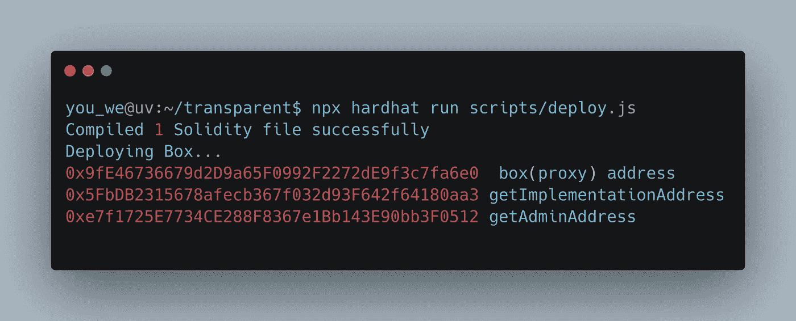
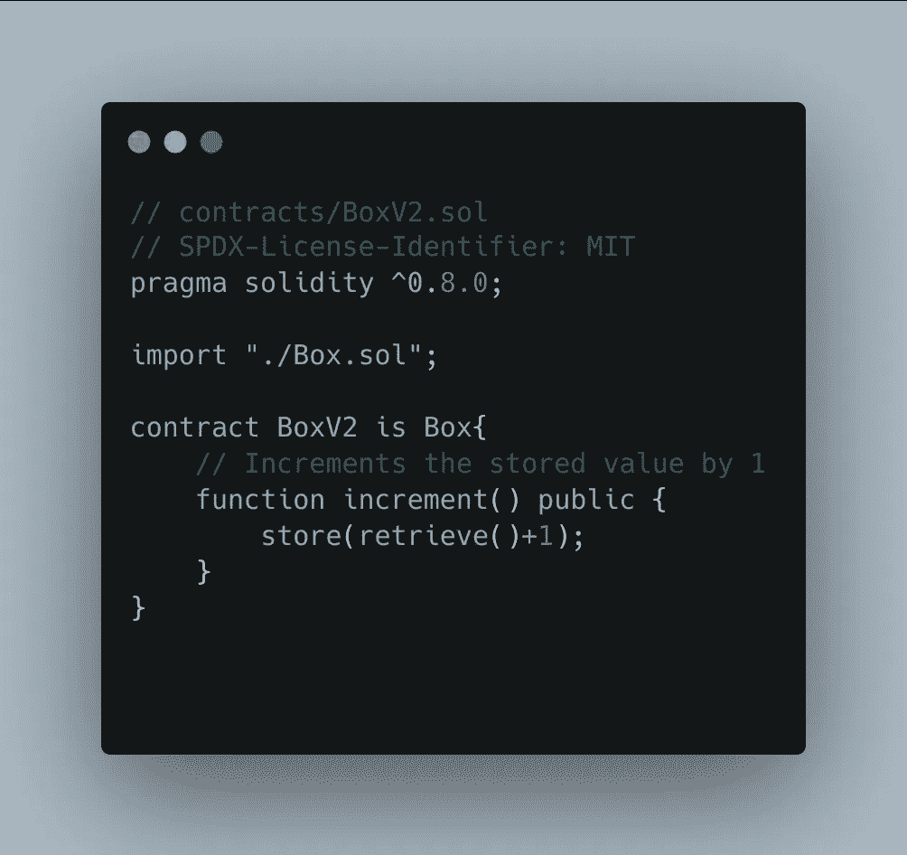
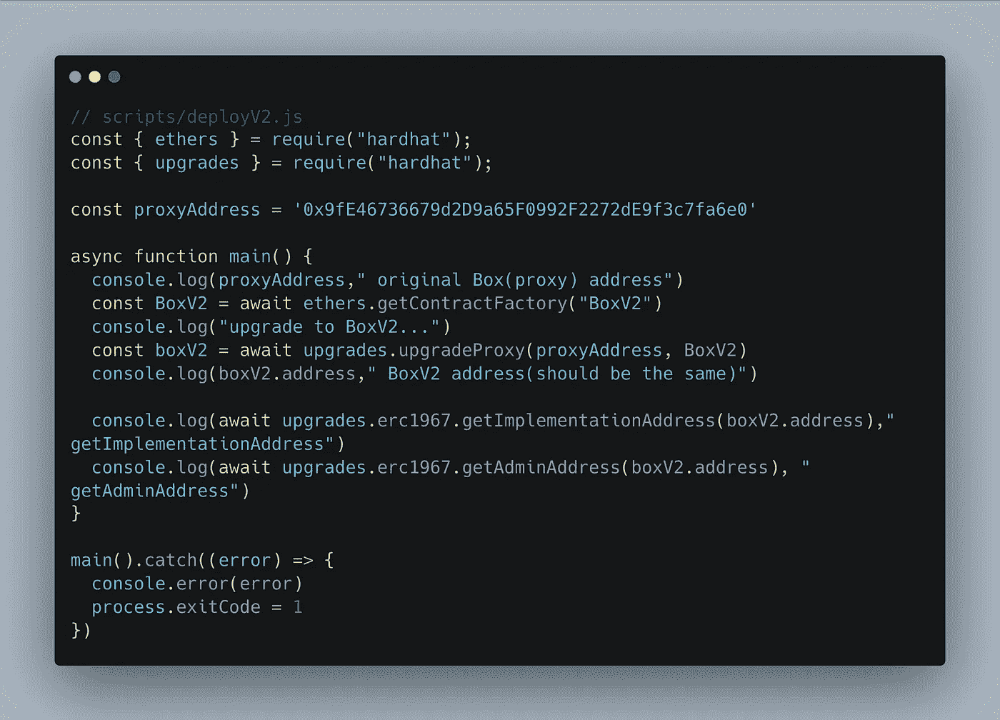
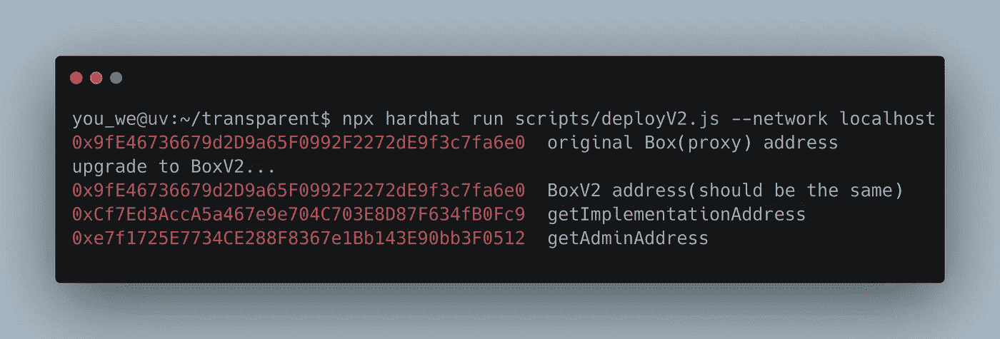

# 透明代理模式初学者指南

> 原文：<https://medium.com/coinmonks/beginners-guide-to-transparent-proxy-pattern-f40d6085bf3c?source=collection_archive---------4----------------------->


在我们开始之前，应该注意到已经有许多关于这个主题的文章发表了。然而，我还没有遇到任何对初学者来说容易理解的教程或任何关于如何部署可升级合同的详细说明。

这就是我们今天要学习的内容。

# 什么是代理模式？

代理是一种设计模式，允许您为另一个对象提供替代或占位符。代理控制对原始对象的访问，允许您在请求到达原始对象之前或之后执行某些操作。

# 为什么我们要使用代理模式？

在区块链世界，写在区块链上的任何东西都不能被编辑或操纵。如果开发人员在智能合约开发期间犯了任何错误，那么宝贵的资金就容易受到攻击。为了防止这些错误，使用代理契约，如果在实现契约上发现任何问题，则将部署新的实现契约。

# 代理模式的类型:

有几种类型的代理模式可用。他们是

1)透明代理模式

2)通用可升级代理标准(UUPS)模式

3)信标模式

但是今天我们将只看到透明代理模式



# 透明代理模式:

透明代理模式由三个契约组成。

*   **代理合同。**用户与之交互的智能合约。它将保存数据/状态，这意味着数据存储在该代理契约帐户的上下文中。
*   **实施契约。**智能合约提供了功能和逻辑。请注意，该数据也在本合同中定义。这是您正在构建的智能合约。
*   **代理人合同。**契约链接代理和实现。

让我们转向实际问题

# 我们要做什么？

使用面向 Hardhat 的 OpenZeppelin 升级插件，我们将部署可升级的合同。

让我们从创建一个安全帽项目开始

> npm 初始化-y
> 
> npm 安装—保存-开发硬件
> 
> npx 安全帽
> 
> npm 安装@ open zeppelin/hard hat-升级

打开***hard hat . config . js***并添加以下语句

> require(" @ open zeppelin/hard hat-upgrades ")；

接下来，我们将在合同文件夹中创建一个合同。在本例中，我们将使用 Openzeppelin 学习指南中的合同。你可以从这个[链接](https://docs.openzeppelin.com/learn/developing-smart-contracts#setting-up-a-solidity-project)得到代码。



让我描述一下这个契约的作用。把这个合同想象成一个盒子。


在盒子里，我们可以存放一些物品，并且很容易找回它们。这里发生了同样的事情:使用 store()函数存储一个新值，然后使用 retrieve()函数检索它。

现在让我们部署合同。

为了部署一个普通的契约，我们使用了 **deploy()** 方法。

```
const Greeter = await ethers.getContractFactory("Greeter");
const greeter = await Greeter.deploy("Hello, Hardhat!");
```

但是对于可升级的契约，我们使用 deployProxy()方法。

```
const Box = await ethers.getContractFactory("Box")
const box = await upgrades.deployProxy(Box,[42],{initializer:'store' }) 
```

在第二行，我们使用 OpenZeppelin **升级**插件，通过调用`store()`作为**初始化器**来部署具有初始值`42`的`Box`。

## 那么，什么是初始化式呢？

初始化器是一个像构造函数一样工作的函数。它应该包含所有只需要初始化一次的值。

现在打开 scripts 文件夹，创建一个名为 deploy.js 的文件



您的部署脚本应该与上面的相同

在上面的脚本中，我们使用 deployProxy()方法部署契约。现在快跑

> npx hard hat run scripts/deploy . js—网络本地主机

该命令成功后，将部署三个合同。



> **重要提示:**需要注意的是，在测试时，您应该在本地主机或任何测试网络中部署契约，因为 hardhat 的本地区块链每次都会被重置。因此，如果您尝试升级您的合同，它将在新的区块链上部署它，我们的旧部署代码将不在那里，它将是一个新的区块链，因此它将抛出以下错误。
> 
> 错误:0xabcde12345 处的协定看起来不像具有逻辑协定地址的 ERC 1967 代理

## 升级到版本 2:

现在让我们制作合同的第二版。

创建一个继承箱式合同的新合同。在这个契约中，我们创建了一个名为 increment()的新函数。该函数的目的是增加存储在 value 变量中的值。



现在，在 scripts/文件夹中为版本 2 创建另一个部署脚本。



在上面的脚本中，我们使用了 upgradeProxy()方法，该方法接受 proxyAddress 和新的实现契约地址作为参数。

现在快跑，

> npx hardhat 运行脚本/deployV2.js —网络本地主机



就是这样。这是我们部署和升级合同的方式。

现在，如果您查看实施地址，它将会发生变化，这意味着我们已经成功部署了新合同，现在我们可以与新合同进行交互了。

> 交易新手？尝试[加密交易机器人](/coinmonks/crypto-trading-bot-c2ffce8acb2a)或[复制交易](/coinmonks/top-10-crypto-copy-trading-platforms-for-beginners-d0c37c7d698c)