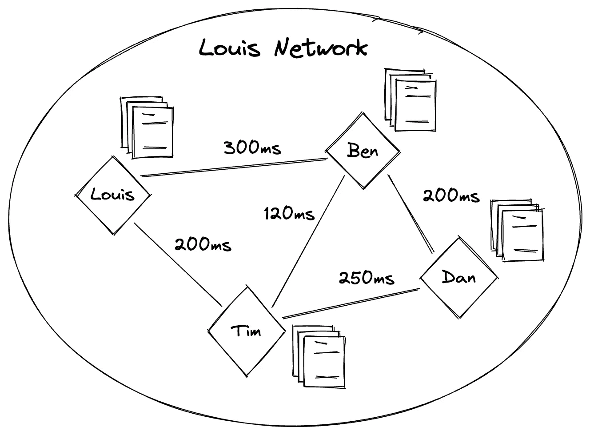
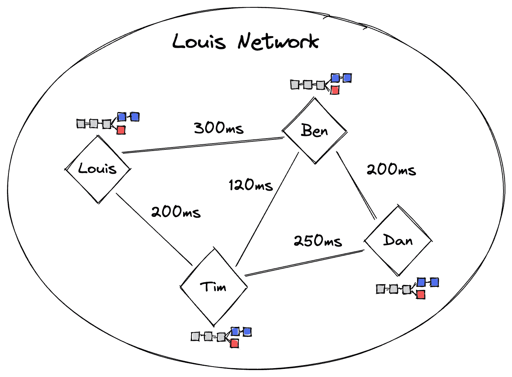
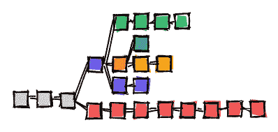

# 做区块链超级新秀——【区块链整体】3。一致性算法

> 原文：<https://medium.com/coinmonks/being-a-super-rookie-in-blockchain-blockchain-overall-3-consensus-algorithm-4f6f7f13d1f1?source=collection_archive---------34----------------------->

```
Suitable for everyone to read
```

*第一次拜访我的故事？去查查我之前的故事。*

[](/@hottestchilipepper/being-a-super-rookie-in-blockchain-blockchain-overall-2188428c0181) [## 成为区块链的超级新秀—[区块链整体]

### 1.区块链是什么鬼？

medium.com](/@hottestchilipepper/being-a-super-rookie-in-blockchain-blockchain-overall-2188428c0181) 

*如果你在谷歌上搜索了“如何开始区块链职业生涯”、“如何开始区块链职业生涯”、“在区块链找工作”、“成为区块链设计师”、“成为区块链金融建筑师”和“成为区块链开发商”，请抓紧了*

# 3.一致性算法

“共识算法”是区块链网络参与者之间的一种共识方式。它是区块链协议的一部分。

提醒一下我们之前做的路易网。本打算给大卫寄 1 美元。Ben 会将前一个块的哈希值加上句子“Ben sent 1 dollar to David”写入新的块中。然后，他会从上面的内容中派生出一个新的哈希值，并写入块中。这整个过程被称为“区块生产”、“区块创造”或“区块提议”
本应复制新积木，并将其交给路易网络的参与者路易、蒂姆和丹。称这个过程为“阻塞传播”

# 3.1 砌块生产规则

你不傻就一定有问题。只有 Ben 应该创建一个新的 block，让 Ben 向 David 发送美元吗？这不是必要的。
由于网络参与者遵守网络协议，我们可以规定想要发送美元的参与者应该产生新的块。在这个规则中，Ben 应该是一个网络参与者，以便 Ben 可以向 David 发送美元。

但是，有一个假设，即块数据和网络参与者是完全独立的。正因为如此，才有优势；即使没有钱，任何人都可以参加。这是“路易协议”的一部分。

因此，区块链网络中的任何人都可以生成一个新的块，并传播它来记录 Ben 向 David 发送了 1 美元。一个问题，“谁生产一个新块？”发生在此时。区块链协议的一部分是“共识算法”来解决这个问题。

## 动力

PoW 是“工作证明”的缩写这是最著名的共识算法。比特币用的是 PoW，过去以太坊用的是 PoW。(以太坊已将其共识算法改为 PoS)

提醒路易网。当本想给大卫寄 1 美元时，本可以造一个句子(明显是‘数据’)，‘本给大卫寄了 1 美元’。然后将其发送给网络参与者。(这个过程显然不是‘传播’。)


[Image 1] Ben send the sentence to the other participants.

然后，参与者路易斯、本、蒂姆和丹将前一个块的哈希值加上句子“本给大卫发了 1 美元”，再加上一个特定的数字，放入哈希函数中。哈希函数将返回一个哈希值。如果散列值低于特定值，则新块可以被传播并被区块链网络接受。你可能不明白是什么意思。还不错。让我们深潜。

首先，我们必须知道“什么哈希值比另一个低”的含义。提醒哈希值。好像是‘0x 646 e 7 c 6 e 249 e 9 a 73 fa 8453099 c 7164 Fe 713 af 91e。’从本系列的第一个故事中我们知道，哈希值是十六进制的。十六进制是一种数字。所以我们可以比较两个十六进制。我们可以很容易地比较，如果一些零在十六进制的头部。0x0000bcd 低于 0x000abcd，因为每个有四个和三个零。你可能知道二进制数。二进制数 11 在十进制数中是 2+1 = 3。二进制数 111 在十进制数中是 2 +2+1 = 7。我们可以在数字的开头加零，比如 011 和 111。我们可以注意到前者比后者低。

站在路易的角度想想。他收到的句子是，“本给大卫寄了 1 美元。”然后 Louis 把[前一个块的 hash 值]+[收到的句子]+[一个特定的数]放入 hash 函数。哈希函数将返回一个哈希值。如果哈希值不低于特定值，则使用更改后的特定数字重试该过程。我们称这个特定的数字为“随机数”，称这个特定的值为“目标值”。'


[Image 2] Hash Function returns a hash created from the previous block’s hash value plus the received sentence plus a nonce.

“目标值”似乎是“0x 000000000000 ffffffffffffffffff”低于目标值意味着在头部具有比目标值更多或相等的零。开头的零的数量被称为“难度”那是什么意思？哈希值的位数固定为 32。如果目标值有五个零，散列值的个数是 2^(32–5)= 2 ⁷.否则，如果目标值有二十个零，则散列值的情况数是 2^(32–20)= 2。您可以直观地看到，前者比后者更容易找到 nonce。你猜对了。难度 5 比难度 20 容易。


[Image 3] Finding a proper nonce when the Difficulty is 12.

最后，如果 Louis 找到了一个使哈希值满足“难度”的“Nonce”，则将[前一个块的哈希值]、[收到的句子]和[Nonce]记录到一个新块中。然后将该块传播到区块链网络。


[Image 4] Louis found a proper nonce and wrote it and the hash value to a new block. Then propagate the new block to the other blockchain network participants.

随机数也是十六进制的。提醒哈希函数的特性。如果至少有一个数字发生变化，那么导出的哈希值将完全不同。在这种情况下，用任何随机数导出的散列值将完全随随机数而变化。所以找到一个符合“困难”的随机数是非常困难的。

我们不需要从 0 中寻找来得到一个符合难度的 nonce。它可以从任意随机数开始。因为低于目标值的数字在数学上分布良好，所以无论你从哪里开始观察，找到合适随机数的概率总是相同的。

如果丹找到一个合适的随机数，将其放入一个新的块中，并将该块传播到区块链网络，则接收到该块的其他人可能会停下来寻找一个随机数，并验证丹所做的块。


[Image 5] Dan found a proper nonce. He made a new block and propagated it to the others. The others stop to find a nonce and validate the block from Dan.

验证是确认新块是否有效。如果它是无效的，参与者不接受它并继续寻找一个随机数。我们将在以后的故事中探讨如何验证块。

## 位置

PoS 是“标桩证明”的缩写 2022 年 9 月，以太坊将其共识算法从 PoW 改为 PoS。到目前为止，它似乎运行良好。

记住，有四个网络参与者。路易斯有 92 美元，本有 5 美元，蒂姆有 3 美元，丹没有。想要在 PoS 上创建积木的参与者需要下注。假设所有参与者都押上了他们所有的钱。


[Image 6] Ben wants to send 1 dollar to David when the number of blocks made is 3.

在 Louis 协议中有一个承诺，将 100 个块创建的持续时间设置为一个“回合”。下注的参与者一个接一个地成为街区生产者。什么块必须由谁来生产。目前，Louis 网络中有三个块，因此编号从 4 到 95 的块应该由 Louis 创建。编号从 96 到 100 的块应该由 Ben 创建，编号从 101 到 103 的块应该由 Tim 创建。丹从来不玩积木，因为他没有押任何美元。


[Image 7] The block numbers that can be created by someone who staked some dollars.

如果本造了一个积木，而另一个只能造一个积木，会发生什么？由于网络协议，所有参与者都知道谁可以产生块。因此，如果发生这种情况，参与者不会接受本的阻止，而被允许创建阻止的人会说一句话，“本给财政部送了 2 美元”，作为惩罚。


[Image 8] Ben creates a block when he is not allowed to create a block.


[Image 9] Tim insists that it is not Ben’s turn.


[Image 10] Ben should pay some dollars as a punishment.

## 3.1.3 残疾人组织

DPoS 是“委托立桩证明”的缩写假设路易斯网络的参与者已经增长到 1000 人，包括路易斯、本、蒂姆和丹。Louis 不能将新块直接传播给 999 个参与者。另一方面，路易斯把它传播给身边的人，然后他们再传播给其他人。因此，如果区块链网络中有太多参与者，传播数据块可能需要很长时间。

我们还应该选择希望在 PoS 中生产积木的参与者。这也很难。残疾人组织的出现就是为了解决这些问题。

假设 Louis Network 采用了 DPoS，Louis、Ben、Tim 和 Dan 坚持要成为委员会成员。委员会成员只能在 dpo 中生成块。所有在路易斯网络中拥有美元的参与者都可以将他们的美元委托给想要成为委员会成员的人。我们称这一过程为“委托立桩”

委托赌注美元在 PoS 中以这种方式有效。例如，路易斯、本和蒂姆自己委托他们的美元。假设路易斯拿了代表 102 美元，本 242 美元，蒂姆 124 美元，丹 372 美元。以下是标桩比率。并且它们属于每个可以创建多少个块。


[Image 11] Chance to create new blocks for each delegated participant.

# 3.2 终局性

终结性是一种保证或担保，即所有过去的块都是固定的，不能被修改或删除。有些区块链是终局的，有些保证是终局的。几乎所有权力区块链都以概率方式作出决定。波斯特·区块链用投票来保证最终结果。

## 概率终结性

可以在功率区块链网络中创建两个或多个新块。想象一下路易斯网络使用电力。路易斯、本、蒂姆和丹之间的网速各不相同。两个部分控制着互联网的速度。其中之一是潜伏期。假设块在参与者之间传播需要时间，如下图所示。



[Image 12] Network latency between network participants.

一旦 Louis 创建了一个块，将它发送给 Ben 需要 0.3 秒(= 300 毫秒)，Tim 需要 0.2 秒。将 Tim 收到的接收块重新发送给 Dan 需要 0.25 秒。因此，向所有参与者传播一个新块将花费 0.45 秒，至少在找到一个适当的随机数之后。

如果路易斯找到了一个适当的随机数，而丹也在 0.1 秒后找到了另一个随机数，那么路易斯的新块和丹的新块存在于路易斯网络上。


[Image 13] Louis’ new block and Dan’s new block exist on the Louis Network.

在时间流逝的 0.3 秒后，路易斯找到了一个合适的随机数，蒂姆收到了路易斯创造的红色方块，本收到了丹创造的蓝色方块。


[Image 14] Forked chain occurred.

从路易斯找到一个合适的随机数开始，经过了 0.55 秒的时间，红色和蓝色块已经在路易斯的网络中传播。在这种情况下，区块链显示单链变成两个分支。我们称这种情况为“分叉”

聚焦[图片 13]。久而久之，所有参与者将占领区块链网络的所有街区。尽管如此，由某人创建的以下块应该与在 fork 情况下首先接收的块相连接。如果因为 Tim 比 blue block 更早地从 Louis 那里收到了 red block，所以他为下一个 block 找到了合适的 nonce，那么他应该将新的 block 连接到 red block。


[Image 15] Tim makes a new block colored red because he received the red one earlier than the blue one.

经过一段时间后，Tim 创建的红色块会传播给所有参与者。


[Image 16] Tim’s red block has been propagated to the all network participants.

当一个新的区块在特定时间后连接到蓝色区块时，参与者一致认为带有红色区块的链是他们的规范链，而放弃蓝色区块。

尽管有人创造的一些区块已经被传播，但这些区块在上述共识方法中可能会失效。换句话说，不能保证“这些区块是最终的”。

当 Tim 创建第五个块时，如果先收到蓝色块的 Ben 或 Dan 找到另一个适当的 nonce 并创建一个新的，则 Louis Network 上将有两个红色块和两个蓝色块。然后，在传播第六个区块之后，两个红色区块或两个蓝色区块将变成无效。

重点关注在 PoW 区块链中使用了“以概率方式做出最终决定”而不是“保证最终决定”。在上述情况下，总是存在同时(在完全传播之前)和连续制造两个块的概率。但只有可能性是如此之低。概率终结性是比特币的特征之一，因为它使用 PoW。许多人将这种共识算法称为“中本聪共识”，中本聪发现，从数学上讲，形成两个六个街区长的分叉链的概率趋近于零。正因为如此，如果我们要说区块是最终确定的，那么通过六个区块应该是。一旦你在交易所存入或取出比特币，你可以看到存入或取出需要几分钟。该持续时间用于等待六个块。

## 确定性终结

一些区块链网络参与者可以做出最终决定。我们可以在 dpo 上看到确定性终结特性。残疾人组织网络的参与者应该相互联系。当创建一个新的块时，所有参与者验证该块的生产者是被允许产生一个新的块并验证该块中的内容和散列的人。然后他们可以投票决定它是否有效。如果有超过三分之二的参与者投赞成票，该区块将被所有网络参与者接受。

想象一下，路易斯创造了一个积木，本和蒂姆投票认为积木是好的，但丹投票认为积木是不正常的，就像[图片 19]。网络参与者中的三个人，路易斯、本和蒂姆，投票认为这个街区不错。因为 3/4 比 2/3 更重要，所以该块被接受。


[Image 17] Louis made a new block.


[Image 18] Ben voted the block is correct.


[Image 19] Dan voted the block is wrong.


[Image 20] Tim voted the block is correct.

区块链网络接受新块的整个过程被称为“块终结”我们可以说在 DPos 网络中保证了“块终结”,因为新的块在后续块被创建之前被终结。我们称这种特性为“确定性终结”

# 3.3 连锁选择规则

如果区块链网络不保证最终性，则使用权力共识，可能出现分叉链。因此，对于网络参与者应该接受什么样的链，应该有一致的算法。

## 最长链规则

我们已经在“3.2.1 概率终结”中应用了最长链规则


[Image 21] The chain consisting of red blocks is canonical.

上图显示，网络参与者将接受最长的链作为主链。在类似上图的情况下，可以选择由红色块组成的链。

然而，由于概率终结性特征存在于 PoW 中，每个参与者应该决定什么链更长，而不是所有参与者都不决定它。尽管每个参与者都可以自主决定积木，但只有一个链最终会被所有参与者接受，因为需要付出艰苦的努力才能生产出动力积木。

我们来看一个例子。返回到使用 PoW 将第三个块传播到 Louis 网络的情况。


[Image 22] Louis and Dan each found proper nonces and made new blocks.

假设路易斯和丹同时找到了第四个区块的正确随机数(不完全同时，但略有相同)。0.2 秒后，蒂姆从路易斯手中接过红色方块，本从丹手中接过蓝色方块。然后红色和蓝色块传播到所有网络参与者。最后出现了分叉链。


[Image 23] The fork occurred.

与之前故事的图像不同，本和丹拥有的蓝色方块显示在红色方块的上方。它意味着每个网络参与者的链的优先级。轻松地说，路易斯和蒂姆将试着把下面的积木和红色的连接起来，本和丹将试着把下面的积木和蓝色的连接起来。


[Image 24] Ben found a proper nonce and propagated it.

如果 Ben 为第 5 个块找到一个合适的随机数，并传播一个新块，蓝色块可能会被附加到参与者的链中，如上图所示。然后 Louis 和 Tim 提高蓝链的优先级来连接新的蓝块，因为蓝叉链最长。



[Image 25] The blue chain is accepted as a canonical chain.

因此，Louis Network 达成了友好的共识，因为 Louis、Tim、Ben 和 d an 将尝试将新块连接到 blue chain！

比特币采用了“最长链规则”，我们称之为“幽灵”。GHOST 是“贪婪最重对象子树”的缩写

## 3.3.2 修改后的 GHOST 协议

当以太坊使用能量时，他们采用了“改良幽灵”

使用 PoW 的比特币协议将难度调整为 10 分钟左右。以太坊将平均块生成时间固定为 12 秒。出现分叉的概率随着块生产时间的缩短而变得更高。对于较短的制块时间来说，PoW 对于以太坊的难度要比比特币容易。所以叉子比以太坊的比特币出现的多。

在这种情况下，如果以太坊采用 GHOST 作为最长链规则，一些攻击者制作的链可以被区块链网络接受。所以以太坊采用了“改良的幽灵协议”

在 just GHOST，“最重的链条”意味着“最长的链条”在 Modified GHOST 中,“最重的链”的含义变为“具有最多块的链”

让我们深入探讨 GHOST 和修改后的 GHOST 协议之间的区别。



[Image 26]

类似上述情况的分叉在以太坊是可能发生的。如果网络属于 GHOST 协议，则底链由最长链规则的红色块组成。但是，假设它遵循修改后的 GHOST 协议。每个分支级别具有最多块的链将被接受。

看到第一个分叉，蓝色和红色块。在蓝色区块，有 4 个绿色、1 个橙色、1 个天蓝色、2 个黄色和 2 个紫色区块与蓝色区块相连。4+1+1+2+2 = 10.蓝色方块除了自己还有 10 个方块。红色区块有 7 个区块。因此，根据修改后的 GHOST 协议，蓝色块将被接受为规范链。


[Image 27] After ignoring the red chain.

之后，网络参与者可以在绿色、橙色和紫色块中进行选择。绿色街区有三个街区。橙色街区有 3 个街区，紫色街区有 1 个街区。因此，绿色和橙色块将被选中，因为它们具有相同的块数。参与者将在下一次块创建后就绿色或橙色链是否规范达成共识。

那么，修改后的 GHOST 协议为什么要在以太坊？攻击者可以在 GHOST 协议中选择他的伪造块的一个分叉链。假设他有很好的计算能力(可以用来找到一个合适的随机数)。在这种情况下，攻击者的链可能是最长的，因为另一个分叉链可能有许多额外的分叉链。

假设攻击者的计算能力是网络参与者总计算能力的 30%。这意味着在所有参与者制作的块的数量是 100 的情况下，攻击者可以制作的伪造块的数量是 30。那么，70 块是规则的，但是由 70 块组成的链有很多分叉。所以最长链的长度可能小于 30。简单地认为 70 个块出现了 3 个分叉。一般情况下最长的链长是 70/3(约 23)。低于 30。但是如果我们使用修改后的 GHOST 协议，不用担心。最长的链的长度是无用的。由 70 个块组成的链将被接受为规范链，因为该链具有最多的块。

如果你有任何问题，请关注我的推特，发微博给我。
[路易的推特](https://twitter.com/Louis_Overlabs)

> 交易新手？尝试[加密交易机器人](/coinmonks/crypto-trading-bot-c2ffce8acb2a)或[复制交易](/coinmonks/top-10-crypto-copy-trading-platforms-for-beginners-d0c37c7d698c)