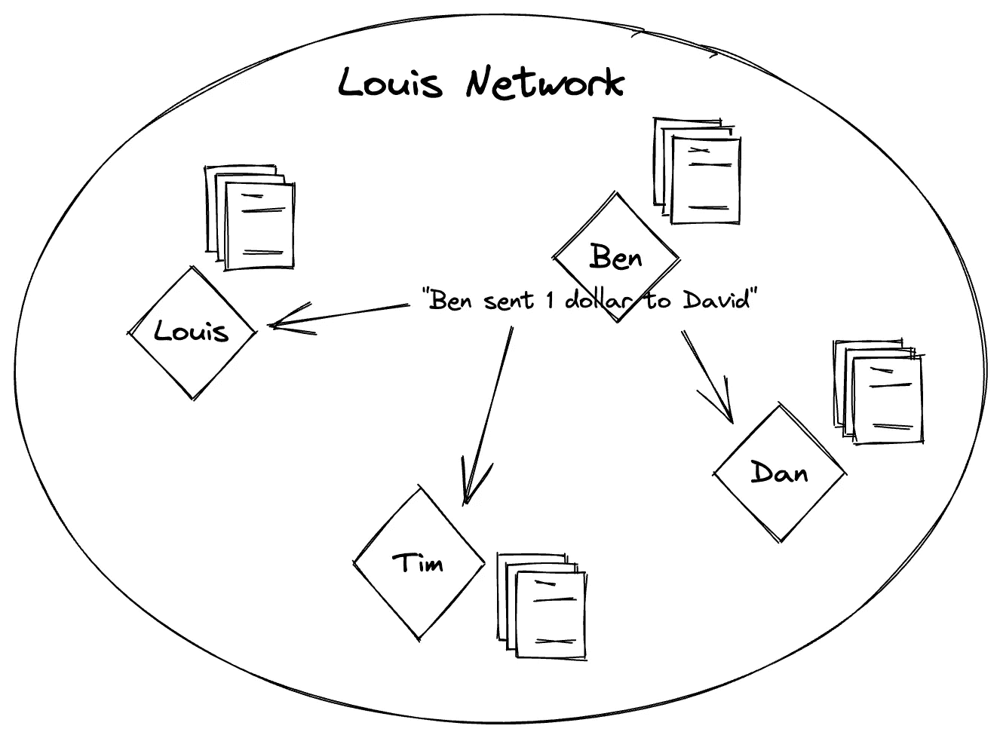

# 做区块链超级新秀——【区块链整体】4。交易

> 原文：<https://medium.com/coinmonks/being-a-super-rookie-in-blockchain-blockchain-overall-4-transaction-104b67e04834?source=collection_archive---------41----------------------->

```
Suitable for everyone to read
```

*第一次拜访我的故事？去查查我之前的故事。*

[](/@hottestchilipepper/being-a-super-rookie-in-blockchain-blockchain-overall-2188428c0181) [## 成为区块链的超级新秀—[区块链整体]

### 1.区块链是什么鬼？

medium.com](/@hottestchilipepper/being-a-super-rookie-in-blockchain-blockchain-overall-2188428c0181) 

*如果你在谷歌上搜索了“如何开始区块链职业生涯”、“如何开始区块链职业生涯”、“在区块链找工作”、“成为区块链设计师”、“成为区块链金融建筑师”和“成为区块链开发商”，请抓紧了*

# 4.交易

发生区块链状态转换的所有请求可以被称为“事务”让我们看看“区块链国家发生转变”是什么意思

首先，我们应该了解区块链的“国家”。提醒路易网第三块已经做好的情况。有三个句子，“路易斯有 100 美元”，“路易斯给本寄了 5 美元”，“路易斯给蒂姆寄了 3 美元。”然后，路易斯有 92 美元，本有 5 美元，蒂姆有 3 美元。像这样，代表一个人有多少美元是区块链的“州”。这些句子就是“交易”

“路易斯有 100 美元”这句话给了区块链中一无所有的路易斯 100 美元。通过这样做，状态被改变了，代表路易有 100 美元。换句话说，这句话把状态从一无所有的区块链变成了拥有 100 美元的路易。

下一句话，“路易斯给本寄了 5 美元”，将状态从路易斯有 100 美元变为路易斯有 95 美元，本有 5 美元。

如上所述，句子本身就是“交易”。

# 4.1 交易执行

让我们看看交易是如何处理的。假设 Louis Network 采用了 PoW，并且 Ben 希望在第三个块完成后向 David 发送 1 美元。首先，本向所有区块链网络参与者发送句子“本给大卫寄了 1 美元”。



[Image 1] Ben is sending the sentence ‘Ben sent 1 dollar to David.’

然后，参与者接受该句子，并将该句子写入一个新的块，并试图找到一个合适的 nonce。如果有人找到一个合适的随机数，他会将该随机数写入新的块，并将其传播到网络。

就这么做了！执行是将一个句子写到块中。

## 4.1.2 UTXO(未用交易产出)模型

让我们回到基因板块。见下图。有一笔交易显示路易斯有 100 美元(TX0)。有两笔交易与第一笔交易有关。


[Image 2] TX1 and TX2 are needs to send 5 dollars from Louis to Ben.

他们显示从路易斯给本寄了 5 美元，从路易斯给路易斯寄了 95 美元。什么是“从路易斯到路易斯”？对于 UTXO 模型是必要的。我们必须为剩余的美元创建另一个交易。请参见下图。


[Image 3] TX4 is for the remaing dollars after sending 3 dollars from Louis to Tim.

追加两个事务。TX3 显示从 Louis 向 Tim 发送了 3 美元，TX4 显示向 Louis 发送了剩余的 92 美元。

有人能把美元寄给一个以上的人吗？是的。


[Image 4] TX5 shows that sending 3 dollars to Dan and 2 dollars to Tim.

TX5 显示从本处收到 5 美元，向丹发送 3 美元，向蒂姆发送 2 美元。

让我们想想“块”见下图。你可以注意到我们写在模块上的句子出现在[图片 6]中。每个句子都与[图片 6]中的每个块相匹配。


[Image 5] The sentences we made before.


[Image 6] Blocks encapsulating transactions.

如果在交易中收到和发出的美元数不匹配，会发生什么？简单。参与者不能接受该块。


[Image 7] The numbers of dollars received and sent are not matched in a transaction.

现在，我们将看到一个更复杂的事情。多人可以向其他人发送美元吗？它意味着是否可以在一个块中进行更多的交易。当然，我们可以。


[Image 8] Dan and Louis want to send dollars to David simultaneously.

现在，我们到了最后一步。在第 4 块之后，大卫想给丹和蒂姆每人寄 3 美元。你能看到 TX6 和 TX8 中的两个“致大卫”吗？他总共有 7 美元。但是 2 块钱在 TX6，5 块钱在 TX8。我们不能只使用“大卫 6”，因为需要 2 和 5 以上来表示 6。所以，我们应该从 TX8 放 5 美元，从 TX6 放 1 美元到 TX10。并为来自 TX6 的剩余 1 美元创建另一个交易。


[Image 9] Using unspent transactions, TX6 and TX8 to send 6 dollars to Dan and Tim.

正如您所注意到的，当 David 想要发送 6 美元时，他应该找到包含美元的“未用交易”。TX6 和 TX8 未用完。这样他就可以和他们进行交易。

像这样的系统被称为“UTXO 模型”是比特币采用的。相反，以太坊采用的是“账户余额模型”。

## 4.1.3 账户余额模型

以太坊里用的是‘账号’。该账户直接代表美元余额。它比 UTXO 更容易理解，因为它很直观。


[Image 10] Blocks and Transactions for the Account Balance Model

没有代表剩余美元的交易。在每个街区，参与者只需检查发送者的余额。如果没有足够的余额，事务将不会被接受，块生产者也不会将其写入新的块。

“帐户余额模型”很容易理解，但在技术上，它比 UTXO 模型更复杂。如果你是开发者，很快就能了解到。如果你不是，那就完成了。

> 交易新手？试试[加密交易机器人](/coinmonks/crypto-trading-bot-c2ffce8acb2a)或者[复制交易](/coinmonks/top-10-crypto-copy-trading-platforms-for-beginners-d0c37c7d698c)