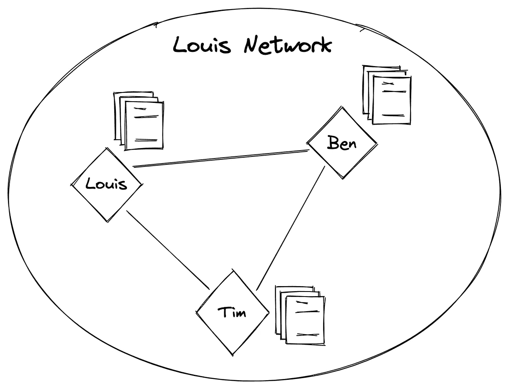
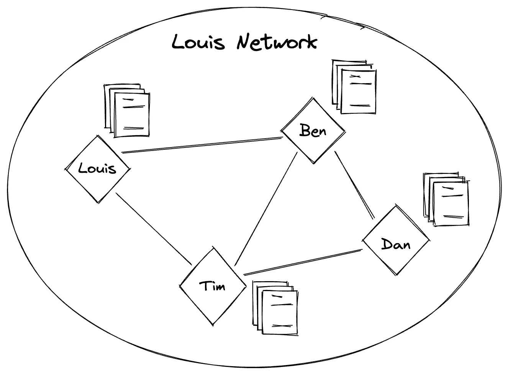

# 做区块链超级新秀——【区块链整体】2。区块链协议和网络

> 原文：<https://medium.com/coinmonks/being-a-super-rookie-in-blockchain-blockchain-overall-6ad09b766c58?source=collection_archive---------44----------------------->

```
Suitable for everyone to read
```

*第一次拜访我的故事？去查查我之前的故事。*

[](/@hottestchilipepper/being-a-super-rookie-in-blockchain-blockchain-overall-2188428c0181) [## 成为区块链的超级新秀—[区块链整体]

### 1.区块链是什么鬼？

medium.com](/@hottestchilipepper/being-a-super-rookie-in-blockchain-blockchain-overall-2188428c0181) 

*如果你在谷歌上搜索了“如何开始区块链职业生涯”、“如何开始区块链职业生涯”、“在区块链找工作”、“成为区块链设计师”、“成为区块链金融建筑师”和“成为区块链开发商”，请抓紧了*

# 2.区块链协议和网络

“区块链整体”部分的第二个主题是“区块链协议和网络”让我们开始吧。

## 2.1 区块链协议

我们制定了一些规则，做出了第一个区块链。提醒一下。向当前块写入一个新的哈希值，该哈希值由前一个块的哈希值加上当前块的数据的哈希函数(以太坊的 SHA3)得出。这些东西是承诺和规则。我们称之为“协议”如果我们把之前制定的区块链称为‘路易’，这些规则就是‘路易议定书’的一部分

## 2.2 区块链网络和参与者

提醒了一下区块链以前犯过的错误。路易斯有 100 美元，他给本寄了 5 美元，又给蒂姆寄了 3 美元。整个过程写在 A4 纸上，然后通过合成所有 A4 纸变成了‘路易区块链’。

如果路易有区块链的数据，他就可以随心所欲地修改和删除数据。他可以改变句子、散列值和随后的块的散列值，以符合 Louis 协议’。'

是不是很奇怪？你已经知道没有人不能修改或删除数据。对此有几个假设。
1。每个人都有相同的哈希函数。
2。每个人都有相同的数据，而且会同步。
在这些规则下，如果 Louis、Ben 和 Tim 在 A4 纸上有相同的内容，那么只要这三个人中的一个改变了内容，所有人都可以通过散列函数注意到修改。

我们可以说路易斯、本和蒂姆遵守了“路易斯协议”他们共享区块链上的所有数据，并且是“路易斯网络”的参与者



2–1 Louis Network

换句话说，遵守特定“协议”的一群人是一个“区块链网络”，这些人是“区块链网络的参与者”。

提醒州政府我在上一个故事里告诉过你。路易斯有 92 美元，本有 5 美元，蒂姆有 3 美元。你要知道，即使人们是网络的参与者，他们也不需要有美元。这意味着 A4 纸内容中没有显示的人可以成为“路易斯网络”的参与者



2–2 Dan is also a participant even though he has no dollars

因此，尽管丹没有钱，但他可以作为参与者加入“路易斯网络”。另一方面，区块链网络的内容(显然是“数据”)和参与者是完全独立的。

正如你从前面的故事中所知道的，如果路易有区块链的数据，没有人能看到路易会犯下的欺诈行为。因此，应该有许多参与者，他们应该在一个区块链网络中拥有所有确切的数据内容，以防止欺诈。

最后，只有当区块链网络中有参与者时，区块链才会变得“安全”

如果你有任何问题，请关注我的推特，发微博给我。
[路易的推特](https://twitter.com/Louis_Overlabs)

> 交易新手？尝试[加密交易机器人](/coinmonks/crypto-trading-bot-c2ffce8acb2a)或[复制交易](/coinmonks/top-10-crypto-copy-trading-platforms-for-beginners-d0c37c7d698c)