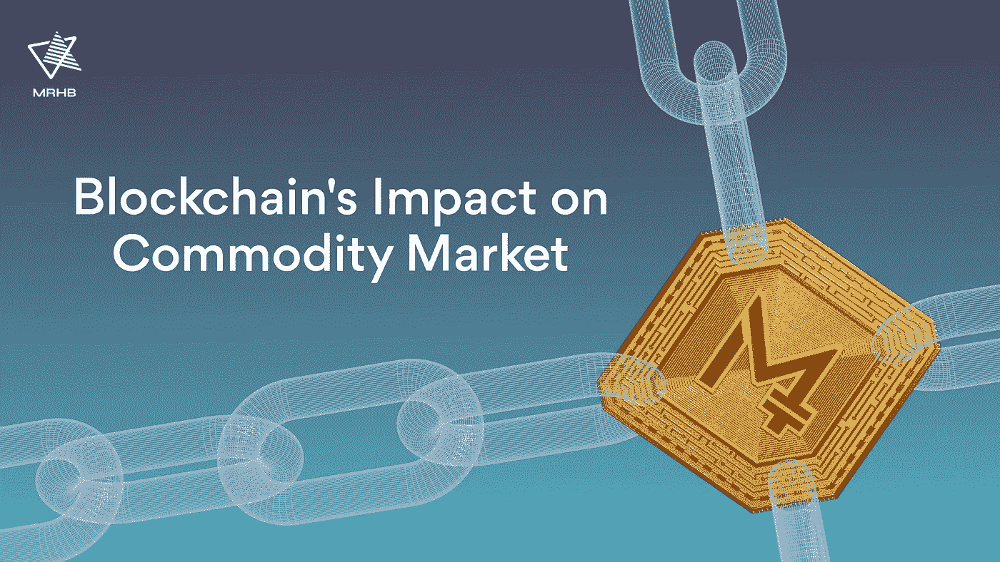
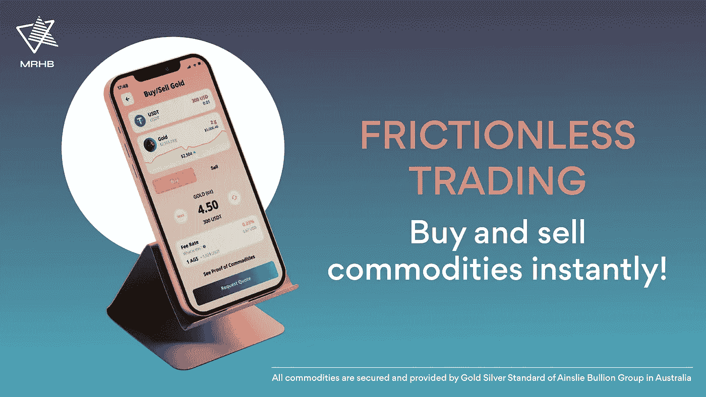

# 使用 Halal Crypto 在区块链上交易商品的好处

> 原文：<https://medium.com/coinmonks/benefits-trading-commodities-6d68e18457b5?source=collection_archive---------37----------------------->

区块链技术已经开始在改变世界各地的商品市场方面显示出巨大的潜力。商品交易市场传统上使用大量的数据和书面记录来执行每笔交易。

此外，全球贸易的复杂性和错综复杂性导致商品交易面临许多挑战。这就是区块链技术的用武之地。区块链可以使模拟和基于纸张的程序过时，同时提供市场透明度。

在本文中，我们将找出:

*   什么是商品市场
*   商品是如何交易的
*   交易商品的好处

# 什么是商品市场？

大宗商品市场是一个大宗购买、出售和交换同质初级产品的平台。商品必须满足基本要求，如法规、标准化和实用性。

商品可以分为两类:硬商品和软商品。

**硬商品**由提炼或开采的资源组成，如贵金属、石油、天然气等。

**软商品**包括农产品和原材料，如糖、咖啡和乳制品。

商品市场经常被生产者和消费者用作对冲通货膨胀的**工具，有时当股票市场不稳定时还会被依赖。市场的高流动性确保了所有价格都是由供求关系竞争性地确立和决定的。**

# 商品是如何交易的？

传统的商品交易平台使用中介来保证每笔交易，中介负责确保买卖双方之间的交易顺利进行。

这些中介机构被称为**清算会员。他们通常是大型金融机构和服务公司。在加密货币领域，商品交易市场通常可以分为两种不同的类型。**

## 1)现货市场

也被称为现金市场，金融工具如**证券和实物商品被交换**用于即时交割。交割是指将现金兑换为交易工具的过程。在这种类型的市场中，你拥有资产的直接所有权，并享有各种法律权利。

## 2)衍生市场

第二种被称为**衍生市场**，它使用类似**期货合同**的金融工具，从基础资产中获取价值。

目前，最流行的商品交易媒介是期货合约。当买方购买期货合约时，他们并不拥有它所代表的资产。取而代之的是，买方获得一份显示某种加密货币交易的合同，在预定的未来日期购买或出售该资产。

# 区块链上交易商品的好处

区块链推动了多个行业在多个领域的发展。此前，大宗商品交易平台只对能够开立巨额信用额度的用户开放。

> 现在，因为区块链，市场已经民主化。

这使得新的交易者可以轻松地使用市场，利用透明、没有中介等优势。

让我们来看看区块链在大宗商品市场上提供的具体好处。

## 隐私

商品交易所的所有相关交易数据都存储在区块链上，使其免受第三方入侵。如果在交换中出现任何差异，由于区块链，可以迅速采取行动。存储在区块链上的数据的准确性、时间敏感性和粒度可实现最高效率。

## 点对点交易

P2P 交换平台能够在短短几秒钟内进入全世界的全球加密市场。这些交易所大多还实行“零交易报酬”政策，这使得小交易者也能非常方便地使用 P2P 交易平台。

## 合法性

区块链对所有交易使用去中心化的账本，这使得发现发票、转盘交易等违规行为变得非常容易。由于所有结算都是实时进行的，商品市场交易的风险大大降低。

## 发展

一些公司和机构投资于技术，以建立更好的监管要求和财务保密性。此外，最近发布的一份[麦肯锡](https://www.mckinsey.com/industries/financial-services/our-insights/global-banking-annual-review)报告显示，可持续发展受到了高度重视，这是区块链帮助的另一个方面。

# 通过 TijarX 进入令牌化商品市场

区块链技术消除了传统商品交易中的低效率。利用这一优势并认识到对道德和清真 DeFi 解决方案的需求，MRHB 建立了一个交易令牌化商品的平台。由于交易费用为零， [TijarX](https://mrhb.network/ecosystem/tijarx) 作为一种财富保值金融解决方案而存在，同时鼓励被排斥的社区参与商品交易。

你可以开始购买令牌化的黄金和白银，分别由 100%完全配置的黄金和白银金条支持。[下载 Sahal 钱包](https://mrhb.network/ecosystem/sahal-wallet)访问 TijarX。

> 交易新手？试试[密码交易机器人](/coinmonks/crypto-trading-bot-c2ffce8acb2a)或者[复制交易](/coinmonks/top-10-crypto-copy-trading-platforms-for-beginners-d0c37c7d698c)