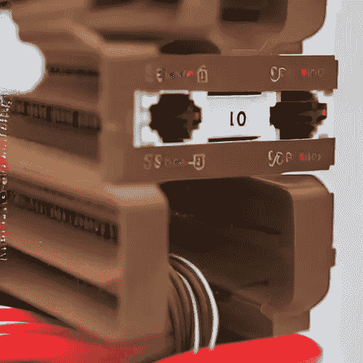

# bera chain——深度潜水

> 原文：<https://medium.com/coinmonks/berachain-a-deep-dive-3c840de5a09a?source=collection_archive---------3----------------------->

A pepe-like bear face constructed from computing parts

60，000 名 Discord 成员，第一个重定基础的 NFT，6 个独立的 NFT 系列，3 年的制作，3 个独立的令牌，真正的 DeFi 创新，以及迷因背后的实质，可能都不会存在。

什么是 Berachain，它是真实的吗？

拿些蜂蜜，振作起来做这项研究。结果可能会很甜蜜。

# **起源**

____________________________________

NFT 项目发展成为更大的生态系统的例子很少。宇迦实验室的无聊猿就是一个例子。更罕见的是 NFT 项目演变成一个完全不同的协议。这正是 Berachain 所承诺的。这是第一个重定基础的 NFT 项目的最后阶段。

它始于 2021 年 8 月 NFT 推出的 Bong Bears。血统追溯到债券熊，嘘熊，熊宝宝，乐队熊，咬熊。六代 NFT。2022 年 4 月，该团队发布了一篇中型文章，详细介绍了他们对原生协议的计划。

# **什么是 Berachain？**

____________________________________

Berachain 是一个即将推出的 DeFi 协议，使用 CosmosSDK 构建。你可以做所有你通常在 DeFi 平台上可以做的事情，但是有一些有趣的不同。

Berachain 不是从零开始构建，而是利用现有的中间件和第三方项目来构建。

# **CosmosSDK**

____________________________________

对于新读者来说，CosmosSDK 是一个用于构建特定于应用程序的区块链的开发工具。

你可以叉宇宙的共识基础设施，创造你自己的区块链。包括你自己的规律和特点。

如果你熟悉 JavaScript 开发，CosmosSDK 有时会被比作 NPM。Cosmos 使用 Tendermint DPos 达成共识。

# **嫩薄荷**

____________________________________

Tendermint 是由 Cosmos 团队创建的一个协议，它使得开发区块链和在其他机器上复制它们变得更加容易。

Tendermint 核心在 Go 中实现。开发人员可以用任何语言在它的基础上构建他们的模块。它使用利害关系证明进行验证。

# **dpo**

____________________________________

授权的利害关系证明意味着即使非验证者也可以参与赌注。

任何人都可以下注他们的硬币，然后选择将他们的赌注献给验证者。用户贡献了他们的股份的验证器可以将该股份添加到他们的总数中。回报是共享的。

由于 CosmosSDK 自带这种开箱即用的 Tendermint DPoS 系统，这就是 Berachain 使用的。

它进一步增加了一种叫做“流动性证明”的东西。

# **流动性证明**

____________________________________

流动性证明是 Berachain 团队创造的一个术语。它允许用户将资产如 ETH、BTC 和 stablecoins 加入验证程序。

通常，在协议的本地令牌中进行标记。Cosmos 系统使得为多个区块链建立一个“通信枢纽”(来自不同链的代币在彼此之间交易)变得更加容易。如果你曾经使用过 THORChain，你就会明白。

Berachain 的流动性证明允许用户从精选的代币中下注，然后将赌注委托给验证者参与 dpo。

在 Berachain 上，没有必要标记协议的本地令牌。你所要做的就是证明你有一些流动资金。

权重和优先级首先授予更突出的令牌，如 BTC、瑞士联邦理工学院和 USDC。

**原生令牌**

在我们更进一步之前，这里是 Berachain 本地令牌。

BERA —用作气体

蜂蜜——土生土长的马币

BGT —用于治理(这是一个 NFT)

# **我下注后会发生什么？**

____________________________________

你可能已经知道了，你的股份有助于保护协议。

在 Berachain，被押的资产被存入金库，用来赚取收益。这可能是通过与本地的 DEX 挂钩，提供协议经营的贷款市场，帮助稳定与本地 stablecoin 蜂蜜的挂钩，等等。

你也可以用你的股份做很多你在 DeFi 协议中会想到的事情。例如，你可以用你的资产作为抵押来生产蜂蜜。蜂蜜可以用在其他方面:

-与其他硬币配对用于原生 DEX。类似符文。即。蜂蜜-其他 _ 硬币

罪犯

——AMO(算法市场运营总监)。与 Frax 类似，这将有助于以不同于简单买卖的方式保持联系汇率

# **大局**

____________________________________

BGT 将成为治理的象征。这是 NFT，你不能转让它。你赢得 BGT 赌注贝拉，汽油令牌。

当你下注 BGT 时，你从 DeFi 相关活动的费用中赚取蜂蜜。

这里的循环变成了股份资产，赚取蜂蜜。赌注贝拉，赚取 BGT 和蜂蜜。利用 BGT 进行治理。将蜂蜜用于各种 DeFi 活动，包括将其用作贷款抵押。购买更多的贝拉，股份等。观察用户采取的最佳途径将会很有趣。

关于 BGT 的另一个注意事项。围绕使用它来衡量奖励权重(类似于 veCRV)的能力展开了讨论。我不确定这是否是必然的。

# **EVMOS**

____________________________________

我不是 100%确定，但我很确定 Berachain 是使用 EVMOS 构建的。

我对 EVMOS 的了解有限。EVMOS 是宇宙和以太坊的 EVM 之间的中间件。

埃夫莫斯是建立在宇宙之上的 EVM 的一个分支，它与以太坊相连。

不熟悉它的安全性和确切的实际功能。

# **原生 DEX**

____________________________________

有迹象表明，Berachain 将在发布时有一个本地 DEX。

AMM 将是 Crocswap，它正在几个协议上启动，并不特定于 Berachain。

Crocswap 有一些重要且独特的实现细节。以下是其中的一些:

*   Uniswap v2 和 v3 上存在针对僵尸程序和其他滥用的尝试缓解措施。例如，为了防止 JIT 流动性合同，给流动性注入一个时间锁，这样它就不会被快速增加和减少。(JIT 流动性是一种三明治攻击，它利用集中的流动性机制损害 LP 的利益)。
*   流动性可以像 Uni v3 那样在集中流动性范围内提供，或者像标准 v2 那样在流动性范围内提供。
*   动态费用。互换活动越多，费用就越高。这有助于缓冲 IL，因为在波动性可能较高的时期，有限合伙人会赚得更多。
*   收入自动复利，无需服务费。
*   允许的地址池和白名单地址的可能性，如 Bancor

# **深度流动性**

____________________________________

由于 DeFi 活动是协议固有的，流动性应该更加集中。

流动性细分是 DeFi 中的一个问题。当流动性分散在许多不同的资产中时，资产池就会干涸，成为“流动性债务”。比如路边的废弃建筑，这些建筑本来是适合居住的。

由于 DeFi 基本构件将是 Berachain 本身的一部分，并且 HONEY 将用作流动性对，因此流动性更有可能具有足够的深度来实现高效协议。

例如，滑动减少了。试图通过在第三方收益金库中使用蜂蜜来利用最佳外部收益率的用户将无法这样做，因为第三方收益金库可能会抛售代币并危及挂钩。

# **项目**

____________________________________

也就是说，原生协议 DeFi 并不禁止第三方项目在 Berachain 上构建。

显然已经有许多团队在为此而努力，当 Berachain 准备好时，他们会争相发布。

由于流动性协议的基本构建模块和基线活动都是由本地令牌拥有和管理的，开发人员有望专注于构建原创和创新的产品。

# **发射**

____________________________________

Berachain 的目标是在本文发表后的几个月内发布。Perp trading 预计将在发布时准备就绪。

# **风险**

____________________________________

标准智能合约、流动性和投机风险。

在 Berachain 的情况下，有助于使协议更加有效和健壮的本地 DeFi 也可能增加风险。系统运行状况更集中于核心 Berachain 产品。

举例来说，如果一个核心部分出现断裂或脆弱，蜂蜜就有可能拖垮所有其他部分。

# **结论**

____________________________________

我们看看会发生什么。我期待看到 Berachain 如何进步。

很可能需要写第 2 部分来深入探讨这个问题。

____________________________________

**简讯独家内容！**

这篇文章是我的免费每周时事通讯中的项目展示！

我在这里分享它，因为这是第一周。

本周版还有独家阿尔法滴！

[在这里注册，确保你不会错过！](https://www.getrevue.co/profile/thecryptoclimax?element=subscribe-through-revue)

____________________________________

**在 Twitter 上关注我的所有更新！**

[https://twitter.com/TheCryptoClimax](https://twitter.com/TheCryptoClimax)

下一集见。

> 交易新手？试试[密码交易机器人](/coinmonks/crypto-trading-bot-c2ffce8acb2a)或者[复制交易](/coinmonks/top-10-crypto-copy-trading-platforms-for-beginners-d0c37c7d698c)