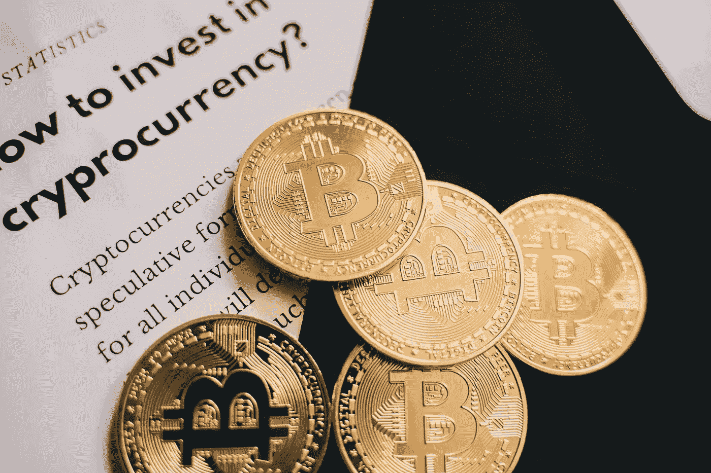

# 最好购买并永久持有的两种加密货币

> 原文：<https://medium.com/coinmonks/best-2-cryptocurrencies-to-buy-and-hold-forever-d3cdf72634d5?source=collection_archive---------25----------------------->

Source photo [Golden Coins in Close-up Photography · Free Stock Photo (pexels.com)](https://www.pexels.com/photo/golden-coins-in-close-up-photography-6771003/)

# 以太坊

就市值而言，以太坊仅次于比特币。以太坊区块链平台和它的本地硬币同名。代币的效用在于能够充当价值储存手段，这是比特币的强项；然而，以太坊也被证明是最有前途的 dApps 平台之一，或者说去中心化的…