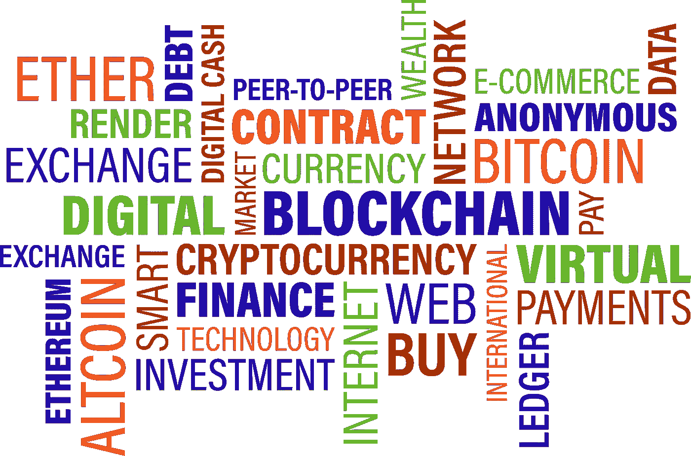

# 现在买入并持有最好的 2 种密码

> 原文：<https://medium.com/coinmonks/best-2-cryptos-to-buy-right-now-and-hold-72d400b8d56a?source=collection_archive---------14----------------------->

Source photo [Business Word Cloud Bitcoin — Free vector graphic on Pixabay](https://pixabay.com/vectors/business-word-cloud-bitcoin-3325386/)

# 以太坊

以太坊(Ethereum)，全球第二大加密货币，是目前最值得投资的货币(ETH-USD)。以太坊是总部位于区块链的分散金融(DeFi)背后的驱动力，因此代表了它自己的生态系统。其区块链技术被其他项目大量采用，使其成为加密货币行业最受欢迎的技术之一。